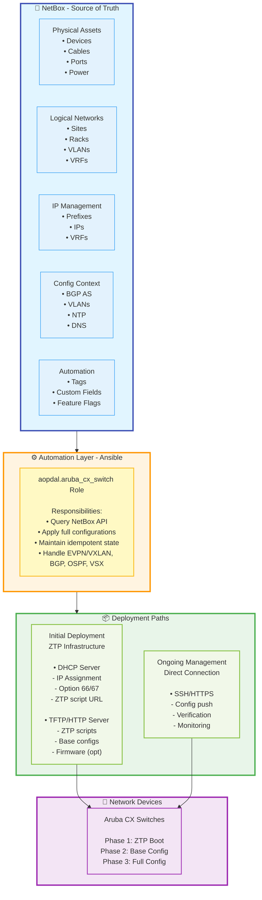
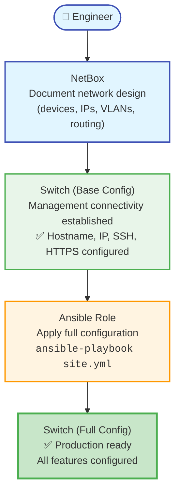
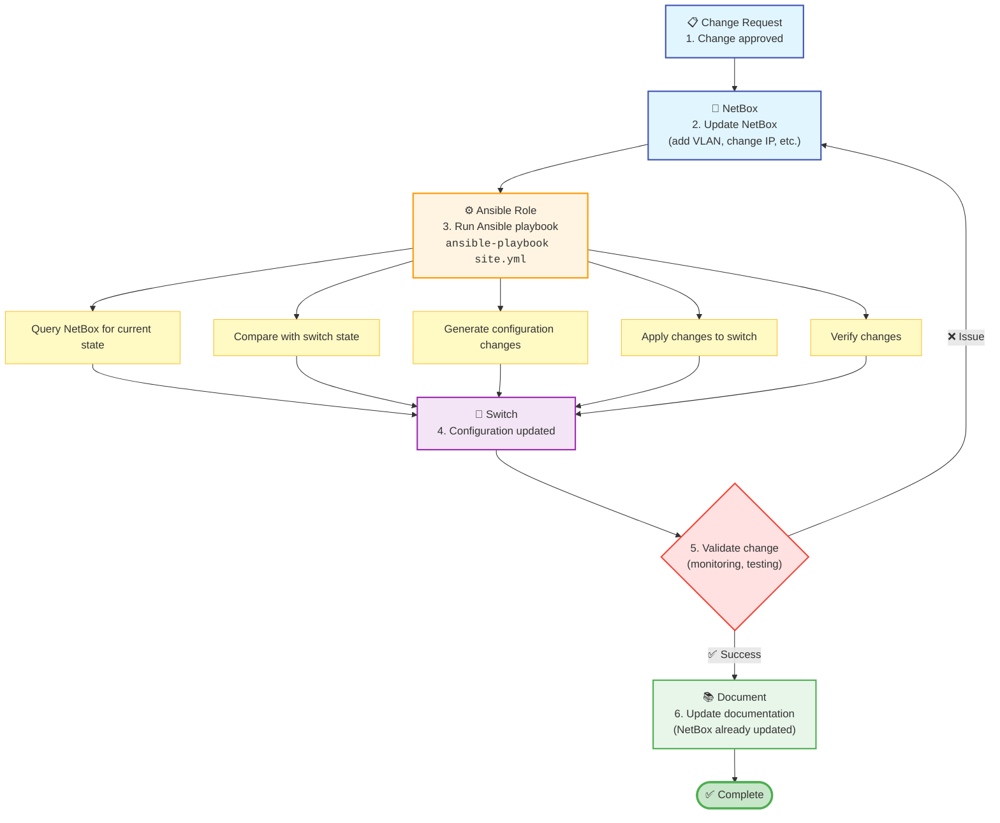

# Network Automation Ecosystem - The Big Picture

This document provides a comprehensive overview of the network automation ecosystem where the `aopdal.aruba_cx_switch` Ansible role operates. It describes the complete lifecycle from initial device deployment through ongoing configuration management.

## Table of Contents

- [Architecture Overview](#architecture-overview)
- [Components and Responsibilities](#components-and-responsibilities)
- [Lifecycle Phases](#lifecycle-phases)
- [Data Flow](#data-flow)
- [Integration Points](#integration-points)
- [Best Practices](#best-practices)

---

## Architecture Overview



---

## Components and Responsibilities

### 1. NetBox (Source of Truth)

**Scope: Complete Network Inventory and Configuration Data**

#### In Scope (Used by This Role)

- ✅ **Device Information**: Hostname, platform, serial number, management IP
- ✅ **Interfaces**: Physical ports, LAGs, SVIs, loopbacks
- ✅ **L2 Configuration**: VLANs, trunk/access ports, allowed VLANs
- ✅ **L3 Configuration**: IP addresses, VRFs, routing
- ✅ **Routing Protocols**: BGP (via netbox-bgp plugin), OSPF areas
- ✅ **EVPN/VXLAN**: VNI mappings, EVPN instance configuration
- ✅ **Virtual Chassis**: VSX configuration data
- ✅ **Config Context**: System settings (NTP, DNS, timezone, banner)
- ✅ **Custom Fields**: Feature flags (device_bgp, device_evpn, device_vxlan, device_vsx)
- ✅ **Tags**: Automation control (ztp_ready, production, staging)

#### Out of Scope (Not Used by This Role, but Important)

- 📋 **Physical Documentation**: Cable management, rack elevations, power circuits
- 📋 **Site Information**: Address, contact information, facility details
- 📋 **Circuit Management**: WAN links, ISP information
- 📋 **Asset Management**: Purchase orders, warranties, contracts
- 📋 **Power Management**: PDUs, power feeds, redundancy

**Why Document These?**
While not used for configuration automation, these provide critical context for:

- Troubleshooting physical layer issues
- Planning upgrades and expansions
- Capacity management
- Disaster recovery

### 2. Ansible

**Scope: Configuration Orchestration and Deployment**

#### This Role (`aopdal.aruba_cx_switch`)

**Responsibilities:**

- ✅ Query NetBox API for device configuration
- ✅ Deploy complete switch configurations via SSH/HTTPS
- ✅ Maintain idempotent configuration state
- ✅ Handle complex features (EVPN, VXLAN, BGP, OSPF, VSX)
- ✅ Provide cleanup of removed configurations (idempotent mode)

**Does NOT Handle:**

- ❌ DHCP server configuration
- ❌ TFTP/HTTP server configuration
- ❌ Generate config for ZTP
- ❌ ZTP script deployment to servers
- ❌ Firmware management
- ❌ Backup/restore operations (separate roles recommended)

### 3. ZTP Infrastructure (Initial Deployment)

**Scope: Zero Touch Provisioning for New Devices**

#### DHCP Server (Out of Scope for This Role)

**Responsibilities:**

- Provide IP address to new switches
- Provide default gateway
- Provide DNS servers
- Provide ZTP bootfile-name
- Provide firmware version and location

**Example Configuration (ISC DHCP):**
```conf
# Aruba CX ZTP Configuration
subclass "Vendor-Class" "Aruba JL725A 6200F" {
    option vendor-class-identifier "Aruba JL725A 6200F";
    option aruba.image-file-name "ArubaOS-CX_6200_10_13_1040.swi";
    option aruba.config-file-name "aoscx_base.conf";
}

subclass "Vendor-Class" "Aruba JL719C 8360" {
    option vendor-class-identifier "Aruba JL719C 8360";
    option aruba.image-file-name "ArubaOS-CX_8360-8100_10_13_1010.swi";
    option aruba.config-file-name "aoscx_dc_base.conf";
}

```

#### TFTP/HTTP Server (Out of Scope for This Role)

**Responsibilities:**

- Host generated base configurations
- (Optional) Host firmware images

**Directory Structure Example:**
```
/srv/tftp
├── ArubaOS-CX_6200_10_13_1040.swi
├── ArubaOS-CX_8360-8100_10_13_1010.swi
├── aoscx_base.conf
└── aoscx_dc_base.conf
```

### 4. Network Devices (Aruba CX Switches)

**Lifecycle Phases:**

1. **Factory Default** → DHCP request
2. **ZTP 1. Phase** → Download and compare firmware version
3. **ZTP 2. Phase** → Download and apply base config
4. **Bootstrap Complete** → Management connectivity established
5. **Ongoing Management** → Full configuration via Ansible

---

## Lifecycle Phases

### Phase 1: Planning and Documentation (NetBox)

**Objective:** Define the desired network state before any equipment arrives.

**Activities:**

**Site Planning**

- Create sites in NetBox
- Document racks and rack units
- Plan power distribution

**Device Documentation**

- Add devices to NetBox (can be pre-populated before physical arrival)
- Set device type, role, platform
- Record serial numbers (when known)
- Assign management IP addresses

**Network Design**

- Define VLANs and prefixes
- Create VRFs for multi-tenancy
- Plan IP addressing scheme
- Design routing topology (BGP AS, OSPF areas)

**Configuration Context**

- Set system-wide settings (NTP, DNS, timezone)
- Define site-specific or role-specific configurations
- Configure BGP fallback parameters

**Custom Fields**

- Set feature flags (device_bgp, device_evpn, device_vxlan, device_vsx)
- Tag devices for automation (ztp_ready, staging, production)

**Output:** Complete network design documented in NetBox.

---

### Phase 2: Staging of device

- Out of scope for this role

---

### Phase 3: Physical Installation

**Objective:** Install equipment in data center or network closet.

**Activities:**

**Physical Installation** (Documented in NetBox)

- Mount devices in racks
- Connect power cables (document in NetBox)
- Connect network cables (document in NetBox)
- Connect management interface to ZTP network

---

### Phase 4: Full Configuration Deployment (Ansible)

**Objective:** Apply complete network configuration from NetBox.

**Prerequisites:**

- Device accessible via management IP
- SSH/HTTPS enabled
- Admin credentials configured

**Process:**

```bash
# Deploy full configuration to all devices
ansible-playbook -i netbox_inventory.yml site.yml

# Or specific devices
ansible-playbook -i netbox_inventory.yml site.yml --limit sw01-lab

# Or specific features
ansible-playbook -i netbox_inventory.yml site.yml --tags vlans,bgp
```

**Configuration Applied:**

- ✅ Base system (NTP, DNS, timezone, banner)
- ✅ VRFs
- ✅ VLANs
- ✅ Physical interfaces (enable/disable, descriptions)
- ✅ LAG interfaces (LACP)
- ✅ L2 interfaces (access/trunk ports)
- ✅ L3 interfaces (IP addresses, VRF attachment)
- ✅ Loopback interfaces
- ✅ EVPN/VXLAN (if enabled)
- ✅ BGP configuration (if enabled)
- ✅ OSPF configuration (if enabled)
- ✅ VSX virtual chassis (if enabled)

**Key Features:**

- **Idempotent:** Safe to run multiple times
- **NetBox-driven:** All config from NetBox
- **Feature flags:** Control what gets configured via custom fields
- **Validation:** Automatic verification of applied configuration

---

### Phase 5: Ongoing Management

**Objective:** Maintain network configuration in sync with NetBox.

**Activities:**

**Configuration Changes**

```
Change Request → Update NetBox → Run Ansible → Verify
```

**Idempotent Mode**

```yaml
aoscx_idempotent_mode: true
```

- Adds configurations from NetBox
- **Removes** configurations not in NetBox
- Ensures switches match NetBox exactly

**Regular Synchronization**

```bash
# Daily/weekly scheduled job
ansible-playbook -i netbox_inventory.yml site.yml
```

**Change Validation**

- Ansible reports changes made
- Compare before/after state
- Rollback if needed

**Documentation Updates**

- Update NetBox when changes occur
- NetBox remains authoritative source
- Audit trail of all changes

---

## Data Flow

### Initial Deployment Flow



### Ongoing Management Flow



---

## Integration Points

### NetBox API Integration

**Authentication:**

```yaml
netbox_url: https://netbox.example.com
netbox_token: "{{ vault_netbox_token }}"
```

**Queried Objects:**

- Devices (filtered by tags, roles, sites)
- Interfaces (physical, virtual, LAG)
- IP addresses
- VLANs and prefixes
- VRFs
- Config context
- Custom fields
- Tags
- BGP sessions (netbox-bgp plugin)

**Dynamic Inventory:**

```bash
# Use NetBox as dynamic inventory source
ansible-playbook -i netbox_inventory.yml site.yml
```

### Collections Used

**Required Collections:**

- `arubanetworks.aoscx` >= 4.4.0 - Aruba CX modules
- `netbox.netbox` >= 3.21.0 - NetBox inventory and modules

**Python Libraries:**

- `pyaoscx` - Aruba CX SDK
- `pynetbox` - NetBox API client

### External Systems (Out of Scope)

While not managed by this role, integration points exist for:

**Monitoring Systems** (Prometheus, SNMP)

- Switch metrics and health
- Interface statistics
- BGP/OSPF status

**Logging Systems** (Syslog, ELK)

- Configuration changes
- System events
- Security logs

**Backup Systems**

- Configuration backups
- Automated snapshots before changes

**CI/CD Pipelines**

- Automated testing of configuration changes
- Rollback procedures
- Change approval workflows

---

## Best Practices

### 1. NetBox as Single Source of Truth

**Do:**

- ✅ Always update NetBox first, then run Ansible
- ✅ Use config context for site/role-specific settings
- ✅ Tag devices appropriately (production, staging, ztp_ready)
- ✅ Document physical infrastructure even if not used for automation
- ✅ Use custom fields for feature flags

**Don't:**

- ❌ Make manual changes to switches without updating NetBox
- ❌ Store configuration in multiple places
- ❌ Bypass NetBox for "quick fixes"

### 2. Idempotent Operations

**Do:**

- ✅ Run Ansible regularly (daily/weekly)
- ✅ Enable idempotent mode in production
  ```yaml
  aoscx_idempotent_mode: true
  ```
- ✅ Use `--check` mode to preview changes
- ✅ Test changes in staging environment first

**Don't:**

- ❌ Fear running Ansible multiple times
- ❌ Make manual changes that conflict with NetBox

### 3. Change Management

**Process:**

```
1. Create change request
2. Update NetBox (staging)
3. Test with Ansible in lab/staging
4. Approve change
5. Update NetBox (production)
6. Run Ansible in production
7. Verify and document
```

**Do:**

- ✅ Use version control for Ansible playbooks
- ✅ Tag production-ready devices appropriately
- ✅ Maintain separate staging environment
- ✅ Use `--limit` and `--tags` for targeted changes
- ✅ Review Ansible output for unexpected changes

**Don't:**

- ❌ Skip testing in staging
- ❌ Run massive changes without review
- ❌ Ignore Ansible warnings or errors

### 4. Security

**Do:**

- ✅ Use Ansible Vault for all credentials
  ```bash
  ansible-vault create group_vars/all/vault.yml
  ```
- ✅ Rotate passwords regularly
- ✅ Use SSH keys where possible
- ✅ Restrict Ansible controller access
- ✅ Audit NetBox access logs
- ✅ Use HTTPS for NetBox API

**Don't:**

- ❌ Store passwords in plain text
- ❌ Use same password across all devices
- ❌ Share Ansible Vault passwords insecurely

### 5. Documentation

**NetBox Documentation:**

- Device serial numbers
- Cable connections (even if not used for config)
- Rack locations
- Power connections
- Circuit IDs
- Contact information

**Ansible Documentation:**

- Playbook usage examples
- Variable definitions
- Custom filters and plugins
- Troubleshooting guides

**Why Document Physical Infrastructure?**

Even though physical documentation isn't used for automation:

- Essential for troubleshooting
- Required for disaster recovery
- Helps plan capacity
- Assists with maintenance
- Provides complete network picture

---

## Troubleshooting

### Configuration Issues

**Problem:** Ansible can't connect to device

- Verify device is in NetBox
- Check management IP reachability
- Confirm SSH/HTTPS is enabled
- Validate credentials

**Problem:** Changes not applied

- Check Ansible output for errors
- Verify NetBox data is correct
- Review custom fields and tags
- Check idempotent mode setting

**Problem:** Unexpected configuration removed

- Check idempotent mode is desired
- Verify all required config is in NetBox
- Review Ansible diff output before applying

---

## Summary

This network automation ecosystem provides:

- ✅ **Single Source of Truth:** NetBox contains all network design and configuration
- ✅ **Automated Deployment:** ZTP for initial setup, Ansible for full configuration
- ✅ **Idempotent State:** Switches automatically sync with NetBox
- ✅ **Complete Lifecycle:** From planning through ongoing management
- ✅ **Scalability:** Handle hundreds of switches from single control point
- ✅ **Auditability:** All changes tracked through NetBox and Ansible

The `aopdal.aruba_cx_switch` role is a key component in this ecosystem, bridging NetBox (source of truth) with Aruba CX switches (network infrastructure).

---

## Related Documentation

- [NETBOX_INTEGRATION.md](NETBOX_INTEGRATION.md) - NetBox configuration and custom fields
- [QUICKSTART.md](QUICKSTART.md) - Getting started with the role
- [REQUIREMENTS.md](REQUIREMENTS.md) - Required software and libraries
- [EVPN_VXLAN_CONFIGURATION.md](EVPN_VXLAN_CONFIGURATION.md) - EVPN/VXLAN fabric setup
- [BGP_CONFIGURATION.md](BGP_CONFIGURATION.md) - BGP configuration options
