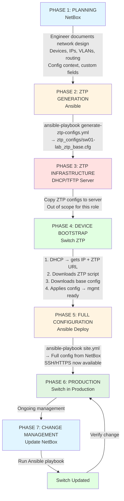
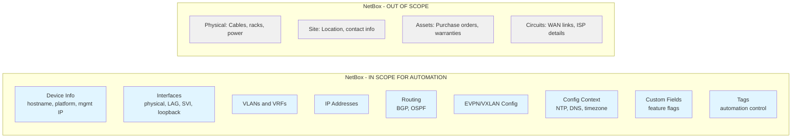
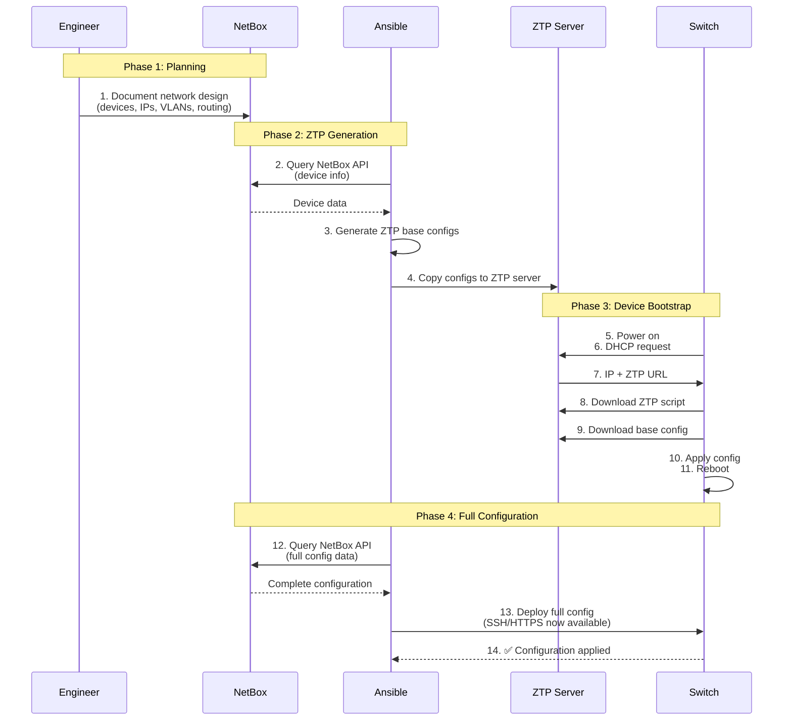
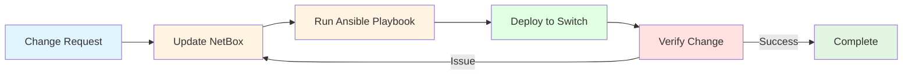
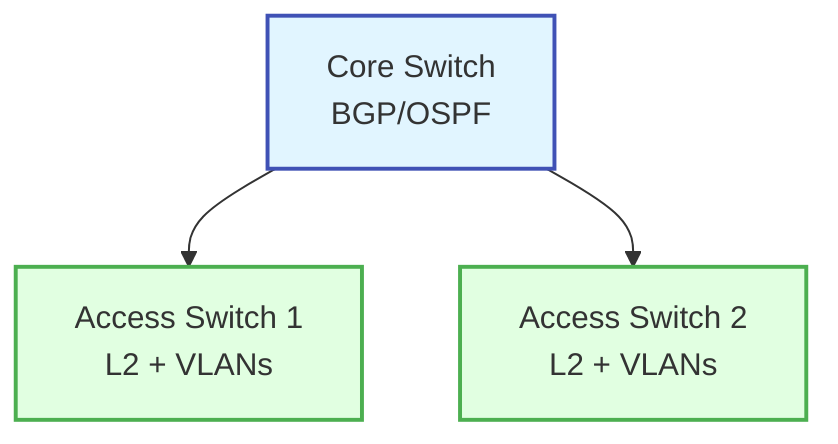
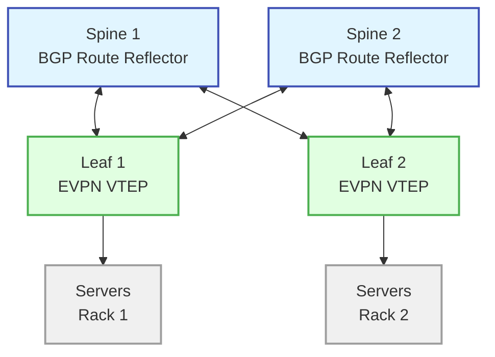
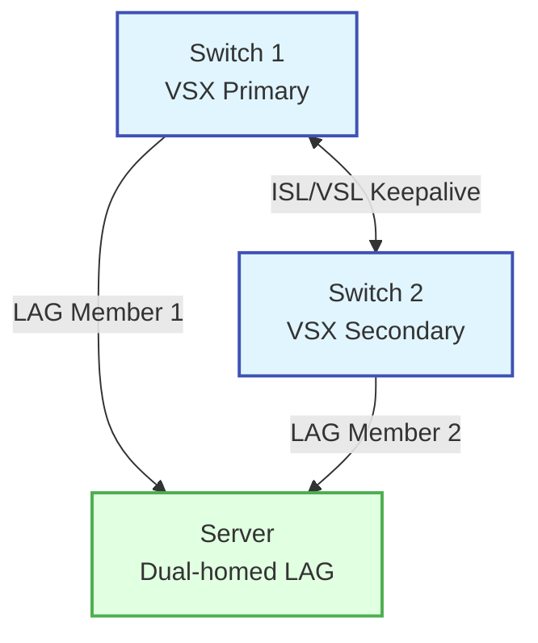
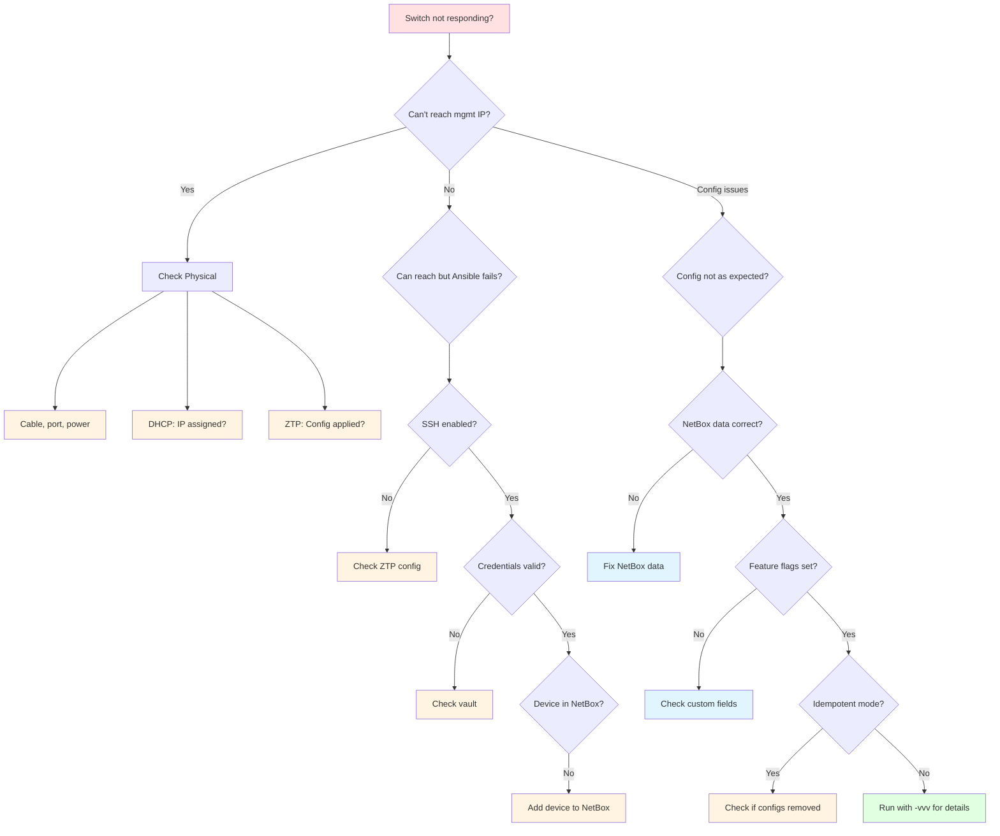

# Network Automation Ecosystem - Visual Reference

This document provides simplified visual diagrams for the automation ecosystem.

## Quick Reference Diagram



## Component Responsibilities

### NetBox (Source of Truth)



### Ansible Role (aopdal.aruba_cx_switch)

**RESPONSIBILITIES:**

- Query NetBox API
- Transform NetBox data into Aruba CX CLI
- Generate Jinja2 templates
- Execute arubanetworks.aoscx collection modules
- Manage configuration lifecycle
- Generate ZTP base configs (before devices exist)

### ZTP Infrastructure (DHCP/TFTP Server)

**OUT OF SCOPE** for this role, but critical for the ecosystem:

- Host ZTP scripts and base configs
- DHCP option configuration (ZTP URL)
- TFTP/HTTP file serving

### Aruba CX Switch

**RESPONSIBILITIES:**

- Execute ZTP process on first boot
- Accept configuration via SSH/HTTPS
- Report status and health

---

## Detailed Data Flow: ZTP to Production



---

## Data Flow: Ongoing Change Management



---

## Network Topologies Supported

### Simple Access Network



### EVPN/VXLAN Fabric



### VSX Pair



---

## Feature Interaction Matrix

| Feature | BGP | OSPF | EVPN | VXLAN | VSX | VRFs |
|---------|:---:|:----:|:----:|:-----:|:---:|:----:|
| **BGP**    | ● | ○ | ● | ○ | ● | ● |
| **OSPF**   | ○ | ● | ● | ● | ● | ● |
| **EVPN**   | ● | ● | ● | ● | ● | ○ |
| **VXLAN**  | ○ | ● | ● | ● | ● | ○ |
| **VSX**    | ● | ● | ● | ● | ● | ● |
| **VRFs**   | ● | ● | ○ | ○ | ● | ● |

**Legend:**

- ● = Required/Strongly recommended
- ○ = Compatible/Optional
- × = Incompatible/Not supported together

**Note:** OSPF is commonly used in EVPN/VXLAN fabrics for underlay routing (loopback reachability between leafs and spines), while eBGP handles the overlay (EVPN control plane).

---

## Troubleshooting Decision Tree



## Quick Command Reference

```bash
# Generate ZTP configs (no device connection needed)
ansible-playbook -i inventory.yml generate-ztp.yml

# Deploy full config to all devices
ansible-playbook -i netbox_inventory.yml site.yml

# Deploy to specific devices
ansible-playbook -i netbox_inventory.yml site.yml --limit sw01,sw02

# Deploy specific features only
ansible-playbook -i netbox_inventory.yml site.yml --tags vlans,bgp

# Check what would change (dry-run)
ansible-playbook -i netbox_inventory.yml site.yml --check --diff

# Enable idempotent mode (remove configs not in NetBox)
ansible-playbook -i netbox_inventory.yml site.yml -e aoscx_idempotent_mode=true

# Verbose output for troubleshooting
ansible-playbook -i netbox_inventory.yml site.yml -vvv
```

See [AUTOMATION_ECOSYSTEM.md](AUTOMATION_ECOSYSTEM.md) for complete details.
