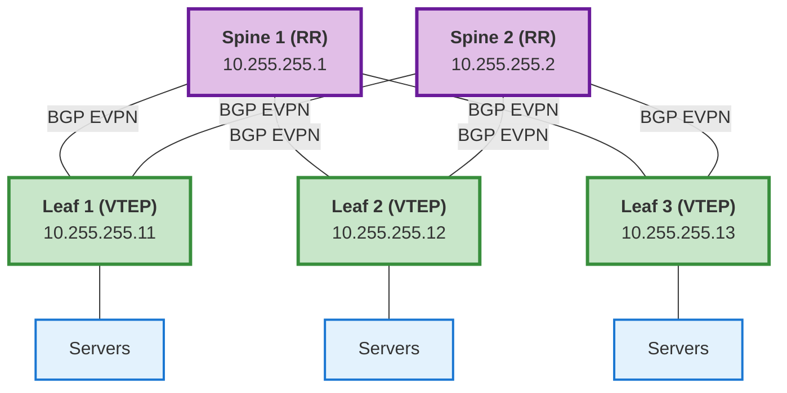

# BGP Configuration for EVPN/VXLAN Fabric

## Overview

This task configures BGP with EVPN (Ethernet VPN) address family support for overlay networking in VXLAN fabrics. It supports:

- BGP router process with Router ID
- EVPN neighbors for overlay
- Optional IPv4 unicast neighbors for underlay
- VRF instances with route distinguishers
- Route reflector configuration
- Additional custom BGP settings

## Requirements

### NetBox Custom Fields

| Field Name | Type | Required | Description |
|------------|------|----------|-------------|
| `device_bgp` | Boolean | Yes | Enable BGP on this device |
| `device_bgp_routerid` | String | Yes | BGP Router ID (typically loopback IP) |

### NetBox Config Context Structure

#### Minimal Configuration (Spine/Leaf)

```json
{
  "bgp_as": 65000,
  "bgp_peers": [
    {
      "peer": "10.255.255.1",
      "remote_as": 65000,
      "update_source": "loopback 0"
    },
    {
      "peer": "10.255.255.2",
      "remote_as": 65000,
      "update_source": "loopback 0"
    }
  ]
}
```

#### Complete EVPN/VXLAN Fabric Configuration

**Spine (Route Reflector):**
```json
{
  "bgp_as": 65000,
  "bgp_peers": [
    {
      "peer": "10.255.255.11",
      "remote_as": 65000,
      "update_source": "loopback 0"
    },
    {
      "peer": "10.255.255.12",
      "remote_as": 65000,
      "update_source": "loopback 0"
    },
    {
      "peer": "10.255.255.13",
      "remote_as": 65000,
      "update_source": "loopback 0"
    },
    {
      "peer": "10.255.255.14",
      "remote_as": 65000,
      "update_source": "loopback 0"
    }
  ],
  "bgp_rr_clients": [
    {"peer": "10.255.255.11"},
    {"peer": "10.255.255.12"},
    {"peer": "10.255.255.13"},
    {"peer": "10.255.255.14"}
  ],
  "bgp_additional_config": [
    "maximum-paths 4",
    "timers bgp 3 9",
    "distance bgp 20 200 200"
  ]
}
```

**Leaf (VTEP):**
```json
{
  "bgp_as": 65000,
  "bgp_peers": [
    {
      "peer": "10.255.255.1",
      "remote_as": 65000,
      "update_source": "loopback 0"
    },
    {
      "peer": "10.255.255.2",
      "remote_as": 65000,
      "update_source": "loopback 0"
    }
  ],
  "bgp_vrfs": [
    {
      "name": "TENANT-A",
      "rd": "10.255.255.11:1001"
    },
    {
      "name": "TENANT-B",
      "rd": "10.255.255.11:1002"
    }
  ]
}
```

#### With IPv4 Unicast (Underlay + Overlay)

```json
{
  "bgp_as": 65000,
  "bgp_ipv4_peers": [
    {
      "peer": "10.1.1.1",
      "remote_as": 65000,
      "update_source": "loopback 0"
    }
  ],
  "bgp_peers": [
    {
      "peer": "10.255.255.1",
      "remote_as": 65000,
      "update_source": "loopback 0"
    },
    {
      "peer": "10.255.255.2",
      "remote_as": 65000,
      "update_source": "loopback 0"
    }
  ]
}
```

## NetBox Custom Fields Configuration

### 1. Create Boolean Field
```
Name: device_bgp
Type: Boolean
Object Types: dcim > device
Label: Enable BGP
Description: Enable BGP routing on this device
Default: False
```

### 2. Create Text Field
```
Name: device_bgp_routerid
Type: Text
Object Types: dcim > device
Label: BGP Router ID
Description: BGP router ID (typically loopback 0 IP address)
Validation Regex: ^(\d{1,3}\.){3}\d{1,3}$
```

## Configuration Examples

### Example 1: Simple EVPN Spine-Leaf

**Spine 1 (10.255.255.1):**

- Custom Field: `device_bgp` = `True`
- Custom Field: `device_bgp_routerid` = `10.255.255.1`
- Config Context:
```json
{
  "bgp_as": 65000,
  "bgp_peers": [
    {"peer": "10.255.255.11", "remote_as": 65000},
    {"peer": "10.255.255.12", "remote_as": 65000}
  ],
  "bgp_rr_clients": [
    {"peer": "10.255.255.11"},
    {"peer": "10.255.255.12"}
  ]
}
```

**Leaf 1 (10.255.255.11):**

- Custom Field: `device_bgp` = `True`
- Custom Field: `device_bgp_routerid` = `10.255.255.11`
- Config Context:
```json
{
  "bgp_as": 65000,
  "bgp_peers": [
    {"peer": "10.255.255.1"},
    {"peer": "10.255.255.2"}
  ]
}
```

### Example 2: Multi-Tenant Leaf with VRFs

**Leaf with Tenants (10.255.255.11):**
```json
{
  "bgp_as": 65000,
  "bgp_peers": [
    {
      "peer": "10.255.255.1",
      "remote_as": 65000,
      "update_source": "loopback 0"
    },
    {
      "peer": "10.255.255.2",
      "remote_as": 65000,
      "update_source": "loopback 0"
    }
  ],
  "bgp_vrfs": [
    {
      "name": "PRODUCTION",
      "rd": "10.255.255.11:10"
    },
    {
      "name": "DEVELOPMENT",
      "rd": "10.255.255.11:20"
    },
    {
      "name": "MANAGEMENT",
      "rd": "10.255.255.11:30"
    }
  ]
}
```

### Example 3: Border Leaf with External Connectivity

**Border Leaf (10.255.255.15):**
```json
{
  "bgp_as": 65000,
  "bgp_peers": [
    {
      "peer": "10.255.255.1",
      "remote_as": 65000,
      "update_source": "loopback 0"
    },
    {
      "peer": "10.255.255.2",
      "remote_as": 65000,
      "update_source": "loopback 0"
    }
  ],
  "bgp_ipv4_peers": [
    {
      "peer": "192.168.100.1",
      "remote_as": 65100,
      "update_source": "vlan 100"
    }
  ],
  "bgp_vrfs": [
    {
      "name": "INTERNET",
      "rd": "10.255.255.15:999"
    }
  ],
  "bgp_additional_config": [
    "maximum-paths 4",
    "maximum-paths ibgp 4"
  ]
}
```

## Field Descriptions

### config_context.bgp_as

- **Type**: Integer
- **Required**: Yes
- **Description**: BGP Autonomous System number
- **Example**: `65000`

### config_context.bgp_peers

- **Type**: List of objects
- **Required**: Yes (for EVPN)
- **Description**: BGP neighbors for EVPN address family
- **Fields**:
  - `peer` (required): Neighbor IP address (typically loopback)
  - `remote_as` (optional): Remote AS number (defaults to local AS for iBGP)
  - `update_source` (optional): Update source interface (defaults to "loopback 0")

### config_context.bgp_ipv4_peers

- **Type**: List of objects
- **Required**: No
- **Description**: BGP neighbors for IPv4 unicast address family (underlay or external)
- **Fields**: Same as bgp_peers

### config_context.bgp_vrfs

- **Type**: List of objects
- **Required**: No
- **Description**: VRF instances for multi-tenancy
- **Fields**:
  - `name` (required): VRF name
  - `rd` (required): Route Distinguisher in format `IP:ID` or `ASN:ID`

### config_context.bgp_rr_clients

- **Type**: List of objects
- **Required**: No (only for route reflectors)
- **Description**: Neighbors to be configured as route reflector clients
- **Fields**:
  - `peer` (required): Neighbor IP address

### config_context.bgp_additional_config

- **Type**: List of strings
- **Required**: No
- **Description**: Additional BGP configuration commands
- **Example**: `["maximum-paths 4", "timers bgp 3 9"]`

## Typical EVPN/VXLAN Fabric Architecture



### BGP Configuration Roles:

- **Spine**: Route reflectors for EVPN control plane
- **Leaf**: VTEP endpoints, VRF for tenants
- **All**: iBGP peering using loopback addresses

## Enable/Disable BGP

### Role Variable
```yaml
# In your playbook or group_vars
aoscx_configure_bgp: true
```

### NetBox Custom Field
```yaml
# Per device in NetBox
device_bgp: true
device_bgp_routerid: "10.255.255.11"
```

Both conditions must be true for BGP to be configured.

## Running BGP Configuration

### Full Run (Includes BGP)
```bash
ansible-playbook configure_aoscx.yml -l leaf-switches
```

### Explicit BGP Only (Tag-Dependent)
```bash
# Only configure BGP (tag-dependent - requires explicit request)
ansible-playbook configure_aoscx.yml -l leaf-switches -t bgp

# Or use routing tag
ansible-playbook configure_aoscx.yml -l leaf-switches -t routing
```

### Safe Run (Excludes BGP)
```bash
# VLANs only - BGP will NOT run
ansible-playbook configure_aoscx.yml -l leaf-switches -t vlans

# Interfaces only - BGP will NOT run
ansible-playbook configure_aoscx.yml -l leaf-switches -t interfaces
```

## Verification Commands

```bash
# Check BGP summary
show bgp summary

# Check EVPN neighbors
show bgp l2vpn evpn summary

# Check VRF instances
show bgp vrf all

# Check EVPN routes
show bgp l2vpn evpn

# Check route reflector clients
show bgp neighbors
```

## Troubleshooting

### BGP Not Configured

**Issue**: BGP configuration skipped

**Check**:
```yaml
# 1. Role variable enabled
aoscx_configure_bgp: true

# 2. NetBox custom field set
device_bgp: true

# 3. Tags used correctly
ansible-playbook configure_aoscx.yml -t bgp  # or -t routing, or no tags
```

### Router ID Not Set

**Issue**: Missing router ID

**Solution**: Set `device_bgp_routerid` in NetBox custom fields
```
Device → Custom Fields → device_bgp_routerid = "10.255.255.11"
```

### EVPN Neighbors Not Establishing

**Check**:

1. Loopback 0 configured and reachable
2. Underlay routing (OSPF) working
3. BGP peer addresses correct in config_context
4. Route reflector configured on spines

### VRF Configuration Failed

**Check**:

1. VRF exists (configure_vrfs.yml runs before BGP)
2. Route distinguisher format correct: `IP:ID` or `ASN:ID`
3. VRF name matches exactly

## Integration with VXLAN

BGP EVPN works with VXLAN configuration:

1. **Loopback configured** (VTEP source)
2. **Underlay routing** (OSPF for reachability)
3. **BGP EVPN** (overlay control plane) ← This task
4. **VXLAN tunnels** (data plane)
5. **VLANs mapped to VNIs** (tenant networks)

## Best Practices

1. **Use iBGP**: Same AS for all fabric devices
2. **Loopback peering**: Always peer using loopback addresses
3. **Route reflectors**: Use spines as RRs to reduce peering mesh
4. **Consistent Router IDs**: Use loopback IP as router ID
5. **VRF naming**: Use consistent naming scheme across fabric
6. **Route distinguishers**: Use format `loopback-ip:vrf-id` for uniqueness

## Related Tasks

- `configure_loopback.yml` - Configure loopback interface for BGP peering
- `configure_ospf.yml` - Configure underlay routing
- `configure_vrfs.yml` - Configure VRF instances before BGP
- `configure_vxlan.yml` - Configure VXLAN tunnels
- `configure_evpn.yml` - Configure EVPN settings

## References

- [Aruba CX EVPN-VXLAN Configuration Guide](https://www.arubanetworks.com/techdocs/AOS-CX/10.13/HTML/evpn_vxlan/)
- [BGP EVPN Best Practices](https://www.arubanetworks.com/techdocs/AOS-CX/10.13/HTML/routing/)
