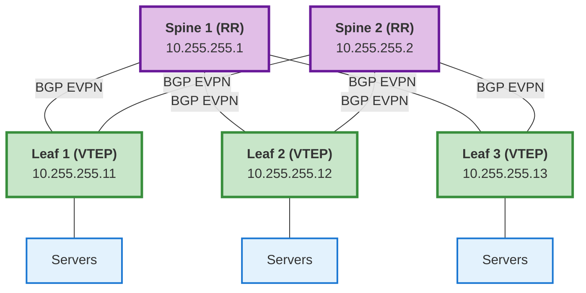
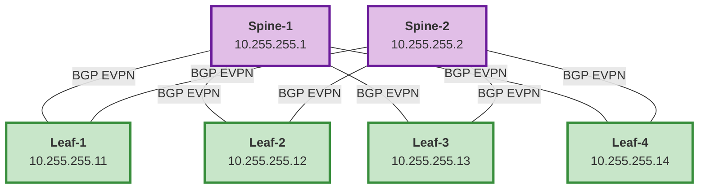

# BGP Configuration

## Overview

This document covers all aspects of BGP configuration for EVPN/VXLAN fabrics using this role,
including:

- BGP router process with Router ID
- EVPN neighbors for overlay
- Optional IPv4 unicast neighbors for underlay
- VRF instances with route distinguishers
- Route reflector configuration
- NetBox BGP plugin integration for structured data models
- Routing policies, prefix lists, and VRF BGP sessions

---

## Architecture



### BGP Configuration Roles

| Role | Function |
|------|----------|
| **Spine** | Route reflectors for EVPN control plane |
| **Leaf** | VTEP endpoints, VRF for tenants |
| **All** | iBGP peering using loopback addresses |

---

## NetBox Setup

### Custom Fields

Two custom fields must exist on every `dcim > device` object:

#### 1. Enable BGP (Boolean)

```
Name: device_bgp
Type: Boolean
Object Types: dcim > device
Label: Enable BGP
Description: Enable BGP routing on this device
Default: False
```

#### 2. BGP Router ID (Text)

```
Name: device_bgp_routerid
Type: Text
Object Types: dcim > device
Label: BGP Router ID
Description: BGP router ID (typically loopback 0 IP address)
Validation Regex: ^(\d{1,3}\.){3}\d{1,3}$
```

Set per device:

```yaml
device_bgp: true
device_bgp_routerid: "10.255.255.11"
```

Both conditions must be `true` for BGP to be configured on a device.

---

### NetBox BGP Plugins

The role requires one of two structured BGP plugins. The use of `config_context` for BGP data is
not supported.

#### netbox-bgp (legacy, default)

The [netbox-bgp](https://github.com/netbox-community/netbox-bgp) plugin. Set
`aoscx_bgp_plugin: "netbox-bgp"` (or leave at default).

#### netbox-routing (newer)

The [netbox-routing](https://github.com/netbox-community/netbox-routing) plugin. Set
`aoscx_bgp_plugin: "netbox-routing"`.

```bash
pip install netbox-routing

# Enable in NetBox configuration
PLUGINS = ['netbox_routing']

echo "netbox-routing" >> /opt/netbox/local_requirements.txt
cd /opt/netbox/netbox && python3 manage.py migrate
sudo systemctl restart netbox
```

---

#### Why Use a Plugin?

| Feature | config_context | netbox-bgp plugin |
|---------|---------------|-------------------|
| Structured data models | ❌ Free-form JSON | ✅ Proper objects |
| Field validation | ❌ None | ✅ AS numbers, IPs |
| Object relationships | ❌ None | ✅ Links sessions to devices, peers, policies |
| Status tracking | ❌ None | ✅ Active, Planned, Offline |
| Querying across devices | ❌ Hard | ✅ RESTful API |
| Change history / audit | ❌ None | ✅ Full NetBox changelog |

#### Plugin Data Models

1. **BGP Sessions** — Individual BGP neighbor relationships
2. **BGP Peer Groups** — Template for common neighbor settings
3. **BGP Communities** — Community definitions
4. **Routing Policies** — Import/export policies
5. **Prefix Lists** — Prefix filtering
6. **AS Path Lists** — AS path filtering

#### Installation

```bash
# Install the plugin
pip install netbox-bgp

# Enable in NetBox configuration (/opt/netbox/netbox/netbox/configuration.py)
PLUGINS = ['netbox_bgp']

# Add to local requirements
echo "netbox-bgp" >> /opt/netbox/local_requirements.txt

# Run migrations and restart
cd /opt/netbox/netbox
python3 manage.py migrate
sudo systemctl restart netbox
```

Verify:

```bash
curl -H "Authorization: Token YOUR_TOKEN" \
  http://netbox-url/api/plugins/installed-plugins/
```

#### BGP Session Fields

| Field | Type | Description |
|-------|------|-------------|
| `name` | String | Session identifier |
| `device` | ForeignKey | Device this session belongs to |
| `local_as` | ForeignKey | Local AS number |
| `remote_as` | ForeignKey | Remote AS number |
| `local_address` | IPAddress | Local IP (e.g., loopback) |
| `remote_address` | IPAddress | Remote IP (neighbor) |
| `status` | Choice | Active, Planned, Offline, etc. |
| `peer_group` | ForeignKey | Optional peer group template |
| `import_policies` | ManyToMany | Import routing policies |
| `export_policies` | ManyToMany | Export routing policies |
| `description` | String | Session description |

#### API Endpoints

```
GET /api/plugins/bgp/session/
GET /api/plugins/bgp/session/{id}/
GET /api/plugins/bgp/peer-group/
GET /api/plugins/bgp/peer-group/{id}/
GET /api/plugins/bgp/community/
GET /api/plugins/bgp/community/{id}/
GET /api/plugins/bgp/routing-policy/
GET /api/plugins/bgp/routing-policy/{id}/
GET /api/plugins/bgp/routing-policy-rule/
GET /api/plugins/bgp/routing-policy-rule/{id}/
GET /api/plugins/bgp/prefix-list/
GET /api/plugins/bgp/prefix-list/{id}/
GET /api/plugins/bgp/prefix-list-rule/
GET /api/plugins/bgp/prefix-list-rule/{id}/
GET /api/plugins/bgp/asn/
GET /api/plugins/bgp/asn/{id}/
```

#### Query BGP Sessions (CLI / Python)

```bash
curl -H "Authorization: Token YOUR_TOKEN" \
  "http://netbox-url/api/plugins/bgp/session/?device=leaf-1"
```

```python
import requests

netbox_url = "https://netbox.example.com"
headers = {"Authorization": f"Token YOUR_NETBOX_TOKEN", "Content-Type": "application/json"}

response = requests.get(
    f"{netbox_url}/api/plugins/bgp/session/",
    headers=headers,
    params={"device": "leaf-1"}
)

for session in response.json()["results"]:
    print(f"Neighbor: {session['remote_address']['address']}")
    print(f"Remote AS: {session['remote_as']['asn']}")
    print(f"Status: {session['status']['value']}")
```

---

## Plugin Selection

The role supports two NetBox BGP plugins. Choose one via `aoscx_bgp_plugin`.

| Value | Plugin | API Base Path |
|-------|--------|---------------|
| `"netbox-bgp"` (default) | [netbox-bgp](https://github.com/netbox-community/netbox-bgp) | `/api/plugins/bgp/` |
| `"netbox-routing"` | [netbox-routing](https://github.com/netbox-community/netbox-routing) | `/api/plugins/routing/` |

```yaml
# defaults/main.yml (or group_vars)
aoscx_bgp_plugin: "netbox-bgp"       # legacy plugin — default for existing installs
# aoscx_bgp_plugin: "netbox-routing" # newer plugin — set when migrating
aoscx_use_netbox_bgp_plugin: true     # set false to disable BGP configuration entirely
```

Both plugins produce the same normalised session shape consumed by the rest of the BGP task
pipeline, so all device configuration tasks are identical regardless of which plugin is active.

### netbox-routing Data Model

netbox-routing uses a three-level hierarchy instead of a flat `session` object:

```
bgp/router      — BGP process (ASN, assigned_object → device or interface)
  └─ bgp/scope  — Router + VRF context (vrf: null = default, or named VRF object)
       └─ bgp/peer            — Peer entry (source IP, peer IP, remote AS)
            └─ bgp/peer-address-family  — Per-AF settings (route-maps per direction)
```

Route-maps and prefix-lists share the `/api/plugins/routing/objects/prefix-list/` namespace.
Use `/api/plugins/routing/objects/route-map/` to list route-map objects specifically.

**Key differences from netbox-bgp:**

| Aspect | netbox-bgp | netbox-routing |
|--------|-----------|----------------|
| VRF binding | Inferred from `local_address` interface | Explicit `scope.vrf` object |
| Address families | Implicit (all sessions = all AFs) | Per-scope AF objects + per-peer AF settings |
| Route-map ref in session | FK dict `{id, name}` in policies | Integer ID in `peer-address-family.routemap_in/out` |
| Prefix-list rule field | `index` | `sequence` |
| Route-map rule field | `index` + `set_actions{}` | `sequence` + `set{}` |
| Match prefix-list | `match_ip_address` / `match_ipv6_address` separate | `match_prefix_list[]` unified |
| le/ge support | Not available | `le` and `ge` fields |
| Server-side filters | Work correctly | Ignored — fetch all, filter client-side |

**Note on address families:** Data migrated from netbox-bgp does not include an `l2vpn-evpn` AF
entry. Until explicit AF objects are created in netbox-routing, peers whose scope has
`vrf == null` (global/default VRF) are treated as EVPN peers (same as legacy behaviour).

---

## Enable/Disable BGP

### Role Variable

```yaml
# In your playbook or group_vars
aoscx_configure_bgp: true
```

## Running BGP Configuration

### Full Run (Includes BGP)

```bash
ansible-playbook configure_aoscx.yml -l leaf-switches
```

### Explicit BGP Only (Tag-Dependent)

```bash
# Only configure BGP (tag-dependent — requires explicit request)
ansible-playbook configure_aoscx.yml -l leaf-switches -t bgp

# Or use routing tag
ansible-playbook configure_aoscx.yml -l leaf-switches -t routing
```

### Safe Run (Excludes BGP)

```bash
# VLANs only — BGP will NOT run
ansible-playbook configure_aoscx.yml -l leaf-switches -t vlans

# Interfaces only — BGP will NOT run
ansible-playbook configure_aoscx.yml -l leaf-switches -t interfaces
```

---

## EVPN Fabric Example (2-Spine, 4-Leaf)

### Topology



### IP Addressing & Roles

| Device | Loopback 0 (Router ID) | Role | VTEP |
|--------|------------------------|------|------|
| spine-1 | 10.255.255.1/32 | Route Reflector | No |
| spine-2 | 10.255.255.2/32 | Route Reflector | No |
| leaf-1 | 10.255.255.11/32 | VTEP | Yes |
| leaf-2 | 10.255.255.12/32 | VTEP | Yes |
| leaf-3 | 10.255.255.13/32 | VTEP | Yes |
| leaf-4 | 10.255.255.14/32 | VTEP | Yes |

**BGP AS: 65000 (iBGP for entire fabric)**

### BGP Peering Matrix

| Device | Peers With | Peer Count | Role |
|--------|-----------|------------|------|
| spine-1 | leaf-1, leaf-2, leaf-3, leaf-4 | 4 | Route Reflector |
| spine-2 | leaf-1, leaf-2, leaf-3, leaf-4 | 4 | Route Reflector |
| leaf-1 | spine-1, spine-2 | 2 | RR Client |
| leaf-2 | spine-1, spine-2 | 2 | RR Client |
| leaf-3 | spine-1, spine-2 | 2 | RR Client |
| leaf-4 | spine-1, spine-2 | 2 | RR Client |

**Total BGP Sessions: 8 (4 leafs × 2 spines)**

### NetBox Custom Fields (Per Device)

```yaml
# spine-1
device_bgp: true
device_bgp_routerid: "10.255.255.1"

# leaf-1
device_bgp: true
device_bgp_routerid: "10.255.255.11"
```

### NetBox BGP Plugin Sessions

#### Create AS Object

```
AS 65000 (Private)
```

#### Create Peer Group (optional)

```
Name: EVPN-OVERLAY
Description: EVPN overlay peers
```

#### Create Sessions (Leaf-1 → Spine-1 example)

- **Device**: leaf-1
- **Name**: leaf-1-to-spine-1
- **Local AS**: 65000 / **Remote AS**: 65000
- **Local Address**: 10.255.255.11/32 (loopback)
- **Remote Address**: 10.255.255.1/32
- **Peer Group**: EVPN-OVERLAY
- **Status**: Active

*(Repeat for all leaf-spine pairs)*

### Deployment Workflow

#### Step 1: Prerequisites

```bash
# 1. Configure loopback interfaces
ansible-playbook configure_aoscx.yml -t loopback

# 2. Configure underlay routing (OSPF)
ansible-playbook configure_aoscx.yml -t ospf

# 3. Verify underlay connectivity (all loopbacks should be reachable)
```

#### Step 2: Configure BGP EVPN

```bash
ansible-playbook configure_aoscx.yml -t bgp
# or
ansible-playbook configure_aoscx.yml -t routing
```

#### Step 3: Verify BGP

```bash
# On spine — expect 4 neighbors in Established state
ssh admin@spine-1
show bgp summary
show bgp l2vpn evpn summary

# On leaf — expect 2 neighbors in Established state
ssh admin@leaf-1
show bgp summary
show bgp l2vpn evpn summary
```

#### Step 4: Configure VXLAN and EVPN

```bash
ansible-playbook configure_aoscx.yml -t vxlan
ansible-playbook configure_aoscx.yml -t evpn
```

### Full Deployment Script

```bash
#!/bin/bash
# deploy-evpn-fabric.sh

echo "=== Deploying EVPN/VXLAN Fabric ==="

ansible-playbook configure_aoscx.yml -t base_config && sleep 5
ansible-playbook configure_aoscx.yml -t vrfs        && sleep 5
ansible-playbook configure_aoscx.yml -t loopback    && sleep 5
ansible-playbook configure_aoscx.yml -t interfaces  && sleep 5
ansible-playbook configure_aoscx.yml -t ospf        && sleep 10
ansible-playbook configure_aoscx.yml -t bgp         && sleep 10
ansible-playbook configure_aoscx.yml -t vlans       && sleep 5
ansible-playbook configure_aoscx.yml -t vxlan       && sleep 5
ansible-playbook configure_aoscx.yml -t evpn        && sleep 5

echo "=== Deployment Complete ==="
echo "Verification:"
echo "  ansible spine*,leaf* -m shell -a 'show bgp summary'"
echo "  ansible spine*,leaf* -m shell -a 'show bgp l2vpn evpn summary'"
echo "  ansible spine*,leaf* -m shell -a 'show vxlan'"
```

---

## Route Reflector Configuration

### Automatic Configuration Based on Device Role

The role automatically configures route reflector settings based on the device's **role** in
NetBox (`device_roles` list):

| Role value | Behaviour |
|------------|-----------|
| `spine` | All BGP neighbors → RR clients |
| `route-reflector` | All BGP neighbors → RR clients |
| `rr` | All BGP neighbors → RR clients |

No manual `bgp_rr_clients` entries required. Example result on spine-1:

```
router bgp 65000
  neighbor 10.255.255.11 route-reflector-client
  neighbor 10.255.255.12 route-reflector-client
  neighbor 10.255.255.13 route-reflector-client
  neighbor 10.255.255.14 route-reflector-client
```

---

## VRF BGP Sessions and Routing Policies

### How VRF Sessions Work

Sessions whose `local_address` is assigned to an interface in a **non-default VRF** are
automatically placed in VRF context on the device. The role uses the
`get_bgp_session_vrf_info` filter to enrich each session with:

| Field | Value | Meaning |
|-------|-------|---------|
| `_vrf` | `"lab-blue"` | Interface VRF name (or `"default"`) |
| `_af` | `"ipv4"` / `"ipv6"` | Address family derived from local IP syntax |

Sessions in `_vrf == "default"` are configured as EVPN/underlay neighbors.
Sessions in any other VRF are configured under the matching `vrf` context inside `router bgp`.

### iBGP vs eBGP Detection

| Condition | Type | Extra Config |
|-----------|------|--------------|
| `local_as.asn == remote_as.asn` | iBGP | `next-hop-self` added |
| `local_as.asn != remote_as.asn` | eBGP | Import/export route-maps applied |

### Routing Policy Rule Fields (API)

| Field | Type | Description |
|-------|------|-------------|
| `routing_policy` | FK dict `{id, name}` | Parent policy |
| `index` | int | Sequence number |
| `action` | string | `"permit"` or `"deny"` |
| `match_ip_address` | list of `{id, name}` | Prefix list objects (ManyToMany) |
| `set_actions` | dict | e.g. `{"as-path prepend": [65015], "local-preference": 300}` |

### Prefix List Rule Fields (API)

| Field | Type | Description |
|-------|------|-------------|
| `prefix_list` | FK dict `{id, name}` | Parent prefix list |
| `index` | int | Sequence number |
| `action` | string | `"permit"` or `"deny"` |
| `prefix` | IPAM FK dict or `null` | `{"prefix": "172.27.4.0/24", ...}` |
| `prefix_custom` | string or `null` | Plain CIDR fallback when `prefix` is null |

### AOS-CX Route-Map Syntax

AOS-CX requires `seq` before the sequence number:

```
route-map LAB-BLUE-IPV4-OUT-01 permit seq 10
  match ip address prefix-list LAB-BLUE-IPV4
  set as-path prepend 65015
```

The `collect_ebgp_vrf_policy_config` filter generates commands using this syntax.

### NetBox Setup for VRF Routing Policies

1. Create **Prefix Lists** under `/api/plugins/bgp/prefix-list/`
2. Create **Prefix List Rules** under `/api/plugins/bgp/prefix-list-rule/` — link to IPAM prefix
   objects or use `prefix_custom` for plain CIDR
3. Create **Routing Policies** under `/api/plugins/bgp/routing-policy/`
4. Create **Routing Policy Rules** under `/api/plugins/bgp/routing-policy-rule/` — set
   `match_ip_address` and `set_actions`
5. Assign policies to BGP sessions via `import_policies` / `export_policies`

---

## Ansible Integration

### Query BGP Plugin and Configure Neighbors

```yaml
---
- name: Get BGP sessions from NetBox BGP plugin
  ansible.builtin.uri:
    url: "{{ lookup('env', 'NETBOX_API') }}/api/plugins/bgp/session/"
    method: GET
    headers:
      Authorization: "Token {{ lookup('env', 'NETBOX_TOKEN') }}"
    body_format: json
    return_content: true
  register: all_bgp_sessions
  delegate_to: localhost
  run_once: true

- name: Filter sessions for this device
  ansible.builtin.set_fact:
    my_bgp_sessions: "{{ all_bgp_sessions.json.results |
      selectattr('device.name', 'equalto', inventory_hostname) |
      selectattr('status.value', 'equalto', 'active') | list }}"

- name: Configure BGP router process
  arubanetworks.aoscx.aoscx_config:
    lines:
      - router bgp {{ my_bgp_sessions[0].local_as.asn }}
      - bgp router-id {{ my_bgp_sessions[0].local_address.address.split('/')[0] }}
  when: my_bgp_sessions | length > 0

- name: Configure BGP neighbors
  arubanetworks.aoscx.aoscx_command:
    commands:
      - configure terminal
      - router bgp {{ item.local_as.asn }}
      - neighbor {{ item.remote_address.address.split('/')[0] }} remote-as {{ item.remote_as.asn }}
      - neighbor {{ item.remote_address.address.split('/')[0] }} update-source loopback 0
      - address-family l2vpn evpn
      - neighbor {{ item.remote_address.address.split('/')[0] }} send-community extended
      - neighbor {{ item.remote_address.address.split('/')[0] }} activate
      - exit-address-family
  loop: "{{ my_bgp_sessions }}"
  loop_control:
    label: "{{ item.name }}"
  vars:
    ansible_connection: network_cli
```

### NetBox Inventory Plugin Integration

```yaml
# netbox_inv_bgp.yml
plugin: netbox.netbox.nb_inventory
api_endpoint: "{{ lookup('env', 'NETBOX_API') }}"
token: "{{ lookup('env', 'NETBOX_TOKEN') }}"
validate_certs: true

compose:
  bgp_sessions: netbox_bgp_sessions
```

---

## Custom Filter Plugins

Four filters in `filter_plugins/netbox_filters_lib/bgp_filters.py` handle BGP data enrichment.

### `get_bgp_session_vrf_info(sessions, interfaces)` — netbox-bgp

Enriches each BGP session with `_vrf` and `_af` by looking up the session's `local_address`
against device interface IPs in NetBox.

```yaml
- set_fact:
    enriched_sessions: >-
      {{ device_bgp_sessions | get_bgp_session_vrf_info(interfaces | default([])) }}
```

Returns each session with:
- `_vrf`: VRF name (or `"default"` for loopbacks/default VRF interfaces)
- `_af`: `"ipv4"` or `"ipv6"`

### `normalize_routing_plugin_peers(routers, scopes, peers, address_families, peer_address_families, route_maps, device_name)` — netbox-routing

Normalises raw netbox-routing API collections into the same session shape used by the rest of
the BGP task pipeline. All seven lists are the full API responses (server-side filters are
unreliable in netbox-routing; filtering is done client-side).

```yaml
- name: Normalize netbox-routing peers for this device
  ansible.builtin.set_fact:
    device_bgp_sessions: >-
      {{ _nb_routing_routers.results |
         normalize_routing_plugin_peers(
           _nb_routing_scopes.results,
           _nb_routing_peers.results,
           _nb_routing_afs.results,
           _nb_routing_peer_afs.results,
           _nb_routing_route_maps.results,
           inventory_hostname
         ) }}
```

Returns a list of sessions with the same shape as netbox-bgp sessions:
- `local_address`, `remote_address`: IP address strings
- `local_as`, `remote_as`: dicts with `asn` key
- `_vrf`: VRF name (scope's `vrf.name`, or `"default"` for global scope)
- `_af`: `"ipv4"` or `"ipv6"` (from the peer-address-family object, or derived from IP)
- `import_policies`, `export_policies`: lists of route-map name strings
- `status`: `"active"` (disabled peers are excluded)

### `collect_ebgp_vrf_policy_config(sessions, policy_rules, prefix_list_rules)` — netbox-bgp

Collects routing policies and prefix lists referenced by session `import_policies` /
`export_policies`. Returns pre-built AOS-CX CLI command lists.

```yaml
- set_fact:
    bgp_policy_data: >-
      {{ bgp_vrf_sessions |
         collect_ebgp_vrf_policy_config(
           netbox_policy_rules_all | default([]),
           netbox_prefix_list_rules_all | default([])
         ) }}
```

Returns:

```python
{
  "prefix_lists": [
    {
      "name": "LAB-BLUE-IPV4",
      "rules": [{"index": 10, "action": "permit", "prefix": "172.27.4.0/24"}]
    }
  ],
  "route_map_rules": [
    {
      "name": "LAB-BLUE-IPV4-OUT-01",
      "index": 10,
      "action": "permit",
      "commands": [
        "route-map LAB-BLUE-IPV4-OUT-01 permit seq 10",
        "match ip address prefix-list LAB-BLUE-IPV4",
        "set as-path prepend 65015"
      ]
    }
  ]
}
```

### `collect_ebgp_vrf_policy_config_routing(sessions, route_map_entries, prefix_list_entries)` — netbox-routing

Same purpose as `collect_ebgp_vrf_policy_config` but consumes netbox-routing objects.

Key differences from the netbox-bgp version:
- Uses `sequence` (not `index`) for ordering
- Uses `set{}` dict (not `set_actions{}`)
- `match_prefix_list[]` is a unified list (no separate IPv4/IPv6 match fields)
- AF is inferred from prefix content (`:` in the prefix string → IPv6)
- Supports `le` and `ge` fields on prefix-list entries

```yaml
- name: Collect eBGP VRF routing policies (netbox-routing)
  ansible.builtin.set_fact:
    bgp_policy_data: >-
      {{ bgp_vrf_sessions |
         collect_ebgp_vrf_policy_config_routing(
           _nb_routing_rm_entries.results | default([]),
           _nb_routing_pl_entries.results | default([])
         ) }}
  when: aoscx_bgp_plugin == 'netbox-routing'
```

Returns the same data shape as `collect_ebgp_vrf_policy_config`, with `le` / `ge` added to
prefix-list rule dicts when present:

```python
{
  "prefix_lists": [
    {
      "name": "LAB-BLUE-IPV4",
      "rules": [{"index": 10, "action": "permit", "prefix": "172.27.4.0/24", "le": 32}]
    }
  ],
  "route_map_rules": [...]
}
```

---

## Verification Commands

### On Spines (Route Reflectors)

```bash
# BGP summary — should show 4 neighbors (leafs 11-14)
show bgp summary

# EVPN summary — should show 4 neighbors Established
show bgp l2vpn evpn summary

# Confirm RR client status
show bgp neighbors 10.255.255.11
# Look for: Route Reflector Client: Yes

# EVPN routes received from leafs (type-2 MAC, type-3 IMET)
show bgp l2vpn evpn
```

### On Leafs (VTEPs)

```bash
# BGP summary — should show 2 neighbors (spines 1, 2)
show bgp summary

# EVPN summary — should show 2 neighbors Established
show bgp l2vpn evpn summary

# EVPN routes from other leafs (learned via RR)
show bgp l2vpn evpn

# VRF BGP instances
show bgp vrf all
```

### Quick Ansible Commands

```bash
# Deploy to all spines
ansible-playbook configure_aoscx.yml -l spine* -t bgp

# Deploy to all leafs
ansible-playbook configure_aoscx.yml -l leaf* -t bgp

# Check BGP status on all devices
ansible spine*,leaf* -m shell -a "show bgp summary"

# Check EVPN status on all devices
ansible spine*,leaf* -m shell -a "show bgp l2vpn evpn summary"
```

---

## Troubleshooting

### BGP Not Configured

```yaml
# 1. Role variable enabled
aoscx_configure_bgp: true

# 2. NetBox custom field set
device_bgp: true

# 3. Tags used correctly
ansible-playbook configure_aoscx.yml -t bgp  # or -t routing, or no tags
```

### Router ID Not Set

Set `device_bgp_routerid` in NetBox custom fields:

```
Device → Custom Fields → device_bgp_routerid = "10.255.255.11"
```

### EVPN Neighbors Not Establishing

1. Loopback 0 configured and reachable
2. Underlay routing (OSPF) working

    ```bash
    show ip ospf neighbor
    ping 10.255.255.1 vrf mgmt
    ```

3. BGP configuration correct

    ```bash
    show running-config | include bgp
    ```

### Route Reflector Not Working

```bash
show bgp neighbors 10.255.255.11
# Look for: Route Reflector Client: Yes

show bgp l2vpn evpn
# Routes should carry RR attributes
```

### VRF Configuration Failed

1. VRF exists (`configure_vrfs.yml` runs before BGP):

    ```bash
    show vrf
    ```

2. Route distinguisher format correct: `IP:ID` or `ASN:ID`
3. VRF name matches exactly

    ```bash
    show bgp vrf TENANT-A summary
    ```

---

## Integration with VXLAN

BGP EVPN works with VXLAN configuration in this order:

1. **Loopback configured** (VTEP source)
2. **Underlay routing** (OSPF for reachability)
3. **BGP EVPN** (overlay control plane) ← This task
4. **VXLAN tunnels** (data plane)
5. **VLANs mapped to VNIs** (tenant networks)

---

## Best Practices

1. **Use iBGP** — Same AS for all fabric devices
2. **Loopback peering** — Always peer using loopback addresses
3. **Route reflectors** — Use spines as RRs to reduce peering mesh
4. **Consistent Router IDs** — Use loopback IP as router ID
5. **VRF naming** — Use consistent naming scheme across fabric
6. **Route distinguishers** — Use format `loopback-ip:vrf-id` for uniqueness
7. **Use netbox-bgp plugin** — For large/complex fabrics; use `config_context` only for simple
   or quick deployments

---

## Related Tasks

- `configure_ospf.yml` — Configure underlay routing
- `configure_vrfs.yml` — Configure VRF instances before BGP
- `configure_vxlan.yml` — Configure VXLAN tunnels
- `configure_evpn.yml` — Configure EVPN settings

## References

- [netbox-bgp Plugin GitHub](https://github.com/netbox-community/netbox-bgp)
- [NetBox Plugins Documentation](https://docs.netbox.dev/en/stable/plugins/)
- [Aruba CX EVPN-VXLAN Configuration Guide](https://arubanetworking.hpe.com/techdocs/AOS-CX/10.17/PDF/vxlan.pdf)
