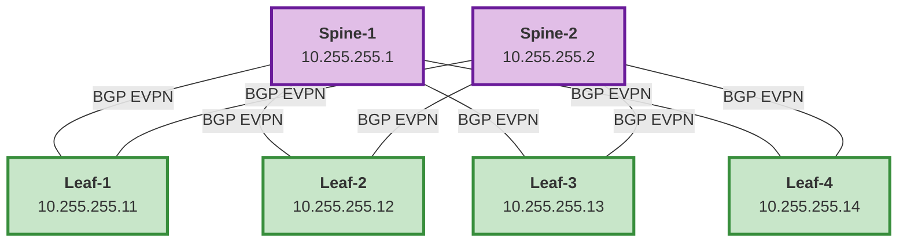

# EVPN/VXLAN Fabric Configuration Example

## Complete NetBox Configuration for 2-Spine, 4-Leaf Fabric

### Fabric Topology



### IP Addressing Scheme

| Device | Loopback 0 (Router ID) | Role | VTEP |
|--------|------------------------|------|------|
| spine-1 | 10.255.255.1/32 | Route Reflector | No |
| spine-2 | 10.255.255.2/32 | Route Reflector | No |
| leaf-1 | 10.255.255.11/32 | VTEP | Yes |
| leaf-2 | 10.255.255.12/32 | VTEP | Yes |
| leaf-3 | 10.255.255.13/32 | VTEP | Yes |
| leaf-4 | 10.255.255.14/32 | VTEP | Yes |

### BGP AS: 65000 (iBGP for entire fabric)

---

## NetBox Configuration

### 1. Custom Fields (All Devices)

#### Spine-1
```yaml
device_bgp: true
device_bgp_routerid: "10.255.255.1"
```

#### Spine-2
```yaml
device_bgp: true
device_bgp_routerid: "10.255.255.2"
```

#### Leaf-1
```yaml
device_bgp: true
device_bgp_routerid: "10.255.255.11"
```

#### Leaf-2
```yaml
device_bgp: true
device_bgp_routerid: "10.255.255.12"
```

#### Leaf-3
```yaml
device_bgp: true
device_bgp_routerid: "10.255.255.13"
```

#### Leaf-4
```yaml
device_bgp: true
device_bgp_routerid: "10.255.255.14"
```

---

### 2. Config Context - Spines (Route Reflectors)

Create a config context named "BGP_EVPN_Spines" assigned to spine devices:

```json
{
  "bgp_as": 65000,
  "bgp_peers": [
    {
      "peer": "10.255.255.11",
      "remote_as": 65000,
      "update_source": "loopback 0"
    },
    {
      "peer": "10.255.255.12",
      "remote_as": 65000,
      "update_source": "loopback 0"
    },
    {
      "peer": "10.255.255.13",
      "remote_as": 65000,
      "update_source": "loopback 0"
    },
    {
      "peer": "10.255.255.14",
      "remote_as": 65000,
      "update_source": "loopback 0"
    }
  ],
  "bgp_rr_clients": [
    {"peer": "10.255.255.11"},
    {"peer": "10.255.255.12"},
    {"peer": "10.255.255.13"},
    {"peer": "10.255.255.14"}
  ],
  "bgp_additional_config": [
    "maximum-paths 4",
    "maximum-paths ibgp 4",
    "timers bgp 3 9"
  ]
}
```

---

### 3. Config Context - Leafs (VTEPs)

Create a config context named "BGP_EVPN_Leafs" assigned to leaf devices:

```json
{
  "bgp_as": 65000,
  "bgp_peers": [
    {
      "peer": "10.255.255.1",
      "remote_as": 65000,
      "update_source": "loopback 0"
    },
    {
      "peer": "10.255.255.2",
      "remote_as": 65000,
      "update_source": "loopback 0"
    }
  ],
  "bgp_additional_config": [
    "maximum-paths 4"
  ]
}
```

---

### 4. Config Context - Leaf VRFs (Per-Leaf or Group)

If you have tenants/VRFs, add to each leaf's config context:

#### Leaf-1 & Leaf-2 (Pod 1)
```json
{
  "bgp_as": 65000,
  "bgp_peers": [
    {"peer": "10.255.255.1"},
    {"peer": "10.255.255.2"}
  ],
  "bgp_vrfs": [
    {
      "name": "TENANT-A",
      "rd": "10.255.255.11:1001"
    },
    {
      "name": "TENANT-B",
      "rd": "10.255.255.11:1002"
    }
  ]
}
```

#### Leaf-3 & Leaf-4 (Pod 2)
```json
{
  "bgp_as": 65000,
  "bgp_peers": [
    {"peer": "10.255.255.1"},
    {"peer": "10.255.255.2"}
  ],
  "bgp_vrfs": [
    {
      "name": "TENANT-A",
      "rd": "10.255.255.13:1001"
    },
    {
      "name": "TENANT-B",
      "rd": "10.255.255.13:1002"
    }
  ]
}
```

---

## Complete Configuration Workflow

### Step 1: Prerequisites (Must run before BGP)

```bash
# 1. Configure loopback interfaces
ansible-playbook configure_aoscx.yml -t loopback

# 2. Configure underlay routing (OSPF)
ansible-playbook configure_aoscx.yml -t ospf

# 3. Verify underlay connectivity
# All loopbacks should be reachable
```

### Step 2: Configure BGP EVPN

```bash
# Configure BGP on all fabric devices
ansible-playbook configure_aoscx.yml -t bgp

# Or full routing
ansible-playbook configure_aoscx.yml -t routing
```

### Step 3: Verify BGP

```bash
# Check BGP neighbors on spine
ssh admin@spine-1
show bgp summary
show bgp l2vpn evpn summary

# Expected: 4 neighbors (all leafs) in Established state

# Check BGP neighbors on leaf
ssh admin@leaf-1
show bgp summary
show bgp l2vpn evpn summary

# Expected: 2 neighbors (both spines) in Established state
```

### Step 4: Configure VXLAN (After BGP)

```bash
# Configure VXLAN tunnels
ansible-playbook configure_aoscx.yml -t vxlan

# Configure EVPN
ansible-playbook configure_aoscx.yml -t evpn
```

---

## Verification Commands

### On Spines (Route Reflectors)

```bash
# BGP summary
show bgp summary
# Should show 4 neighbors (leafs 11, 12, 13, 14)

# EVPN summary
show bgp l2vpn evpn summary
# Should show 4 neighbors in Established state

# Route reflector status
show bgp neighbors 10.255.255.11
# Should show "Route Reflector Client: Yes"

# EVPN routes received
show bgp l2vpn evpn
# Should show type-2 (MAC), type-3 (IMET) routes from leafs
```

### On Leafs (VTEPs)

```bash
# BGP summary
show bgp summary
# Should show 2 neighbors (spines 1, 2)

# EVPN summary
show bgp l2vpn evpn summary
# Should show 2 neighbors in Established state

# EVPN routes
show bgp l2vpn evpn
# Should show routes from other leafs (learned via RR)

# VRF BGP instances
show bgp vrf all
# Should show VRF instances: TENANT-A, TENANT-B
```

---

## Troubleshooting Guide

### BGP Neighbors Not Establishing

**Check 1: Underlay Connectivity**
```bash
ping 10.255.255.1 vrf mgmt
# Should reach spine loopback from leaf
```

**Check 2: OSPF Running**
```bash
show ip ospf neighbor
# Should show underlay neighbors
```

**Check 3: BGP Configuration**
```bash
show running-config | include bgp
# Verify AS number and router-id
```

### Route Reflector Not Working

**Check 1: RR Configuration**
```bash
show bgp neighbors 10.255.255.11
# Look for: Route Reflector Client: Yes
```

**Check 2: EVPN Routes**
```bash
show bgp l2vpn evpn
# Routes should have RR attributes
```

### VRF Not Working

**Check 1: VRF Exists**
```bash
show vrf
# TENANT-A and TENANT-B should be listed
```

**Check 2: BGP VRF Instance**
```bash
show bgp vrf TENANT-A summary
# Should show BGP instance for VRF
```

---

## Complete Deployment Script

```bash
#!/bin/bash
# deploy-evpn-fabric.sh

echo "=== Deploying EVPN/VXLAN Fabric ==="
echo

echo "Step 1: Base Configuration"
ansible-playbook configure_aoscx.yml -t base_config
sleep 5

echo "Step 2: VRFs"
ansible-playbook configure_aoscx.yml -t vrfs
sleep 5

echo "Step 3: Loopback Interfaces"
ansible-playbook configure_aoscx.yml -t loopback
sleep 5

echo "Step 4: Physical Interfaces"
ansible-playbook configure_aoscx.yml -t interfaces
sleep 5

echo "Step 5: Underlay Routing (OSPF)"
ansible-playbook configure_aoscx.yml -t ospf
sleep 10

echo "Step 6: BGP EVPN (Overlay)"
ansible-playbook configure_aoscx.yml -t bgp
sleep 10

echo "Step 7: VLANs"
ansible-playbook configure_aoscx.yml -t vlans
sleep 5

echo "Step 8: VXLAN"
ansible-playbook configure_aoscx.yml -t vxlan
sleep 5

echo "Step 9: EVPN"
ansible-playbook configure_aoscx.yml -t evpn
sleep 5

echo "=== Deployment Complete ==="
echo
echo "Verification:"
echo "1. Check BGP: ansible all -m shell -a 'show bgp summary'"
echo "2. Check EVPN: ansible all -m shell -a 'show bgp l2vpn evpn summary'"
echo "3. Check VXLAN: ansible all -m shell -a 'show vxlan'"
```

---

## Expected BGP Peering Matrix

| Device | Peers With | Peer Count | Role |
|--------|-----------|------------|------|
| spine-1 | leaf-1, leaf-2, leaf-3, leaf-4 | 4 | Route Reflector |
| spine-2 | leaf-1, leaf-2, leaf-3, leaf-4 | 4 | Route Reflector |
| leaf-1 | spine-1, spine-2 | 2 | RR Client |
| leaf-2 | spine-1, spine-2 | 2 | RR Client |
| leaf-3 | spine-1, spine-2 | 2 | RR Client |
| leaf-4 | spine-1, spine-2 | 2 | RR Client |

**Total BGP Sessions: 8 (4 leafs × 2 spines)**

---

## Quick Ansible Commands

```bash
# Deploy to all spines
ansible-playbook configure_aoscx.yml -l spine* -t bgp

# Deploy to all leafs
ansible-playbook configure_aoscx.yml -l leaf* -t bgp

# Deploy to entire fabric
ansible-playbook configure_aoscx.yml -l spine*,leaf* -t bgp

# Check BGP status on all devices
ansible spine*,leaf* -m shell -a "show bgp summary"

# Check EVPN status on all devices
ansible spine*,leaf* -m shell -a "show bgp l2vpn evpn summary"
```

---

## NetBox Config Context Assignment Strategy

### Option 1: Device-Specific

- Assign unique config context to each device
- Most flexible but more work

### Option 2: Role-Based

- Create "Spines" and "Leafs" config contexts
- Assign based on device role
- Easier to manage

### Option 3: Site-Based

- Create per-site config contexts
- Good for multi-datacenter deployments

### Recommended: Role-Based with Inheritance
```
Config Context Hierarchy:
1. "BGP_Global" (all devices) → AS number
2. "BGP_Spines" (spine role) → RR settings
3. "BGP_Leafs" (leaf role) → VTEP settings
4. Per-device contexts → VRFs, specific peers
```

---

## Files Referenced

- Task: `/tasks/configure_bgp.yml`
- Documentation: `/docs/BGP_CONFIGURATION.md`
- Related: `/tasks/configure_ospf.yml`, `/tasks/configure_vxlan.yml`, `/tasks/configure_evpn.yml`
