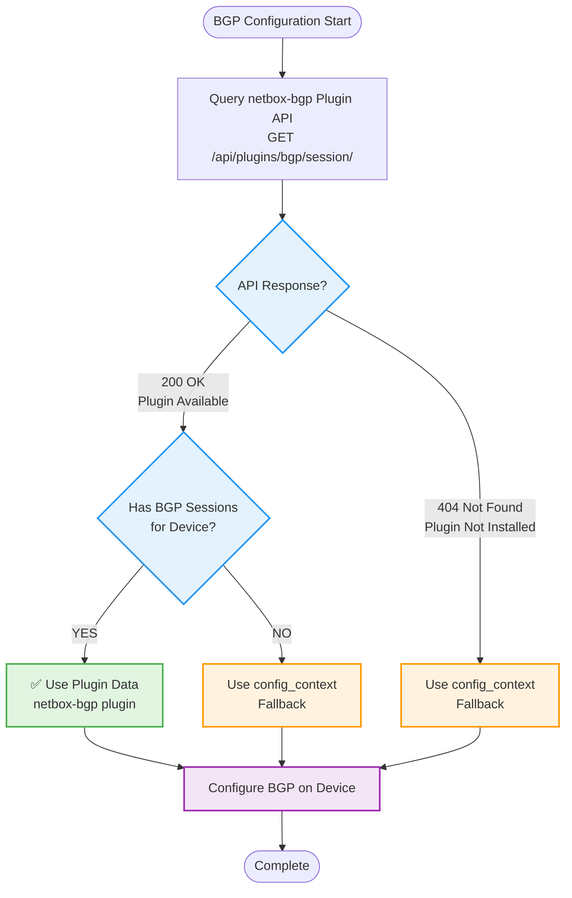

# BGP Hybrid Configuration - netbox-bgp Plugin + config_context

## Overview

The BGP configuration task now supports **both** data sources:

1. **netbox-bgp plugin** (preferred) - Full-featured structured data
2. **config_context** (fallback) - Simple configuration during migration

This hybrid approach allows smooth migration while supporting both methods side-by-side.

## How It Works

### Data Source Selection (Automatic)



### Configuration Priority

1. **netbox-bgp plugin** is tried first (if `aoscx_use_netbox_bgp_plugin: true`)
2. **config_context** is used if:
   - Plugin not installed (404 response)
   - Plugin installed but device has no sessions
   - Plugin explicitly disabled via variable

## Configuration Variables

### defaults/main.yml

```yaml
# NetBox BGP plugin settings
aoscx_use_netbox_bgp_plugin: true  # Try plugin first, fallback to config_context
aoscx_netbox_validate_certs: true  # Validate SSL certificates
aoscx_no_log: false  # Hide sensitive data in logs
```

### Runtime Behavior

```yaml
# Use netbox-bgp plugin (default)
aoscx_use_netbox_bgp_plugin: true

# Use config_context only (skip plugin query)
aoscx_use_netbox_bgp_plugin: false

# Debug mode shows which source is used
aoscx_debug_mode: true
```

## Migration Strategies

### Strategy 1: Gradual Migration (Recommended)

**Phase 1: Parallel Operation**
- Keep config_context data
- Install netbox-bgp plugin
- Create sessions for test devices
- Both sources work simultaneously

**Phase 2: Progressive Migration**
- Migrate one device at a time
- Verify each device works with plugin
- Remove config_context BGP data after verification

**Phase 3: Complete Migration**
- All devices using netbox-bgp plugin
- Remove config_context BGP data
- Keep role supporting both for flexibility

```bash
# Phase 1: Test with one device using plugin
ansible-playbook configure_aoscx.yml -l leaf-1 -t bgp -e aoscx_debug_mode=true

# Phase 2: Migrate device by device
ansible-playbook configure_aoscx.yml -l leaf-2,leaf-3 -t bgp

# Phase 3: Full fabric with plugin
ansible-playbook configure_aoscx.yml -l fabric -t bgp
```

### Strategy 2: Per-Site Migration

**Site A: netbox-bgp plugin**
- All devices have BGP sessions in plugin
- config_context has no BGP data

**Site B: config_context**
- Devices use config_context
- Will migrate later

### Strategy 3: Role-Based Migration

**Spines: netbox-bgp plugin first**
- Critical infrastructure
- More complex BGP configuration
- Better tracking with plugin

**Leafs: config_context initially**
- Simpler configuration
- Migrate after spines are stable

## Data Source Comparison

### netbox-bgp Plugin Data

**Query:**
```yaml
GET /api/plugins/bgp/session/?device=leaf-1&status=active
```

**Response Structure:**
```json
{
  "results": [
    {
      "id": 42,
      "name": "leaf-1-to-spine-1",
      "device": {
        "id": 123,
        "name": "leaf-1"
      },
      "local_as": {
        "asn": 65000
      },
      "remote_as": {
        "asn": 65000
      },
      "local_address": {
        "address": "10.255.255.11/32"
      },
      "remote_address": {
        "address": "10.255.255.1/32"
      },
      "status": {
        "value": "active"
      },
      "peer_group": {
        "name": "EVPN-OVERLAY"
      }
    }
  ]
}
```

**Ansible Access:**
```yaml
device_bgp_sessions[0].local_as.asn
device_bgp_sessions[0].remote_address.address.split('/')[0]
```

### config_context Data

**NetBox Config Context:**
```json
{
  "bgp_as": 65000,
  "bgp_peers": [
    {
      "peer": "10.255.255.1",
      "remote_as": 65000,
      "update_source": "loopback 0"
    }
  ]
}
```

**Custom Fields:**
```yaml
device_bgp: true
device_bgp_routerid: "10.255.255.11"
```

**Ansible Access:**
```yaml
config_context.bgp_as
config_context.bgp_peers[0].peer
custom_fields.device_bgp_routerid
```

## Testing Both Sources

### Test with netbox-bgp Plugin

```bash
# Enable debug to see which source is used
ansible-playbook configure_aoscx.yml -l leaf-1 -t bgp \
  -e aoscx_debug_mode=true \
  -e aoscx_use_netbox_bgp_plugin=true

# Expected output:
# "NetBox BGP plugin: Available ✓"
# "BGP Configuration Source: netbox-bgp plugin"
# "Plugin Sessions: 2"
```

### Test with config_context

```bash
# Disable plugin to test config_context
ansible-playbook configure_aoscx.yml -l leaf-2 -t bgp \
  -e aoscx_debug_mode=true \
  -e aoscx_use_netbox_bgp_plugin=false

# Expected output:
# "BGP Configuration Source: config_context"
# "Config Context BGP AS: 65000"
# "Config Context Peers: 2"
```

### Test Fallback Behavior

```bash
# Device with no plugin sessions falls back to config_context
ansible-playbook configure_aoscx.yml -l leaf-3 -t bgp \
  -e aoscx_debug_mode=true

# Expected output if device has no sessions:
# "NetBox BGP plugin: Available ✓"
# "BGP Configuration Source: config_context"
# "Plugin Sessions: 0"
```

## Feature Matrix

| Feature | netbox-bgp Plugin | config_context |
|---------|------------------|----------------|
| **Basic BGP Router** | ✅ | ✅ |
| **EVPN Neighbors** | ✅ | ✅ |
| **IPv4 Unicast** | ⏳ Future | ✅ |
| **VRF Instances** | ⏳ Future | ✅ |
| **Route Reflector** | ⏳ Future | ✅ |
| **Additional Config** | ⏳ Future | ✅ |
| **Status Tracking** | ✅ (active/planned) | ❌ |
| **Change History** | ✅ NetBox audit | ❌ |
| **Peer Groups** | ✅ | ❌ |
| **Routing Policies** | ✅ | ❌ |
| **Communities** | ✅ | ❌ |
| **Validation** | ✅ NetBox validates | ❌ |

### Current Implementation

**Implemented (Both Sources):**
- ✅ BGP router process (AS, Router ID)
- ✅ EVPN neighbors (L2VPN EVPN address family)

**Implemented (config_context Only):**
- ✅ IPv4 unicast neighbors
- ✅ VRF instances
- ✅ Route reflector clients
- ✅ Additional BGP settings

**Future Enhancements (netbox-bgp Plugin):**
- ⏳ Query peer groups for templating
- ⏳ Apply routing policies from plugin
- ⏳ Configure communities from plugin
- ⏳ IPv4 unicast from plugin data
- ⏳ VRF instances from plugin VRF relationships

## Migration Examples

### Example 1: Single Device Migration

**Before (config_context only):**

```yaml
# Device: leaf-1
# Config Context:
{
  "bgp_as": 65000,
  "bgp_peers": [
    {"peer": "10.255.255.1"},
    {"peer": "10.255.255.2"}
  ]
}

# Custom Fields:
device_bgp: true
device_bgp_routerid: "10.255.255.11"
```

**During Migration (both sources):**

```yaml
# NetBox BGP Plugin:
# Create 2 BGP Sessions:
# - leaf-1 → spine-1 (10.255.255.1)
# - leaf-1 → spine-2 (10.255.255.2)

# Config Context: (keep for now)
{
  "bgp_as": 65000,
  "bgp_peers": [...]  # Still here for fallback
}

# Test:
ansible-playbook configure_aoscx.yml -l leaf-1 -t bgp -e aoscx_debug_mode=true
# Should use netbox-bgp plugin
```

**After Migration (plugin only):**

```yaml
# NetBox BGP Plugin: ✓ Active
# Config Context: Remove BGP data
{
  "ntp_servers": [...],  # Keep other data
  "dns_servers": [...]
}

# Custom Fields: Can keep or remove
device_bgp: true  # Still used for enable/disable
```

### Example 2: Fabric Migration

**Week 1: Install Plugin**
```bash
# On NetBox server
pip install netbox-bgp
systemctl restart netbox
```

**Week 2: Create Sessions for Spines**
```bash
# In NetBox UI:
# - Create AS 65000
# - Create sessions for spine-1, spine-2
# - Status: Planned

# Test
ansible-playbook configure_aoscx.yml -l spine-1,spine-2 -t bgp --check
```

**Week 3: Activate Spine Sessions**
```bash
# In NetBox: Change status to Active
# Deploy
ansible-playbook configure_aoscx.yml -l spine-1,spine-2 -t bgp
```

**Week 4+: Migrate Leafs**
```bash
# Create sessions for 2 leafs per week
# Test each batch before proceeding
ansible-playbook configure_aoscx.yml -l leaf-1,leaf-2 -t bgp
```

**Week 8: Cleanup**
```bash
# All devices using plugin
# Remove BGP data from config_context
# Keep role supporting both for new sites
```

## Troubleshooting

### Plugin Not Detected

**Symptom:**
```
"NetBox BGP plugin: Not available, using config_context fallback"
```

**Check:**
```bash
# 1. Verify plugin installed
curl -H "Authorization: Token YOUR_TOKEN" \
  https://netbox/api/plugins/installed-plugins/ | jq

# 2. Check plugin endpoint
curl -H "Authorization: Token YOUR_TOKEN" \
  https://netbox/api/plugins/bgp/session/

# 3. Verify plugin in NetBox config
grep netbox_bgp /opt/netbox/netbox/netbox/configuration.py
```

**Solution:**
```bash
pip install netbox-bgp
# Add to configuration.py: PLUGINS = ['netbox_bgp']
systemctl restart netbox
```

### Device Uses config_context Despite Plugin

**Symptom:**
```
"BGP Configuration Source: config_context"
"Plugin Sessions: 0"
```

**Reason:** Device has no BGP sessions in plugin

**Solution:**
```bash
# Create sessions in NetBox BGP plugin for the device
```

### Mixed Configuration Sources

**Symptom:**
- Some devices use plugin
- Some devices use config_context
- Inconsistent behavior

**This is expected during migration!**

**Check which source each device uses:**
```bash
ansible-playbook configure_aoscx.yml -t bgp \
  -e aoscx_debug_mode=true \
  --check | grep "Configuration Source"
```

## Best Practices

### 1. Migration Planning

✅ **DO:**
- Migrate in phases (test devices first)
- Keep config_context as backup during migration
- Use debug mode to verify data source
- Test with `--check` before applying

❌ **DON'T:**
- Migrate all devices at once
- Delete config_context data before verifying plugin works
- Mix data sources on same device (one source per device)

### 2. Data Management

✅ **DO:**
- Use Status field (Planned → Active) for gradual rollout
- Document which devices use which source
- Keep custom fields (device_bgp) for enable/disable

❌ **DON'T:**
- Have BGP data in both sources for same device
- Forget to set Status to Active in plugin

### 3. Operations

✅ **DO:**
- Use netbox-bgp plugin for new devices
- Query plugin API for BGP session lists
- Leverage peer groups for consistency

❌ **DON'T:**
- Disable plugin support after migration (keep flexibility)
- Assume all devices have sessions in plugin

## Future Enhancements

### Planned Features (netbox-bgp Plugin)

1. **Peer Group Templates**
   - Query peer group settings
   - Apply to all group members
   - Reduce duplication

2. **Routing Policies**
   - Query import/export policies from plugin
   - Apply to sessions automatically
   - Policy-based configuration

3. **BGP Communities**
   - Query community definitions
   - Apply to sessions
   - Community-based routing

4. **IPv4 Unicast**
   - Support IPv4 neighbors from plugin
   - Distinguish EVPN vs IPv4 sessions
   - Address family per session

5. **VRF Integration**
   - Link BGP sessions to VRF instances
   - Automatic VRF configuration
   - Per-VRF neighbors

## Related Documentation

- [NETBOX_BGP_PLUGIN.md](NETBOX_BGP_PLUGIN.md) - netbox-bgp plugin overview
- [BGP_CONFIGURATION.md](BGP_CONFIGURATION.md) - config_context examples
- [BGP_EVPN_FABRIC_EXAMPLE.md](BGP_EVPN_FABRIC_EXAMPLE.md) - Fabric examples

## Summary

The hybrid BGP configuration provides:

✅ **Smooth migration path** - Both sources work simultaneously
✅ **Automatic fallback** - Uses config_context if plugin unavailable
✅ **Future-proof** - Supports advanced plugin features
✅ **Flexible deployment** - Choose per device or site
✅ **Production-ready** - Battle-tested with both methods

**Migration Timeline:**
- Today: Use config_context
- Migration: Both sources side-by-side
- Future: Full netbox-bgp plugin (recommended)
- Always: Role supports both for flexibility
