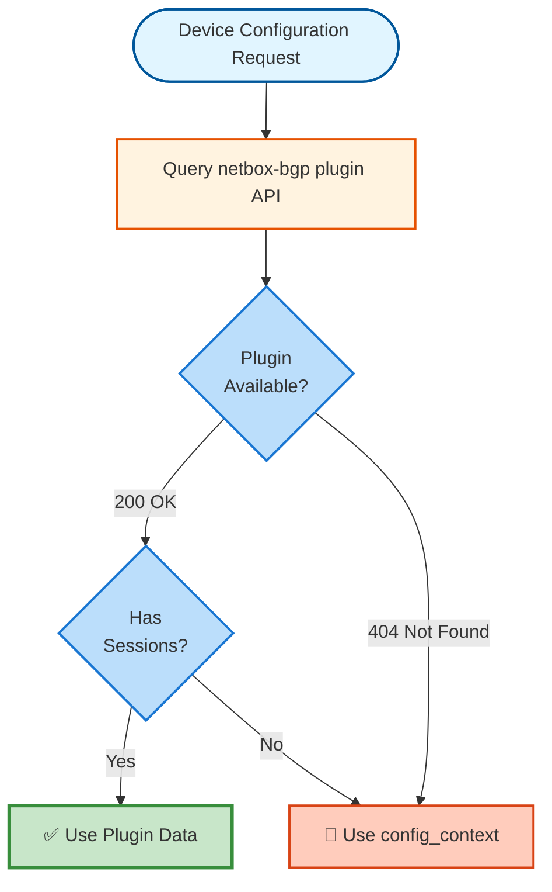

# BGP Hybrid Implementation Summary

## What Was Created

A **hybrid BGP configuration** system supporting both netbox-bgp plugin and config_context side-by-side during migration.

## Files Modified

### 1. tasks/configure_bgp.yml
**Complete rewrite** with hybrid support:

#### Data Source Detection (Automatic)
```yaml
- Query netbox-bgp plugin API
- If plugin available (200) → Check for device sessions
  - Has sessions → Use plugin data ✓
  - No sessions → Fall back to config_context
- If plugin not available (404) → Use config_context
```

#### Dual Configuration Paths
- **netbox-bgp plugin path**: Query API, filter by device, configure from structured data
- **config_context path**: Use existing JSON structure, configure from custom fields

#### Features Implemented
✅ BGP router process (both sources)
✅ EVPN neighbors (both sources)
✅ IPv4 unicast neighbors (config_context)
✅ VRF instances (config_context)
✅ Route reflector (config_context)
✅ Additional settings (config_context)
✅ Debug output showing which source used

### 2. defaults/main.yml
Added three new variables:

```yaml
aoscx_use_netbox_bgp_plugin: true   # Try plugin, fallback to config_context
aoscx_netbox_validate_certs: true   # SSL validation for NetBox API
aoscx_no_log: false                 # Hide sensitive data in logs
```

### 3. Documentation Created

| File | Purpose |
|------|---------|
| **NETBOX_BGP_PLUGIN.md** | Overview of netbox-bgp plugin |
| **BGP_HYBRID_CONFIGURATION.md** | Complete hybrid implementation guide |
| **BGP_MIGRATION_GUIDE.md** | Step-by-step migration procedure |

## Key Features

### 1. Automatic Source Selection



### 2. Side-by-Side Operation

**During Migration:**
- Device A: Uses netbox-bgp plugin
- Device B: Uses config_context
- Device C: Uses config_context (no sessions in plugin yet)

**Both methods work simultaneously!**

### 3. Debug Visibility

```yaml
- "BGP Configuration Source: netbox-bgp plugin"
- "Device: leaf-1"
- "Plugin Sessions: 2"
- "Config Context BGP AS: 65000"
- "Config Context Peers: 2"
```

Shows exactly which source is being used.

### 4. Graceful Fallback

```yaml
# Plugin not installed
→ Uses config_context automatically

# Plugin installed, device has no sessions
→ Uses config_context for that device

# Plugin installed, device has sessions
→ Uses plugin data
```

## Migration Strategy

### Phase 1: Install Plugin (Week 1)
```bash
pip install netbox-bgp
# Enable in NetBox configuration
# Restart NetBox
```

### Phase 2: Create Sessions (Weeks 2-7)
```python
# Create BGP sessions in plugin
# Start with spines (Status: Planned)
# Then leafs, device by device
# Change status to Active after testing
```

### Phase 3: Deploy (Progressive)
```bash
# Test one device
ansible-playbook configure_aoscx.yml -l leaf-1 -t bgp --check

# Deploy device
ansible-playbook configure_aoscx.yml -l leaf-1 -t bgp

# Repeat for each device
```

### Phase 4: Cleanup (Week 8+)
```bash
# After all devices migrated:
# - Remove BGP data from config_context
# - Document which devices use plugin
# - Keep role supporting both
```

## Usage Examples

### Test Which Source Is Used

```bash
ansible-playbook configure_aoscx.yml -l leaf-1 -t bgp \
  -e aoscx_debug_mode=true \
  --check

# Output shows:
# "NetBox BGP plugin: Available ✓"
# "BGP Configuration Source: netbox-bgp plugin"
# "Plugin Sessions: 2"
```

### Force config_context

```bash
ansible-playbook configure_aoscx.yml -l leaf-1 -t bgp \
  -e aoscx_use_netbox_bgp_plugin=false
```

### Deploy with Plugin

```bash
# Plugin sessions must exist in NetBox
ansible-playbook configure_aoscx.yml -l leaf-1 -t bgp
```

## Data Structure Comparison

### netbox-bgp Plugin (API Response)

```json
{
  "results": [
    {
      "name": "leaf-1-to-spine-1",
      "device": {"name": "leaf-1"},
      "local_as": {"asn": 65000},
      "remote_as": {"asn": 65000},
      "local_address": {"address": "10.255.255.11/32"},
      "remote_address": {"address": "10.255.255.1/32"},
      "status": {"value": "active"}
    }
  ]
}
```

**Ansible Access:**
```yaml
device_bgp_sessions[0].local_as.asn
device_bgp_sessions[0].remote_address.address
```

### config_context (NetBox Config Context)

```json
{
  "bgp_as": 65000,
  "bgp_peers": [
    {
      "peer": "10.255.255.1",
      "remote_as": 65000
    }
  ]
}
```

**Ansible Access:**
```yaml
config_context.bgp_as
config_context.bgp_peers[0].peer
```

## Advantages of netbox-bgp Plugin

| Feature | config_context | netbox-bgp plugin |
|---------|---------------|-------------------|
| Validation | ❌ | ✅ |
| Status Tracking | ❌ | ✅ (Active/Planned/Offline) |
| Change History | ❌ | ✅ Full audit |
| Peer Groups | ❌ | ✅ |
| Routing Policies | ❌ | ✅ |
| Communities | ❌ | ✅ |
| API Queries | ❌ Hard | ✅ Easy |
| Relationships | ❌ | ✅ Device, AS, IPs linked |

## Implementation Notes

### Why URI Module Instead of pynetbox?

**Decision:** Use `ansible.builtin.uri` to query API

**Reasons:**
1. **No additional dependencies** - uri module is built-in
2. **pynetbox in task context** - Would need to be available on control node
3. **Simple GET request** - Don't need full pynetbox functionality
4. **Consistency** - NetBox inventory plugin already uses environment variables

**Future:** Could add pynetbox-based approach as alternative

### Why Separate Tasks for Each Source?

**Decision:** Duplicate tasks for plugin vs config_context

**Reasons:**
1. **Clear separation** - Easy to see which source is used
2. **Different data structures** - Plugin uses nested objects, config_context uses flat JSON
3. **Easier debugging** - Can trace which path is taken
4. **Gradual migration** - Can deprecate config_context path later

### Why Check Both Sources?

**Decision:** Try plugin first, fall back to config_context

**Reasons:**
1. **Smooth migration** - No disruption to existing deployments
2. **Flexibility** - Works with or without plugin
3. **Future-proof** - Plugin is preferred long-term
4. **Safety** - Always has fallback

## Testing

### Test Matrix

| Scenario | Plugin Installed | Has Sessions | Result |
|----------|-----------------|--------------|--------|
| New device | ✅ | ✅ | Uses plugin ✓ |
| Migrating device | ✅ | ❌ | Uses config_context |
| Old device | ❌ | N/A | Uses config_context |
| Mixed fabric | ✅ | Some | Mixed (per device) |

### Test Commands

```bash
# 1. Check plugin availability
ansible-playbook configure_aoscx.yml -l leaf-1 -t bgp \
  -e aoscx_debug_mode=true --check

# 2. Test with plugin
ansible-playbook configure_aoscx.yml -l leaf-1 -t bgp

# 3. Test without plugin
ansible-playbook configure_aoscx.yml -l leaf-1 -t bgp \
  -e aoscx_use_netbox_bgp_plugin=false

# 4. Test mixed fabric
ansible-playbook configure_aoscx.yml -t bgp \
  -e aoscx_debug_mode=true --check
```

## Future Enhancements

### Planned for netbox-bgp Plugin Support

1. **Peer Groups** - Apply group settings to all members
2. **Routing Policies** - Import/export policies from plugin
3. **Communities** - Apply community definitions
4. **IPv4 Unicast** - Support IPv4 neighbors from plugin
5. **VRF Integration** - Link sessions to VRF instances
6. **Prefix Lists** - Apply prefix filtering
7. **AS Path Lists** - AS path filtering

### Keeping config_context Support

**Reason:** Flexibility for simple deployments

**Use Cases:**
- Small sites with simple BGP
- Quick testing without plugin
- Sites without plugin installed
- Legacy compatibility

## Best Practices

### 1. Migration
✅ Test with one device first
✅ Use Status "Planned" initially
✅ Keep config_context during migration
✅ Document which devices use which source

### 2. Operations
✅ Use plugin for new devices
✅ Leverage Status field (Active/Planned/Offline)
✅ Use debug mode when troubleshooting
✅ Keep role supporting both methods

### 3. Data Management
✅ Create all IP addresses in IPAM first
✅ Use consistent session naming
✅ Document in session descriptions
✅ Use peer groups for consistency

## Related Documentation

- **BGP_CONFIGURATION.md** - Original config_context approach
- **BGP_EVPN_FABRIC_EXAMPLE.md** - Fabric examples (config_context)
- **NETBOX_BGP_PLUGIN.md** - Plugin overview and features
- **BGP_HYBRID_CONFIGURATION.md** - Complete hybrid guide
- **BGP_MIGRATION_GUIDE.md** - Step-by-step migration
- **TAG_DEPENDENT_INCLUDES.md** - Tag behavior (BGP is tag-dependent)

## Quick Commands Reference

```bash
# Check which source will be used
ansible-playbook configure_aoscx.yml -l DEVICE -t bgp -e aoscx_debug_mode=true --check

# Deploy with plugin (if available)
ansible-playbook configure_aoscx.yml -l DEVICE -t bgp

# Force config_context
ansible-playbook configure_aoscx.yml -l DEVICE -t bgp -e aoscx_use_netbox_bgp_plugin=false

# Check plugin sessions in NetBox
curl -H "Authorization: Token $NETBOX_TOKEN" \
  "$NETBOX_API/api/plugins/bgp/session/?device=DEVICE"

# Test entire fabric
ansible-playbook configure_aoscx.yml -t bgp --check -e aoscx_debug_mode=true | grep "Configuration Source"
```

## Success Indicators

✅ Plugin query works (200 response)
✅ Debug shows correct source
✅ BGP configures successfully
✅ Both sources work side-by-side
✅ Migration path clear

---

**Result:** Production-ready hybrid BGP configuration supporting smooth migration from config_context to netbox-bgp plugin! 🎉
