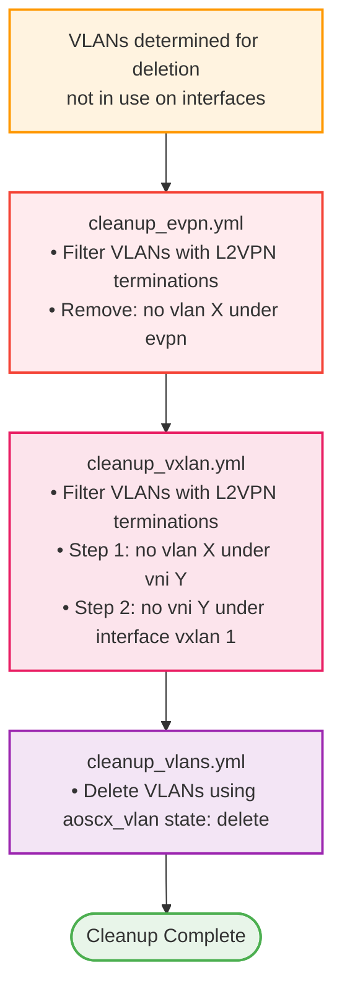

# EVPN and VXLAN Cleanup Implementation Summary

## Overview

Implemented cleanup tasks for EVPN and VXLAN configurations that run **before** VLAN deletion to prevent orphaned configurations and ensure proper cleanup order.

## Critical Ordering

```
EVPN Cleanup → VXLAN Cleanup → VLAN Deletion
```

**Why this matters:**

- Deleting a VLAN with active EVPN/VXLAN config leaves orphaned configurations
- VXLAN VNI must be removed before the VLAN
- EVPN control plane config must be removed before VXLAN to avoid issues

**Important:** Cleanup only runs when `aoscx_idempotent_mode: true`

- This connects configuration and cleanup together
- Initial deployments (`aoscx_idempotent_mode: false`) only create configs, no cleanup
- Ongoing management (`aoscx_idempotent_mode: true`) creates new configs AND removes old ones

## Files Created

### 1. `tasks/cleanup_evpn.yml`

**Purpose:** Remove EVPN configuration for VLANs being deleted

**What it does:**

- Filters VLANs to cleanup: in `vlans_to_delete` AND have L2VPN terminations
- Removes EVPN config: `no vlan X` under `evpn` context
- Only runs when `device_evpn` custom field is `true`

**Example cleanup:**
```
evpn
  no vlan 100
  no vlan 200
```

### 2. `tasks/cleanup_vxlan.yml`

**Purpose:** Remove VXLAN VNI and VLAN-to-VNI mappings for VLANs being deleted

**What it does:**

- Filters VLANs to cleanup: in `vlans_to_delete` AND have L2VPN terminations
- **Two-step removal process** (reverse of configuration):
    - Step 1: Remove VLAN from VNI (`no vlan X` under `vni Y`)
    - Step 2: Remove VNI from VXLAN interface (`no vni Y`)
- Only runs when `device_vxlan` custom field is `true`

**Example cleanup:**
```
interface vxlan 1
  vni 10100
    no vlan 100        # Step 1
  no vni 10100         # Step 2
```

## Files Modified

### `tasks/main.yml`

**Changes:**

- Added EVPN cleanup include before VLAN cleanup
- Added VXLAN cleanup include before VLAN cleanup
- Updated comments to explain critical ordering

**New structure:**
```yaml
# EVPN/VXLAN/VLAN cleanup order is critical (only in idempotent mode):
# 1. Remove EVPN configuration
# 2. Remove VXLAN VNI and VLAN-to-VNI mappings
# 3. Delete VLANs themselves

- name: Include EVPN cleanup tasks
  ansible.builtin.include_tasks:
    file: cleanup_evpn.yml
  when:
    - aoscx_configure_evpn | default(false) | bool
    - custom_fields.device_evpn | default(false) | bool
    - aoscx_idempotent_mode | bool  # CRITICAL: Only cleanup in idempotent mode

- name: Include VXLAN cleanup tasks
  ansible.builtin.include_tasks:
    file: cleanup_vxlan.yml
  when:
    - aoscx_configure_vxlan | default(false) | bool
    - custom_fields.device_vxlan | default(false) | bool
    - aoscx_idempotent_mode | bool  # CRITICAL: Only cleanup in idempotent mode

- name: Include VLAN cleanup tasks
  ansible.builtin.include_tasks:
    file: cleanup_vlans.yml
  when:
    - aoscx_configure_vlans | bool
    - aoscx_idempotent_mode | bool  # CRITICAL: Only cleanup in idempotent mode
```

### `docs/EVPN_VXLAN_CONFIGURATION.md`

**Added section:** "Cleanup Process" with:

- Overview of cleanup ordering and why it matters
- Detailed explanation of each cleanup task
- Examples of configurations before/after cleanup
- VLAN identification logic
- Verification commands
- Troubleshooting cleanup issues
- Updated prerequisites and task dependencies
- Updated summary to include cleanup tasks

## Key Features

- ✅ **Intelligent filtering** - Only removes EVPN/VXLAN for VLANs being deleted
- ✅ **L2VPN termination check** - Only cleanups VLANs with VNI mappings
- ✅ **Custom field control** - Respects per-device enable/disable
- ✅ **Proper ordering** - Critical cleanup sequence enforced
- ✅ **Two-step VXLAN removal** - VLAN from VNI, then VNI itself
- ✅ **Safe execution** - Only runs when needed (when conditions)
- ✅ **Idempotent** - Safe to run multiple times
- ✅ **Debug output** - Shows what was cleaned up

## Cleanup Flow



## Usage

The cleanup tasks run **automatically** as part of the role execution when:

1. **Idempotent mode is enabled** - `aoscx_idempotent_mode: true` ⚠️ **REQUIRED**
2. VLANs are identified for deletion (not in use on interfaces)
3. Custom fields enable EVPN/VXLAN (`device_evpn`, `device_vxlan`)
4. Role variables enable EVPN/VXLAN (`aoscx_configure_evpn`, `aoscx_configure_vxlan`)

**Mode Behavior:**

| Mode | `aoscx_idempotent_mode` | Configuration | Cleanup |
|------|-------------------------|---------------|---------|
| **Initial Deployment** | `false` | ✅ Creates configs | ❌ No cleanup |
| **Ongoing Management** | `true` | ✅ Creates configs | ✅ Removes old configs |

**Why this matters:**

- **Initial deployment**: You want to create configurations without removing anything
- **Ongoing management**: You want to add new configs AND remove old ones to match NetBox

**No additional configuration needed!** Just set `aoscx_idempotent_mode: true` when you want cleanup enabled.

## Verification

After cleanup completes, verify:

```bash
# Check EVPN - VLAN should not appear
show evpn vlan

# Check VXLAN - VNI should not appear
show interface vxlan 1

# Check VLAN - should not exist
show vlan
```

## Tag Support

All cleanup tasks support tags for selective execution:

```bash
# Run only EVPN cleanup
ansible-playbook playbook.yml --tags evpn,cleanup

# Run only VXLAN cleanup
ansible-playbook playbook.yml --tags vxlan,cleanup

# Run only VLAN cleanup (not recommended without EVPN/VXLAN cleanup first)
ansible-playbook playbook.yml --tags vlans,cleanup

# Run all overlay cleanup
ansible-playbook playbook.yml --tags overlay,cleanup

# Run all cleanup tasks
ansible-playbook playbook.yml --tags cleanup
```

## Comparison with Production Code

Your production playbook showed configuration order matters. This implementation ensures cleanup follows the **reverse order**:

**Configuration Order (your production):**
```
VLANs → Interfaces → Loopback → Underlay → BGP → EVPN → VXLAN
```

**Cleanup Order (this implementation):**
```
EVPN Cleanup → VXLAN Cleanup → VLAN Deletion
```

This matches best practices and ensures clean removal without orphaned configurations!

## Documentation

Complete documentation in:

- `docs/EVPN_VXLAN_CONFIGURATION.md` - Includes new "Cleanup Process" section
    - Cleanup overview and ordering
    - Each cleanup task explained
    - Examples and verification
    - Troubleshooting

## Next Steps

The EVPN/VXLAN implementation is now complete with:

- ✅ Configuration tasks (configure_evpn.yml, configure_vxlan.yml)
- ✅ Cleanup tasks (cleanup_evpn.yml, cleanup_vxlan.yml)
- ✅ Proper ordering enforced in main.yml
- ✅ Comprehensive documentation
- ✅ Custom field control
- ✅ Intelligent VLAN filtering
- ✅ NetBox L2VPN integration

The role can now fully manage EVPN/VXLAN lifecycle from creation to cleanup!
