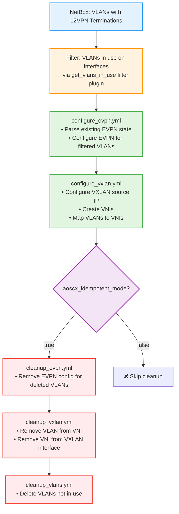

# EVPN and VXLAN Configuration

## Overview

The EVPN and VXLAN tasks configure overlay networking for EVPN/VXLAN fabrics on Aruba CX switches. They use NetBox L2VPN terminations as the source of truth for VNI mappings and only configure VLANs that are **actually in use** on the device.

- **`configure_evpn.yml`** — Configures EVPN per-VLAN (RD and route-targets)
- **`configure_vxlan.yml`** — Configures the VXLAN source IP and VNI-to-VLAN mapping
- **`cleanup_evpn.yml`** / **`cleanup_vxlan.yml`** — Remove stale config in idempotent mode

## Required NetBox Configuration

### Device Custom Fields

| Custom Field | Type | Where | Purpose |
|---|---|---|---|
| `device_evpn` | Boolean | Device | Enable EVPN tasks on this device |
| `device_vxlan` | Boolean | Device | Enable VXLAN tasks on this device |

Typically set to `true` on leaf (VTEP) switches and `false` on spines.

### L2VPN and L2VPN Termination

Each VLAN that needs EVPN/VXLAN must be linked to an L2VPN object in NetBox:

**Step 1 — Create L2VPN:**

```
Name: VLAN-100-L2VPN
Identifier: 10100       ← this becomes the VNI
Type: VXLAN
```

**Step 2 — Create L2VPN Termination:**

```
L2VPN: VLAN-100-L2VPN
Assigned Object Type: VLAN
Assigned Object: VLAN 100
```

This links VLAN 100 to VNI 10100. The role reads `vlan.l2vpn_termination.l2vpn.identifier` to get the VNI.

## How It Works

### VLAN Filtering

Both tasks filter the NetBox VLAN list using three criteria before configuring anything:

1. VLAN VID is in `vlans_in_use.vids` (actually used on at least one interface)
2. VLAN has an `l2vpn_termination.id` (linked to an L2VPN in NetBox)
3. VLAN is **not already configured** on the device (idempotency — checked via `parse_evpn_evi_output`)

```yaml
vlans_for_evpn: >-
  {{ vlans
    | selectattr('vid', 'in', vlans_in_use.vids)
    | selectattr('l2vpn_termination.id', 'defined')
    | rejectattr('vid', 'in', existing_evpn_vlans)
    | list }}
```

A VLAN is counted as "in use" when it appears on a physical or LAG interface in access or tagged mode, or as an SVI. This is calculated by the `get_vlans_in_use` filter plugin.

### Idempotency

Before calculating which VLANs need configuring, both tasks run `show evpn evi` on the device and parse the output with the `parse_evpn_evi_output` filter to build the current device state. VLANs already configured are excluded, so only genuinely new VLANs are pushed.

## Configuration Tasks

### configure_evpn.yml

**What it configures:**

```
evpn
  vlan 100
    rd auto
    route-target export auto
    route-target import auto
  vlan 200
    rd auto
    route-target export auto
    route-target import auto
```

Each VLAN in `vlans_for_evpn` gets an EVPN instance with automatic RD and route-targets.

### configure_vxlan.yml

Three steps, in order:

**Step 1 — Configure VXLAN source IP** (once per device):

The source loopback is selected based on the `device_vsx` custom field:
- VSX pair: `loopback1` (dedicated VTEP IP shared via VSX keep-alive sync)
- Non-VSX: `loopback0`

```
interface vxlan 1
  source ip 10.0.0.1    ← IPv4 address of the selected loopback
  no shutdown
```

**Step 2 — Create VNI:**

```
interface vxlan 1
  vni 10100
  vni 10200
```

**Step 3 — Map VLAN to VNI:**

```
interface vxlan 1
  vni 10100
    vlan 100
  vni 10200
    vlan 200
```

## Operating Modes

The `aoscx_idempotent_mode` variable controls whether cleanup tasks run:

| Mode | `aoscx_idempotent_mode` | Configure | Cleanup |
|---|---|---|---|
| **Initial deployment** | `false` | ✅ Runs | ❌ Skipped |
| **Ongoing management** | `true` | ✅ Runs | ✅ Runs |

### Initial Deployment (`aoscx_idempotent_mode: false`)

Use this for first-time fabric setup or when adding a new device. Only creates configuration — never removes anything.

### Ongoing Management (`aoscx_idempotent_mode: true`)

Use this for day-to-day operations. Creates new configs and removes stale ones so the device matches NetBox exactly.

### Configuration and Cleanup Flow



## Lifecycle Scenarios

### Scenario 1: Initial Fabric Deployment

```yaml
aoscx_idempotent_mode: false
aoscx_configure_evpn: true
aoscx_configure_vxlan: true
```

1. ✅ Creates EVPN config for VLANs 100, 200
2. ✅ Configures VXLAN source IP from loopback
3. ✅ Creates VNIs 10100, 10200 and maps VLANs
4. ❌ No cleanup (idempotent mode off)

### Scenario 2: Remove VLAN 300 from Production

First remove VLAN 300 from all interface assignments in NetBox, then run:

```yaml
aoscx_idempotent_mode: true
aoscx_configure_evpn: true
aoscx_configure_vxlan: true
```

1. ✅ EVPN cleanup removes `vlan 300` from `evpn`
2. ✅ VXLAN cleanup removes VLAN 300 from VNI 10300, then removes VNI 10300
3. ✅ VLAN cleanup deletes VLAN 300

### Scenario 3: Add VLAN 400

Add VLAN 400 to NetBox, create L2VPN with identifier 10400, create L2VPN Termination, assign VLAN to interfaces. Then run:

```yaml
aoscx_idempotent_mode: true
aoscx_configure_evpn: true
aoscx_configure_vxlan: true
```

1. ✅ Creates EVPN config for VLAN 400
2. ✅ Creates VNI 10400 and maps VLAN 400
3. ✅ Cleanup checks pass — nothing to remove

## Cleanup Process

> Cleanup only runs when `aoscx_idempotent_mode: true`.

### Cleanup Order (Critical)

```
EVPN Cleanup → VXLAN Cleanup → VLAN Deletion
```

This order matters: EVPN config must be removed before VXLAN, and both before the VLAN itself is deleted to avoid orphaned configurations.

### cleanup_evpn.yml

Identifies VLANs in `vlan_changes.vlans_to_delete` that have an L2VPN termination and removes them from the EVPN context:

```
evpn
  no vlan 100
  no vlan 200
```

Only runs when `custom_fields.device_evpn` is true.

### cleanup_vxlan.yml

Two-step removal (reverse of configuration) for VLANs in `vlan_changes.vlans_to_delete` with L2VPN terminations:

```
interface vxlan 1
  vni 10100
    no vlan 100        # Step 1: Remove VLAN from VNI
  no vni 10100         # Step 2: Remove VNI
```

Step 1 only runs when `custom_fields.device_vxlan` is true.

### Cleanup Filter Logic

```yaml
vlans_to_remove_from_evpn: >-
  {{ vlans
    | selectattr('vid', 'in', vlan_changes.vlans_to_delete)
    | selectattr('l2vpn_termination.id', 'defined')
    | list }}
```

Only VLANs that are both scheduled for deletion **and** have an L2VPN termination (VNI mapping) are cleaned up.

## Role Variables

```yaml
# defaults/main.yml
aoscx_configure_evpn: false    # Must be explicitly enabled
aoscx_configure_vxlan: false   # Must be explicitly enabled
```

Both role variables and the per-device NetBox custom fields must be true for tasks to run.

## NetBox Configuration Examples

### Simple Fabric (2 Spines, 4 Leafs)

**VNI scheme:** `VNI = 10000 + VLAN ID`

```bash
# Create L2VPN objects
Name: VLAN-100-L2VPN    Identifier: 10100    Type: VXLAN
Name: VLAN-200-L2VPN    Identifier: 10200    Type: VXLAN

# Create L2VPN Terminations for each leaf
L2VPN: VLAN-100-L2VPN    VLAN: 100 (on leaf-1)
L2VPN: VLAN-100-L2VPN    VLAN: 100 (on leaf-2)
... (repeat for each leaf)

# Device custom fields
leaf-1,2,3,4:   device_evpn: true    device_vxlan: true
spine-1,2:      device_evpn: false   device_vxlan: false
```

### Multi-Tenant Fabric

```
TENANT-A: VLANs 100-199, VNIs 11100-11199
TENANT-B: VLANs 200-299, VNIs 12200-12299

L2VPN naming: TENANT-A-VLAN-100, TENANT-B-VLAN-200, ...
```

## Verification Commands

```bash
# Show EVPN instances
show evpn evi

# Show VXLAN interface and source IP
show interface vxlan 1

# Show VNI-to-VLAN mappings
show vxlan vni

# Show MAC addresses learned via VXLAN
show mac-address-table interface vxlan1
```

## Troubleshooting

### EVPN Not Configured

**Symptom:** `show evpn evi` returns empty

1. Check `aoscx_configure_evpn: true` in role vars
2. Check `device_evpn: true` in NetBox device custom fields
3. Check VLAN has an L2VPN termination: `curl "$NETBOX_URL/api/ipam/l2vpn-terminations/?assigned_object_id=<VLAN_ID>"`
4. Check VLAN is actually in use on an interface

Run with `aoscx_debug: true` or `-v` for filtered VLAN lists.

### VXLAN Source IP Not Set / Wrong Loopback

**Symptom:** VXLAN source IP is missing or uses the wrong loopback

Check `device_vsx` custom field on the device — if `true`, `loopback1` is used; if `false` or unset, `loopback0` is used. Verify the selected loopback has an IPv4 address in NetBox.

### VNI Not Created

**Symptom:** `show vxlan vni` returns empty

1. Check `aoscx_configure_vxlan: true` in role vars
2. Check `device_vxlan: true` in NetBox device custom fields
3. Check L2VPN has a numeric `identifier` (VNI): `curl "$NETBOX_URL/api/ipam/l2vpns/<ID>/"`

### VLAN-to-VNI Mapping Missing

**Symptom:** VNI exists but no VLAN is mapped

The VXLAN task runs in three steps. If the task was interrupted between Step 2 (create VNI) and Step 3 (map VLAN), re-running is safe — the idempotency check skips already-configured VLANs.

### Cleanup Not Removing Stale Config

1. Confirm `aoscx_idempotent_mode: true`
2. Confirm VLAN is no longer assigned to any interface in NetBox (it must not be in `vlans_in_use`)
3. Confirm the VLAN still exists in NetBox with its L2VPN termination (needed to look up the VNI for cleanup)

## Best Practices

**VNI Numbering:**
- Use a consistent scheme: `VNI = 10000 + VLAN ID` is simple and readable
- Multi-tenant: allocate ranges per tenant to avoid conflicts
- Avoid reusing VNIs across L2VPNs

**Operations:**
- Initial deployment: use `aoscx_idempotent_mode: false`; verify manually; then switch to `true`
- Ensure underlay routing (OSPF/BGP) is fully operational before enabling EVPN/VXLAN
- Configure in order: VLANs → Interfaces → Loopback → Underlay → BGP EVPN → EVPN → VXLAN

**NetBox hygiene:**
- Don't create L2VPN terminations for VLANs not in use
- Don't reuse VNI identifiers across L2VPNs
- Set `device_evpn`/`device_vxlan` to `false` on spines and access switches

## Related Documentation

- [BGP_CONFIGURATION.md](BGP_CONFIGURATION.md) - BGP EVPN control plane configuration and fabric examples
- [BASE_CONFIGURATION.md](BASE_CONFIGURATION.md) - Base system and VLAN configuration
- [VLAN_WORKFLOW_DIAGRAMS.md](VLAN_WORKFLOW_DIAGRAMS.md) - VLAN lifecycle and facts flow
