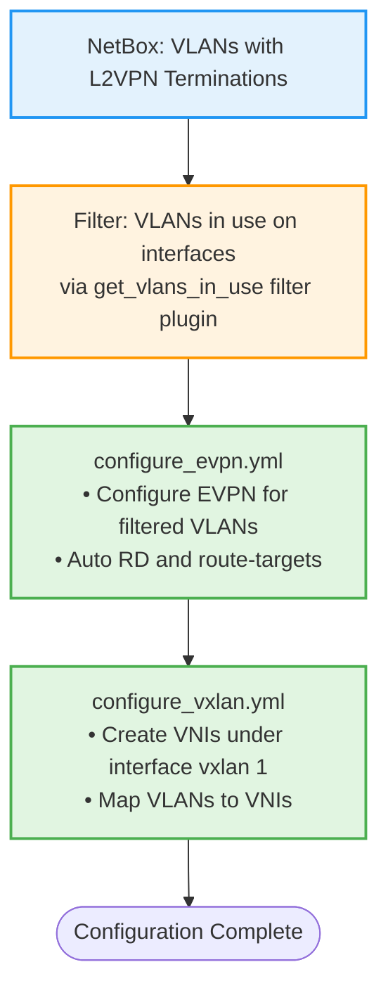
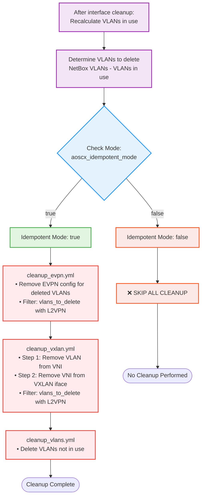

# EVPN/VXLAN Configuration and Cleanup Modes

## Overview

The EVPN and VXLAN configuration has two modes of operation controlled by `aoscx_idempotent_mode`:

## Mode Comparison

| Mode | `aoscx_idempotent_mode` | Use Case | Configuration | Cleanup |
|------|-------------------------|----------|---------------|---------|
| **Initial Deployment** | `false` | First-time setup | ✅ Creates EVPN/VXLAN | ❌ No cleanup |
| **Ongoing Management** | `true` | Day-to-day operations | ✅ Creates EVPN/VXLAN | ✅ Removes old configs |

## Behavior Details

### Initial Deployment Mode (`aoscx_idempotent_mode: false`)

**When to use:**

- First-time fabric deployment
- Adding new devices to existing fabric
- When you only want to add configurations without removing anything

**What happens:**

```yaml
# EVPN Configuration
- configure_evpn.yml ✅ RUNS
  - Creates EVPN config for VLANs in use

# VXLAN Configuration
- configure_vxlan.yml ✅ RUNS
  - Creates VNIs and VLAN-to-VNI mappings

# EVPN Cleanup
- cleanup_evpn.yml ❌ SKIPPED (idempotent_mode: false)

# VXLAN Cleanup
- cleanup_vxlan.yml ❌ SKIPPED (idempotent_mode: false)

# VLAN Cleanup
- cleanup_vlans.yml ❌ SKIPPED (idempotent_mode: false)
```

**Result:** Only creates new configurations, never removes anything.

### Ongoing Management Mode (`aoscx_idempotent_mode: true`)

**When to use:**

- Day-to-day network management
- When you want device config to match NetBox exactly
- Removing decommissioned VLANs/VNIs

**What happens:**

```yaml
# EVPN Configuration
- configure_evpn.yml ✅ RUNS
  - Creates EVPN config for VLANs in use

# VXLAN Configuration
- configure_vxlan.yml ✅ RUNS
  - Creates VNIs and VLAN-to-VNI mappings

# EVPN Cleanup
- cleanup_evpn.yml ✅ RUNS (idempotent_mode: true)
  - Removes EVPN config for VLANs being deleted

# VXLAN Cleanup
- cleanup_vxlan.yml ✅ RUNS (idempotent_mode: true)
  - Removes VNIs and VLAN-to-VNI mappings for VLANs being deleted

# VLAN Cleanup
- cleanup_vlans.yml ✅ RUNS (idempotent_mode: true)
  - Deletes VLANs not in use
```

**Result:** Creates new configs AND removes old ones to match NetBox state.

## Configuration Flow (Both Modes)



## Cleanup Flow (Idempotent Mode Only)



## Example Scenarios

### Scenario 1: Initial Fabric Deployment

```yaml
# playbook.yml
- hosts: leaf_switches
  vars:
    aoscx_idempotent_mode: false  # Initial deployment mode
    aoscx_configure_vlans: true
    aoscx_configure_evpn: true
    aoscx_configure_vxlan: true
```

**What happens:**

1. ✅ Creates VLANs 100, 200, 300
2. ✅ Creates EVPN config for VLANs 100, 200, 300
3. ✅ Creates VNIs 10100, 10200, 10300
4. ❌ No cleanup runs (idempotent_mode: false)

**Result:** Fresh fabric configuration, nothing removed.

### Scenario 2: Remove VLAN 300 from Production

**NetBox changes:**

- Remove VLAN 300 from all interface assignments
- Keep VLAN 300 object (will be deleted by cleanup)

```yaml
# playbook.yml
- hosts: leaf_switches
  vars:
    aoscx_idempotent_mode: true  # Ongoing management mode
    aoscx_configure_vlans: true
    aoscx_configure_evpn: true
    aoscx_configure_vxlan: true
```

**What happens:**

1. ✅ Interface cleanup removes VLAN 300 from interfaces
2. ✅ EVPN cleanup removes `vlan 300` from EVPN
3. ✅ VXLAN cleanup removes VLAN 300 from VNI 10300
4. ✅ VXLAN cleanup removes VNI 10300
5. ✅ VLAN cleanup deletes VLAN 300

**Result:** VLAN 300 completely removed with proper ordering.

### Scenario 3: Add VLAN 400 to Production

**NetBox changes:**

- Create VLAN 400
- Create L2VPN with identifier 10400
- Create L2VPN Termination linking VLAN 400 to L2VPN
- Assign VLAN 400 to interfaces

```yaml
# playbook.yml
- hosts: leaf_switches
  vars:
    aoscx_idempotent_mode: true  # Ongoing management mode
    aoscx_configure_vlans: true
    aoscx_configure_evpn: true
    aoscx_configure_vxlan: true
```

**What happens:**

1. ✅ Creates VLAN 400
2. ✅ Configures interfaces with VLAN 400
3. ✅ Creates EVPN config for VLAN 400
4. ✅ Creates VNI 10400 and maps VLAN 400
5. ✅ Cleanup checks but finds nothing to remove

**Result:** VLAN 400 added, existing configs unchanged.

## Control Variables

### Required for Cleanup

```yaml
# Enable idempotent mode (required for cleanup)
aoscx_idempotent_mode: true

# Enable VLAN configuration and cleanup
aoscx_configure_vlans: true

# Enable EVPN configuration and cleanup
aoscx_configure_evpn: true

# Enable VXLAN configuration and cleanup
aoscx_configure_vxlan: true
```

### Per-Device Control (NetBox Custom Fields)

```yaml
# Enable on device in NetBox
custom_fields:
  device_evpn: true    # Enable EVPN config and cleanup
  device_vxlan: true   # Enable VXLAN config and cleanup
```

## Decision Matrix

| Scenario | `idempotent_mode` | Config Tasks | Cleanup Tasks |
|----------|-------------------|--------------|---------------|
| Initial deployment | `false` | ✅ Run | ❌ Skip |
| Add new VLAN | `true` | ✅ Run | ✅ Run (nothing to clean) |
| Remove old VLAN | `true` | ✅ Run | ✅ Run (cleanup old) |
| Update existing VLAN | `true` | ✅ Run | ✅ Run (if needed) |
| Read-only check | `false` | ✅ Run | ❌ Skip |

## Benefits of This Approach

- ✅ **Safe initial deployment** - No risk of removing configs on first run
- ✅ **Connected lifecycle** - Configuration and cleanup work together
- ✅ **Explicit control** - Clear mode selection via variable
- ✅ **Idempotent** - Safe to run multiple times in either mode
- ✅ **Predictable** - Same behavior every time for given mode
- ✅ **Production-ready** - Matches common Ansible patterns

## Best Practices

1. **Initial Deployment:**
    - Use `aoscx_idempotent_mode: false`
    - Verify configs manually
    - Switch to `true` after validation

2. **Day-to-Day Operations:**
    - Use `aoscx_idempotent_mode: true`
    - Let automation handle cleanup
    - Trust the ordering

3. **Troubleshooting:**
    - Use `aoscx_idempotent_mode: false` to only add configs
    - Verify what would be cleaned up
    - Switch to `true` when ready

## Summary

The `aoscx_idempotent_mode` variable provides:

- **Clear separation** between initial deployment and ongoing management
- **Safety** by preventing unintended cleanup during initial setup
- **Flexibility** to operate in either mode as needed
- **Connection** between EVPN, VXLAN, and VLAN configuration and cleanup

All cleanup tasks respect this mode, ensuring consistent behavior across the entire role!
