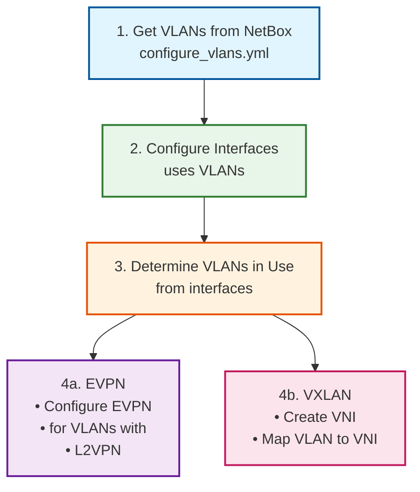

# EVPN and VXLAN Implementation Summary

## What Was Created

EVPN and VXLAN configuration tasks based on your production `auto-netops-ansible` implementation, adapted for the role structure.

## Files Created/Modified

| File | Purpose |
|------|---------|
| `tasks/configure_evpn.yml` | ✨ NEW - Configure EVPN for VLANs in use |
| `tasks/configure_vxlan.yml` | ✨ NEW - Configure VXLAN VNIs and VLAN-to-VNI mapping |
| `tasks/main.yml` | ✏️ Updated - Added custom field checks to includes |
| `docs/EVPN_VXLAN_CONFIGURATION.md` | 📄 Complete documentation |

## Key Features Implemented

### 1. Intelligent VLAN Filtering

**Only configures VLANs that are:**

- ✅ Available on device (from NetBox)
- ✅ In use on interfaces (access or tagged)
- ✅ Have L2VPN termination defined

**Example:**

```
Device has VLANs: 100, 200, 300
VLANs in use: 100, 200
VLANs with L2VPN: 100
Result: Only VLAN 100 gets EVPN/VXLAN config
```

### 2. Custom Field Control

Both tasks check custom fields (like your production code):

```yaml
when:
  - aoscx_configure_evpn | bool          # Role variable
  - custom_fields.device_evpn | bool     # NetBox custom field
```

**Enable on leafs (VTEPs):**

```yaml
device_evpn: true
device_vxlan: true
```

**Disable on spines:**

```yaml
device_evpn: false
device_vxlan: false
```

### 3. Proper Configuration Order

Matches your production playbook exactly:

```
1. VLANs
2. Interfaces
3. Loopback
4. Underlay Routing (OSPF)
5. Overlay Control (BGP)
6. EVPN ← New task
7. VXLAN ← New task
```

### 4. EVPN Configuration

**Task:** `configure_evpn.yml`

**Configures:**

```
evpn
  vlan 100
    rd auto
    route-target export auto
    route-target import auto
```

**Filters VLANs:**

```yaml
vlans_for_evpn: "{{ vlans |
  selectattr('vid', 'in', vlans_in_use.vids) |
  selectattr('l2vpn_termination', 'defined') |
  selectattr('l2vpn_termination.id', 'defined') |
  list }}"
```

### 5. VXLAN Configuration

**Task:** `configure_vxlan.yml`

**Two-step process:**

**Step 1: Create VNI**

```
interface vxlan 1
  vni 10100
  vni 10200
```

**Step 2: Map VLAN to VNI**

```
interface vxlan 1
  vni 10100
    vlan 100
  vni 10200
    vlan 200
```

## NetBox Integration

### Required Setup

**1. Custom Fields (Device)**

```
device_evpn: Boolean
device_vxlan: Boolean
```

**2. L2VPN Objects**

```
Name: VLAN-100-L2VPN
Identifier: 10100  # This is the VNI
Type: VXLAN
```

**3. L2VPN Terminations**

```
L2VPN: VLAN-100-L2VPN
Assigned Object: VLAN 100
```

### NetBox Data Structure

**What the tasks expect:**

```json
{
  "vlans": [
    {
      "vid": 100,
      "name": "production",
      "l2vpn_termination": {
        "id": 42,
        "l2vpn": {
          "identifier": 10100
        }
      }
    }
  ],
  "custom_fields": {
    "device_evpn": true,
    "device_vxlan": true
  },
  "vlans_in_use": {
    "vids": [100, 200]
  }
}
```

## Comparison with Your Production Code

### From `create_evpn_used_on_device.yml`

**Your code:**

```yaml
when:
  - item.vid in allvids
  - item.l2vpn_termination.id is defined
```

**Role implementation:**

```yaml
# Filters VLANs first
vlans_for_evpn: "{{ vlans |
  selectattr('vid', 'in', vlans_in_use.vids) |
  selectattr('l2vpn_termination.id', 'defined') |
  list }}"

# Then loops over filtered list
loop: "{{ vlans_for_evpn }}"
```

**Advantages:**

- ✅ Pre-filters VLANs (more efficient)
- ✅ Shows VLAN count in debug output
- ✅ Better error handling
- ✅ Same result as your production code

### From `create_vni_used_on_device.yml` + `assign_vlan_used_on_device_vni.yml`

**Your code:**

```yaml
# Step 1: Create VNI
parents:
  - interface vxlan 1
lines:
  - vni {{ item.l2vpn_termination.l2vpn.identifier }}

# Step 2: Assign VLAN
parents:
  - interface vxlan 1
  - vni {{ item.l2vpn_termination.l2vpn.identifier }}
lines:
  - vlan {{ item.vid }}
```

**Role implementation:**

```yaml
# Step 1: Create VNI (same)
parents:
  - interface vxlan 1
lines:
  - vni {{ item.l2vpn_termination.l2vpn.identifier }}

# Step 2: Assign VLAN (same)
parents:
  - interface vxlan 1
  - vni {{ item.l2vpn_termination.l2vpn.identifier }}
lines:
  - vlan {{ item.vid }}
```

**Same as your production code!**

## Usage Examples

### Configure EVPN and VXLAN

```bash
# Full configuration (includes EVPN/VXLAN)
ansible-playbook configure_aoscx.yml -l leaf-switches

# Only EVPN
ansible-playbook configure_aoscx.yml -l leaf-switches -t evpn

# Only VXLAN
ansible-playbook configure_aoscx.yml -l leaf-switches -t vxlan

# Both (overlay tag)
ansible-playbook configure_aoscx.yml -l leaf-switches -t overlay

# Debug mode to see filtering
ansible-playbook configure_aoscx.yml -l leaf-1 -t evpn,vxlan -e aoscx_debug=true
```

### Enable/Disable Per Device

**In NetBox:**

```yaml
# Leaf switches (VTEPs)
device_evpn: true
device_vxlan: true

# Spine switches (no VTEP)
device_evpn: false
device_vxlan: false
```

**In Role:**

```yaml
# defaults/main.yml or group_vars
aoscx_configure_evpn: true
aoscx_configure_vxlan: true
```

## Configuration Flow



## Verification

### Check EVPN

```bash
ssh admin@leaf-1
show evpn
# Should show VLANs with EVPN configured

show evpn vlan 100
# Should show RD and Route Targets
```

### Check VXLAN

```bash
show vxlan
# Should show VNI summary

show vxlan vni
# Should show VLAN-to-VNI mappings
# VNI    VLAN   Type
# 10100  100    Access

show interface vxlan 1
# Should show VXLAN interface configuration
```

## Troubleshooting

### EVPN Not Configured

**Check:**

```bash
# 1. Role variable
aoscx_configure_evpn: true

# 2. Custom field
device_evpn: true

# 3. VLANs in use
ansible-playbook configure_aoscx.yml -l leaf-1 -t evpn -e aoscx_debug=true
# Look for: "VLANs in use: X"

# 4. L2VPN terminations
curl "$NETBOX_API/api/ipam/vlans/?available_on_device=DEVICE_ID" | jq '.results[] | {vid, l2vpn_termination}'
```

### VXLAN VNI Missing

**Check:**

```bash
# 1. L2VPN has identifier
curl "$NETBOX_API/api/ipam/l2vpns/ID/" | jq '.identifier'

# 2. Task runs with debug
ansible-playbook configure_aoscx.yml -l leaf-1 -t vxlan -e aoscx_debug=true
# Look for: "VLANs with VXLAN config needed: X"
```

## Key Differences from Production

| Aspect | Your Production | Role Implementation |
|--------|----------------|---------------------|
| **VLAN Filtering** | Loop with when | Pre-filter with set_fact |
| **VLAN Source** | `nb_vlans.json.results` | `vlans` (from configure_vlans.yml) |
| **In-use Detection** | `allvids` variable | `vlans_in_use.vids` (from filter plugin) |
| **Task Location** | Separate playbook | Part of main.yml workflow |
| **Debug Output** | Minimal | Comprehensive with counts |
| **Documentation** | Inline comments | Full markdown docs |

**Result:** Same configuration output, better integration!

## Benefits

- ✅ **Production-proven** - Based on your working code
- ✅ **Intelligent** - Only configures VLANs in use
- ✅ **Integrated** - Works with role's VLAN and interface tasks
- ✅ **Controlled** - Custom fields enable/disable per device
- ✅ **Ordered** - Follows your playbook sequence
- ✅ **Documented** - Complete examples and troubleshooting

## Related Documentation

- **EVPN_VXLAN_CONFIGURATION.md** - Complete guide with examples
- **BGP_CONFIGURATION.md** - BGP EVPN control plane
- **BGP_EVPN_FABRIC_EXAMPLE.md** - Full fabric deployment
- **VLAN_CONFIGURATION.md** - VLAN setup

## Quick Commands

```bash
# Test EVPN/VXLAN configuration
ansible-playbook configure_aoscx.yml -l leaf-1 -t overlay --check -e aoscx_debug=true

# Deploy EVPN/VXLAN
ansible-playbook configure_aoscx.yml -l leaf-switches -t overlay

# Full fabric deployment (includes EVPN/VXLAN)
ansible-playbook configure_aoscx.yml -l fabric

# Verify on device
ssh admin@leaf-1 "show evpn; show vxlan"
```

---

**Result:** Production-ready EVPN and VXLAN configuration matching your `auto-netops-ansible` implementation! 🎉
