# Interface Idempotent Configuration - Quick Reference

## Overview

Interface configuration now only updates interfaces that need changes, significantly improving performance.

## How It Works

```
1. Gather facts from device
   ↓
2. Compare with NetBox desired state
   ↓
3. Identify interfaces needing changes
   ↓
4. Configure only those interfaces
```

## What Gets Compared

| Property | NetBox Source | Device Source | Example |
|----------|---------------|---------------|---------|
| Enabled/disabled | `interface.enabled` | `admin_state` | true → "up" |
| Description | `interface.description` | `description` | "Access Port" |
| MTU | `interface.mtu` | `mtu` | 9000 |
| LAG membership | `interface.lag.name` | `lag_id` | "lag1" → "1" |
| VLAN mode | `interface.mode` | `vlan_mode` | "access" |
| Native VLAN | `interface.untagged_vlan.vid` | `vlan_tag.native` | 100 |
| Trunk VLANs | `interface.tagged_vlans` | `vlan_trunks` | [10, 20, 30] |

## Files Modified

### New Files

- `filter_plugins/netbox_filters_lib/interface_filters.py` - Added `get_interfaces_needing_config_changes()`
- `tasks/identify_interface_changes.yml` - New analysis task
- `docs/INTERFACE_IDEMPOTENT_IMPLEMENTATION.md` - Full documentation

### Updated Files

- `tasks/main.yml` - Added interface analysis before configuration
- `tasks/configure_physical_interfaces.yml` - Loop over `interface_changes.physical`
- `tasks/configure_lag_interfaces.yml` - Loop over `interface_changes.lag`
- `tasks/configure_mclag_interfaces.yml` - Loop over `interface_changes.mclag`
- `tasks/assign_interfaces_to_lag.yml` - Loop over `interface_changes.lag_members`
- `tasks/configure_l2_interfaces.yml` - Loop over `interface_changes.l2`
- `tasks/configure_l3_interfaces.yml` - Loop over `interface_changes.l3`
- `filter_plugins/netbox_filters.py` - Registered new filter

## Debug Output

Run with `-v` flag to see:

```yaml
TASK [Debug - Interface change analysis summary]
ok: [switch1] => {
    "msg": [
        "Physical interfaces needing changes: 3 (1/1/1, 1/1/5, 1/1/10)",
        "LAG interfaces needing changes: 1 (lag1)",
        "L2 interfaces needing changes: 2",
        "L3 interfaces needing changes: 1",
        "Interfaces NOT needing changes: 44"
    ]
}
```

## Performance Impact

| Scenario | Before | After | Improvement |
|----------|--------|-------|-------------|
| Initial deployment (50 interfaces) | 50 API calls | 50 API calls | 0% (expected) |
| Steady state (no changes) | 50 API calls | 0 API calls | 100% |
| Minor update (5 changes) | 50 API calls | 5 API calls | 90% |

## Common Use Cases

### 1. Check What Would Change (Dry Run)

```bash
# Run with debug to see what would be configured
ansible-playbook -i inventory playbook.yml --tags interfaces -v --check
```

### 2. Update Only Physical Interfaces

```bash
# Only run physical interface configuration
ansible-playbook -i inventory playbook.yml --tags physical_interfaces -v
```

### 3. See Change Reasons

Add to playbook:

```yaml
aoscx_debug: true
```

## Troubleshooting

### Issue: All interfaces configured every time

**Cause**: Device facts not available

**Solution**: Verify fact gathering is enabled:

```yaml
aoscx_gather_facts: true  # Should be enabled
```

### Issue: Interface skipped but should be configured

**Cause**: NetBox and device state match

**Solution**: Verify NetBox data:

1. Check interface properties in NetBox
2. Compare with device state: `show interface 1/1/1`
3. Run with `-v` to see comparison results

### Issue: Error "identify_interface_changes.yml must run before..."

**Cause**: Interface analysis not performed

**Solution**: Ensure analysis task is included in `main.yml` and not skipped

## Filter Usage (Advanced)

### In Playbooks

```yaml
- name: Identify interfaces needing changes
  ansible.builtin.set_fact:
    interface_changes: >-
      {{
        interfaces | get_interfaces_needing_config_changes(ansible_facts)
      }}

- name: Configure only interfaces needing changes
  arubanetworks.aoscx.aoscx_interface:
    name: "{{ item.name }}"
    enabled: "{{ item.enabled }}"
  loop: "{{ interface_changes.physical }}"
```

### Filter Output Structure

```python
{
    "physical": [<interface_objects>],    # Physical interfaces needing changes
    "lag": [<interface_objects>],         # LAG interfaces (non-MCLAG)
    "mclag": [<interface_objects>],       # MCLAG interfaces
    "l2": [<interface_objects>],          # L2 interfaces
    "l3": [<interface_objects>],          # L3 interfaces
    "lag_members": [<interface_objects>], # LAG member assignments
    "no_changes": [<interface_objects>]   # Already correct
}
```

## Testing Commands

### Test All Interface Types

```bash
ansible-playbook -i inventory playbook.yml \
  --tags interfaces \
  -v
```

### Test Specific Interface Type

```bash
# Physical only
ansible-playbook -i inventory playbook.yml --tags physical_interfaces -v

# LAG only
ansible-playbook -i inventory playbook.yml --tags lag_interfaces -v

# L2 only
ansible-playbook -i inventory playbook.yml --tags l2_interfaces -v
```

### Check Mode (See Changes Without Applying)

```bash
ansible-playbook -i inventory playbook.yml \
  --tags interfaces \
  --check \
  -vv
```

## Key Variables

| Variable | Purpose | Default |
|----------|---------|---------|
| `interface_changes` | Categorized interfaces needing changes | (set by analysis) |
| `aoscx_debug` | Enable detailed debug output | false |
| `aoscx_gather_facts` | Enable device fact gathering | true |
| `aoscx_idempotent_mode` | L2 cleanup mode | false |

## Related Patterns

This implementation follows the same pattern as:

- **VLAN configuration**: `identify_vlan_changes.yml`
- **EVPN configuration**: Custom parsing filter
- **VXLAN configuration**: Similar comparison logic

## Quick Reference Card

```mermaid
flowchart TD
    Title[Interface Idempotent Configuration]

    Gather[1. Fact Gathering]
    Gather_Detail["✓ Device state collected via API"]

    Analysis[2. Analysis Phase]
    Analysis_Detail1["✓ Compare NetBox vs Device"]
    Analysis_Detail2["✓ Categorize by interface type"]
    Analysis_Detail3["✓ Set interface_changes fact"]

    Config[3. Configuration Phase]
    Config_Detail1["✓ Configure physical (if needed)"]
    Config_Detail2["✓ Configure LAG/MCLAG (if needed)"]
    Config_Detail3["✓ Configure L2/L3 (if needed)"]
    Config_Detail4["✓ Assign LAG members (if needed)"]

    Results[4. Results]
    Results_Detail1["✓ Only changed interfaces configured"]
    Results_Detail2["✓ Reduced API calls (typically 70-100%)"]
    Results_Detail3["✓ Faster execution"]

    Title --> Gather
    Gather --> Gather_Detail
    Gather_Detail --> Analysis
    Analysis --> Analysis_Detail1
    Analysis_Detail1 --> Analysis_Detail2
    Analysis_Detail2 --> Analysis_Detail3
    Analysis_Detail3 --> Config
    Config --> Config_Detail1
    Config_Detail1 --> Config_Detail2
    Config_Detail2 --> Config_Detail3
    Config_Detail3 --> Config_Detail4
    Config_Detail4 --> Results
    Results --> Results_Detail1
    Results_Detail1 --> Results_Detail2
    Results_Detail2 --> Results_Detail3

    style Title fill:#e3f2fd,stroke:#1976d2,stroke-width:3px
    style Gather fill:#e8f5e9
    style Gather_Detail fill:#f1f8e9
    style Analysis fill:#fff3e0
    style Analysis_Detail1 fill:#fff9c4
    style Analysis_Detail2 fill:#fff9c4
    style Analysis_Detail3 fill:#fff9c4
    style Config fill:#f3e5f5
    style Config_Detail1 fill:#f8bbd0
    style Config_Detail2 fill:#f8bbd0
    style Config_Detail3 fill:#f8bbd0
    style Config_Detail4 fill:#f8bbd0
    style Results fill:#e0f2f1
    style Results_Detail1 fill:#b2dfdb
    style Results_Detail2 fill:#b2dfdb
    style Results_Detail3 fill:#b2dfdb
```



## Quick Tips

1. **Always run with `-v`** on first use to verify behavior
2. **Check NetBox data** if interfaces are unexpectedly skipped
3. **Enable aoscx_debug** for detailed change reasons
4. **Test in non-production** first to verify comparison logic
5. **Monitor API calls** to confirm performance improvement

## Support

For issues or questions:

1. Check full documentation: `docs/INTERFACE_IDEMPOTENT_IMPLEMENTATION.md`
2. Review debug output with `-v` flag
3. Verify NetBox interface configuration
4. Check device facts: `ansible-playbook -i inventory playbook.yml --tags gather_facts -v`

---

**Implementation Status**: ✅ Complete
**Testing Status**: ⏳ Awaiting production validation
**Performance**: 🚀 70-100% reduction in API calls (typical)
