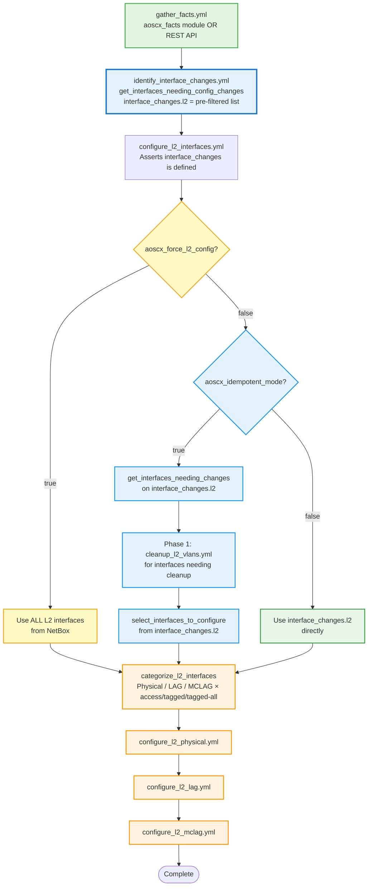

# L2 Interface Configuration

## Overview

The role uses a **two-stage pipeline** for L2 interface configuration:

1. **`identify_interface_changes.yml`** — Compares NetBox desired state against device
   facts (gathered via `gather_facts.yml`) and produces an `interface_changes` fact containing
   only the interfaces that actually need changes. This is where the bulk of the intelligence
   lives and where performance is won or lost.
2. **`configure_l2_interfaces.yml`** — Consumes `interface_changes.l2` and applies the
   required configuration in the selected mode.

This pre-filtering means the role makes **zero API calls to the device** for interfaces that
are already correctly configured, regardless of mode.

---

## Fact Gathering Modes

Before any interface comparison can happen, the role gathers device state. There are two
options, controlled by `aoscx_gather_facts_rest_api`.

### Default: aoscx_facts module

```yaml
aoscx_gather_facts_rest_api: false  # default
```

Uses the `arubanetworks.aoscx.aoscx_facts` module. Compatible with all firmware versions.

### REST API mode (recommended for performance)

```yaml
aoscx_gather_facts_rest_api: true
```

Uses direct REST API calls via `gather_facts_rest_api.yml`. Requires firmware v10.15+.

**Benefits over the default module:**

- **3–5× faster fact gathering** — single authenticated session instead of per-resource module calls
- **IPv6 addresses included** — the aoscx_facts module returns only URI references for IPv6
- **VSX virtual IPs** — required for anycast/active-gateway configuration
- **EVPN/VXLAN facts** — gathered in the same session

```yaml
# group_vars/switches.yml
aoscx_gather_facts_rest_api: true
aoscx_rest_validate_certs: false  # adjust for your environment
```

REST API credentials default to `ansible_host` / `ansible_user` / `ansible_password`. Override
with `aoscx_rest_host`, `aoscx_rest_user`, `aoscx_rest_password` if needed.

---

## Configuration Modes

### Standard Mode (default)

```yaml
aoscx_idempotent_mode: false   # default
aoscx_force_l2_config: false   # default
```

**Behavior:**

- Applies configurations for interfaces identified as needing changes by
  `identify_interface_changes.yml`
- Does not remove any existing configurations
- Suitable for initial deployment and additive changes

### Idempotent Mode

```yaml
aoscx_idempotent_mode: true
```

**Behavior:**

- **Phase 1**: Runs cleanup (`cleanup_l2_vlans.yml`) for interfaces identified as needing
  cleanup
- **Phase 2**: Applies configurations for interfaces identified as needing changes
- Ensures the device matches NetBox exactly
- Suitable for ongoing drift detection and compliance enforcement

**Cleanup Actions:**

- Removes VLAN assignments from interfaces not matching NetBox
- Cleans up trunk allowed VLANs
- Does NOT remove VLAN 1 (default VLAN)
- Only touches interfaces that exist in NetBox

### Force Mode

```yaml
aoscx_force_l2_config: true
```

**Behavior:**

- Bypasses change detection entirely
- Configures **all** L2 interfaces from NetBox regardless of current device state
- Useful when mode changes (e.g. `native-untagged` ↔ `native-tagged`) confuse change
  detection
- Takes precedence over `aoscx_idempotent_mode`

---

## Workflow Diagram



---

## Filter Plugin Reference

| Filter | Purpose | Used In |
|--------|---------|---------|
| `get_interfaces_needing_config_changes` | Cross-references NetBox interfaces with device facts to produce `interface_changes` | `identify_interface_changes.yml` (prerequisite) |
| `get_interfaces_needing_changes` | Within idempotent mode, refines `interface_changes.l2` to `cleanup` and `configure` lists | Idempotent mode only |
| `select_interfaces_to_configure` | Picks the final `configure` list from the refined analysis | Idempotent mode only |
| `categorize_l2_interfaces` | Groups interfaces into access/tagged/tagged-all × physical/LAG/MCLAG | All modes |
| `compare_interface_vlans` | Compares a single interface's NetBox vs device VLAN state | Called by `get_interfaces_needing_changes` |

---

## Variable Reference

| Variable | Default | Description |
|----------|---------|-------------|
| `aoscx_gather_facts_rest_api` | `false` | Use REST API for fact gathering (3–5× faster, requires v10.15+) |
| `aoscx_idempotent_mode` | `false` | Enable full sync with cleanup |
| `aoscx_force_l2_config` | `false` | Bypass change detection, configure all interfaces |
| `aoscx_configure_l2_interfaces` | `true` | Enable/disable L2 interface configuration |
| `aoscx_gather_facts` | `true` | Enable fact gathering |
| `aoscx_debug` | `false` | Enable verbose debug output |

---

## Performance Considerations

The most impactful performance decision is **how facts are gathered**, not which configuration
mode is used.

| Factor | Impact |
|--------|--------|
| `aoscx_gather_facts_rest_api: true` | **3–5× faster** fact gathering |
| `identify_interface_changes.yml` pre-filtering | Skips device API calls for already-correct interfaces in all modes |
| Standard vs idempotent mode | Marginal difference once facts are gathered; idempotent adds one cleanup pass |

**Recommendation:** Enable `aoscx_gather_facts_rest_api: true` on firmware v10.15+ for the
largest throughput gain.

---

## Examples

### Initial Deployment (Standard Mode + REST API Facts)

```yaml
# group_vars/switches.yml
aoscx_idempotent_mode: false
aoscx_gather_facts_rest_api: true
aoscx_configure_l2_interfaces: true
```

### Ongoing Management (Idempotent Mode + REST API Facts)

```yaml
# group_vars/production_switches.yml
aoscx_idempotent_mode: true
aoscx_gather_facts_rest_api: true
aoscx_configure_l2_interfaces: true
aoscx_debug: true  # recommended for visibility
```

### Force Reconfigure (after mode type change)

```yaml
# host_vars/specific_switch.yml
aoscx_force_l2_config: true
# Reset to false after the run
```

---

## Troubleshooting

### Idempotent Mode Not Removing Configs

1. Verify facts are gathered: `aoscx_gather_facts: true`
2. Enable debug to see the change analysis: `aoscx_debug: true`
3. Check that the interface exists in NetBox — the role only manages interfaces present in NetBox

### Change Detection Not Working (Mode Type Mismatch)

If you switch an interface between `native-untagged` and `native-tagged`, the change
detection may not catch it correctly. Use force mode for that run:

```yaml
aoscx_force_l2_config: true
```

### Slow Fact Gathering

Switch to REST API mode if on firmware v10.15+:

```yaml
aoscx_gather_facts_rest_api: true
```

### Debug Interface Analysis

```yaml
aoscx_debug: true
```

With `-v` or higher, `identify_interface_changes.yml` prints a full summary:

```
Physical interfaces needing changes: 3  [1/1/1, 1/1/2, 1/1/5]
L2 interfaces needing changes: 5
Interfaces not needing changes: 42
```
