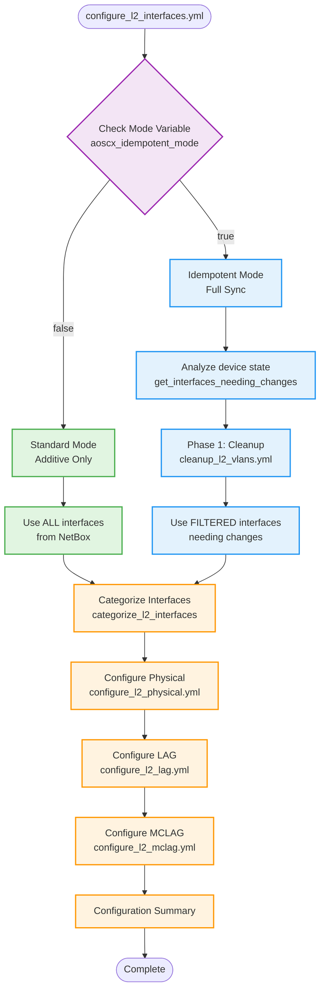

# L2 Interface Configuration Modes

This document explains how the role handles L2 interface configuration in both standard and idempotent modes.

## Overview

The role provides a **unified task file** (`tasks/configure_l2_interfaces.yml`) that intelligently handles both configuration modes based on the `aoscx_idempotent_mode` variable. This provides:

- **Simplified code** - Single task file instead of duplicate logic
- **Consistent behavior** - Same categorization and configuration logic
- **Better maintainability** - Changes in one place
- **Clear mode separation** - Explicit conditional logic for mode-specific behavior

## Configuration Modes

### Standard Mode (Default)

**Variable:** `aoscx_idempotent_mode: false`

**Behavior:**

- ✅ **Additive only** - Applies configurations from NetBox without removing existing configs
- ✅ **Fast execution** - Skips device state analysis
- ✅ **Safe for initial deployment** - Won't accidentally remove manual configurations
- ✅ **Simple workflow** - Categorizes interfaces → Applies configurations

**Use Cases:**

- Initial device provisioning
- Adding new interfaces or VLANs
- Environments where manual configs coexist with Ansible
- Testing and development

**Example:**

```yaml
---
# group_vars/switches.yml
aoscx_idempotent_mode: false
aoscx_configure_l2_interfaces: true
```

### Idempotent Mode

**Variable:** `aoscx_idempotent_mode: true`

**Behavior:**

- ✅ **Full synchronization** - Device state matches NetBox exactly
- ✅ **Cleanup phase** - Removes configurations not in NetBox
- ✅ **Change detection** - Analyzes current state vs desired state
- ✅ **Intelligent cleanup** - Only removes what's not referenced
- ✅ **Two-phase workflow**:
    1. **Phase 1**: Cleanup unwanted configurations
    2. **Phase 2**: Apply desired configurations

**Cleanup Actions:**

- Removes VLAN assignments from interfaces not matching NetBox
- Cleans up trunk allowed VLANs
- Does NOT remove VLAN 1 (default VLAN)
- Preserves interfaces without L2 configuration in NetBox

**Use Cases:**

- Ongoing configuration management
- Drift detection and remediation
- Compliance enforcement
- Production environments with NetBox as single source of truth

**Example:**

```yaml
---
# group_vars/production_switches.yml
aoscx_idempotent_mode: true
aoscx_configure_l2_interfaces: true
aoscx_debug: true  # Recommended for visibility
```

## Technical Implementation

### Workflow Diagram



### Key Functions

#### Standard Mode Logic

```jinja2
interfaces_to_configure: >-
  {{ interfaces | selectattr('mode', 'defined') | list }}
```

#### Idempotent Mode Logic

```jinja2
interfaces_needing_changes: >-
  {{ interfaces | get_interfaces_needing_changes(ansible_facts) }}

interfaces_to_configure: >-
  {{ interfaces_needing_changes.configure }}
```

### Filter Plugin Usage

The role uses custom filter plugins for data transformation:

| Filter | Purpose | Used In |
|--------|---------|---------|
| `get_interfaces_needing_changes` | Analyzes device facts vs NetBox | Idempotent mode only |
| `categorize_l2_interfaces` | Groups interfaces by type | Both modes |
| `get_vlans_in_use` | Identifies VLANs referenced by interfaces | Both modes |
| `compare_interface_vlans` | Compares device vs NetBox state | Idempotent mode only |

## Migration Guide

### From Old Structure

**Before (v1.0.0):**

```yaml
# Unified task file
tasks/
  configure_l2_interfaces.yml         # Handles both modes automatically
```

### Updating Your Playbooks

**No changes required!** The role automatically detects the mode:

```yaml
- name: Configure switches
  hosts: switches
  roles:
    - role: aopdal.aruba_cx_switch
      vars:
        aoscx_idempotent_mode: true  # or false
```

## Performance Comparison

### Standard Mode

- ⏱️ **Faster** - No device state analysis
- 📊 **Lower overhead** - Direct configuration application
- 🔄 **Suitable for**: Large-scale initial deployments

### Idempotent Mode

- ⏱️ **Slower** - Analyzes current state
- 📊 **Higher overhead** - Fact gathering + comparison + cleanup
- 🔄 **Suitable for**: Ongoing management, smaller change sets

**Benchmark (100 interfaces):**

*Note: The following timing values are approximate and will vary depending on hardware, network conditions, and test environment.*

- Standard Mode: ~2 minutes
- Idempotent Mode: ~5 minutes (includes cleanup analysis)

## Best Practices

### 1. Use Standard Mode for Initial Deployment

```yaml
# First-time switch configuration
aoscx_idempotent_mode: false
aoscx_configure_vlans: true
aoscx_configure_l2_interfaces: true
```

### 2. Switch to Idempotent Mode for Ongoing Management

```yaml
# After initial deployment
aoscx_idempotent_mode: true
aoscx_configure_l2_interfaces: true
```

### 3. Enable Debug Mode for Visibility

```yaml
aoscx_debug: true
# Shows:
# - Mode selection
# - Interface categorization
# - Cleanup actions (idempotent mode)
# - Configuration summary
```

### 4. Test in Development First

```yaml
# Test with idempotent mode on dev switches first
- hosts: dev_switches
  vars:
    aoscx_idempotent_mode: true
    aoscx_debug: true
  roles:
    - aopdal.aruba_cx_switch
```

### 5. Use Tags for Targeted Runs

```bash
# Only configure L2 interfaces
ansible-playbook site.yml --tags l2_interfaces

# Skip cleanup in idempotent mode (if needed)
ansible-playbook site.yml --skip-tags cleanup
```

## Troubleshooting

### Issue: Idempotent Mode Not Removing Configs

**Symptoms:**

- Extra VLANs not removed from interfaces
- Device state doesn't match NetBox

**Possible Causes:**

1. Device facts not gathered: Ensure `aoscx_gather_facts: true`
2. Interface not in NetBox: Interface must exist in NetBox to be managed
3. VLAN 1 is protected: Default VLAN is never removed

**Solution:**

```yaml
# Ensure facts are gathered
aoscx_gather_facts: true

# Enable debug to see what's detected
aoscx_debug: true

# Check the analysis output
```

### Issue: Standard Mode Too Slow

**Symptoms:**

- Configuration takes longer than expected

**Possible Cause:**

- Accidentally using idempotent mode

**Solution:**

```yaml
# Verify the mode
- name: Check mode
  ansible.builtin.debug:
    msg: "Mode: {{ aoscx_idempotent_mode }}"

# Explicitly set to false
aoscx_idempotent_mode: false
```

## Examples

### Example 1: Initial Deployment (Standard Mode)

```yaml
---
- name: Initial switch deployment
  hosts: new_switches
  gather_facts: false
  vars:
    aoscx_idempotent_mode: false
    aoscx_gather_facts: true
    aoscx_configure_l2_interfaces: true

  roles:
    - aopdal.aruba_cx_switch
```

**Expected Behavior:**

- Configures all interfaces from NetBox
- Preserves any existing manual configurations
- Fast execution (~2 min for 100 interfaces)

### Example 2: Ongoing Management (Idempotent Mode)

```yaml
---
- name: Daily configuration sync
  hosts: production_switches
  gather_facts: false
  vars:
    aoscx_idempotent_mode: true
    aoscx_gather_facts: true
    aoscx_configure_l2_interfaces: true
    aoscx_debug: true

  roles:
    - aopdal.aruba_cx_switch
```

**Expected Behavior:**

- Analyzes device state
- Removes configurations not in NetBox
- Applies/updates configurations from NetBox
- Ensures device matches NetBox exactly

### Example 3: Gradual Migration

```yaml
---
# Week 1: Use standard mode to add configs
- name: Week 1 - Add configurations
  hosts: switches
  vars:
    aoscx_idempotent_mode: false
  roles:
    - aopdal.aruba_cx_switch

# Week 2: Switch to idempotent after verification
- name: Week 2 - Enable full sync
  hosts: switches
  vars:
    aoscx_idempotent_mode: true
    aoscx_debug: true
  roles:
    - aopdal.aruba_cx_switch
```

## Summary

The unified L2 interface configuration provides:

- ✅ **Flexibility** - Choose the right mode for your use case
- ✅ **Safety** - Standard mode for initial deployment
- ✅ **Compliance** - Idempotent mode for ongoing management
- ✅ **Simplicity** - Single task file, automatic mode detection
- ✅ **Visibility** - Debug output shows exactly what's happening

Choose standard mode for speed and safety during initial deployment, then switch to idempotent mode for ongoing drift detection and compliance enforcement.
