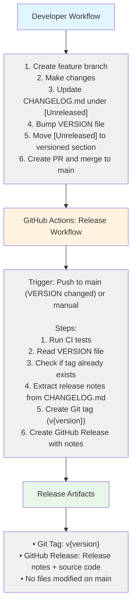
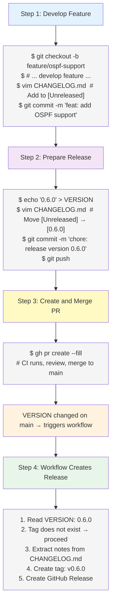
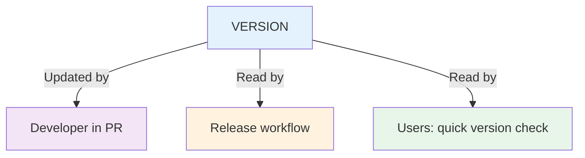
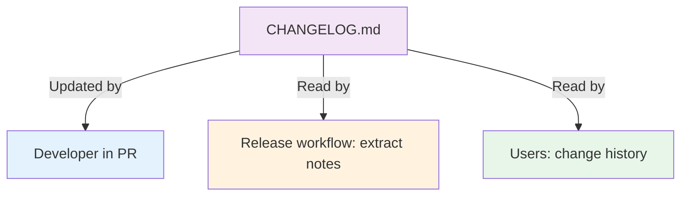
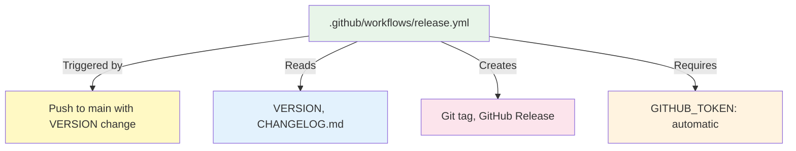

# Release System Integration

How the release system components work together.

## Overview

The release system is designed to respect branch protection. The developer handles version bumps and changelog updates in a pull request. The automated workflow only creates tags and GitHub Releases — it never pushes commits to `main`.

## System Architecture



---

## Component Details

### 1. VERSION — Version Storage

**Purpose**: Single source of truth for current version

**Location**: `/VERSION`

**Format**:
```
0.5.0
```

**Updated by**: Developer (in PR, before merge)

**Read by**:
- Release workflow (to create the correct tag)
- Users (quick version check)

**Why not galaxy.yml?**: This is an Ansible **Role** (not a Collection). Roles use `meta/main.yml` for Galaxy metadata, not `galaxy.yml`. We use a simple `VERSION` file for version tracking.

---

### 2. CHANGELOG.md — Change Tracking

**Purpose**: Human-readable change history and release notes source

**Location**: `/CHANGELOG.md`

**Format**: [Keep a Changelog](https://keepachangelog.com/)

```markdown
## [Unreleased]

## [0.6.0] - 2026-03-15

### Added
- New features

## [0.5.0] - 2026-02-25
```

**Updated by**: Developer
- During development: add entries to `[Unreleased]`
- At release time: move `[Unreleased]` content to a versioned section

**Read by**:
- Release workflow (extracts release notes for the version)
- Users (understand changes between versions)
- Documentation site (via MkDocs)

---

### 3. Release Workflow — Automation Engine

**Purpose**: Create Git tags and GitHub Releases automatically

**Location**: `/.github/workflows/release.yml`

**Triggers**:
- Push to `main` when `VERSION` file changes
- Manual workflow dispatch

**What it does**:
- Reads VERSION file
- Checks if tag already exists (skip if so)
- Extracts release notes from CHANGELOG.md
- Creates annotated Git tag `v{version}`
- Creates GitHub Release with notes

**What it does NOT do**:
- Does not commit to `main`
- Does not modify VERSION or CHANGELOG.md
- Does not auto-increment versions

---

### 4. Git Tags — Version Markers

**Purpose**: Mark specific commits as releases

**Format**: `v{version}` (e.g., `v0.5.0`)

**Created by**: Release workflow (automated)

**Used for**:
- Checkout specific version
- Track release history
- GitHub Release association

---

### 5. GitHub Releases — Distribution

**Purpose**: Provide downloadable releases with notes

**Created by**: Release workflow (automated)

**Contains**:
- Release version and date
- Release notes (extracted from CHANGELOG.md)
- Source code (zip/tar.gz)
- Git tag reference

---

## Integration Flow

### Scenario: Feature Development to Release



---

## File Dependencies

### VERSION File



### CHANGELOG.md



### Release Workflow



---

## Configuration

### Release Workflow Configuration

**File**: `.github/workflows/release.yml`

**Key settings**:
```yaml
on:
  push:
    branches:
      - main
    paths:
      - VERSION            # Only triggers when VERSION changes
  workflow_dispatch:       # Manual trigger

permissions:
  contents: write          # Required for creating tags and releases
```

### Branch Protection Compatibility

The workflow works with branch protection because:
- It never pushes **commits** to `main` (which would require a PR)
- It only pushes **tags** (`refs/tags/*`), which are not restricted by the pull request rule
- The `GITHUB_TOKEN` has `contents: write` permission, which is sufficient for tags

---

## Error Handling

### Common Issues

| Error | Cause | Solution |
|-------|-------|----------|
| Tag already exists | Version already released | Delete tag or bump VERSION to next version |
| Empty release notes | No matching section in CHANGELOG | Add a `## [x.y.z] - date` section matching VERSION |
| Workflow not triggered | VERSION not in changed files | Ensure VERSION was modified in the merged PR |
| CI tests failed | Code issues | Fix tests, update PR, re-merge |

### Recovery Procedures

**Delete a failed release**:
```bash
gh release delete v0.6.0 --yes
git tag -d v0.6.0
git push origin :refs/tags/v0.6.0

# Re-trigger
gh workflow run release.yml --ref main
```

---

## Future: Ansible Galaxy Integration

When ready to publish to Ansible Galaxy, add a publishing step to the release workflow:

```yaml
- name: Import role to Ansible Galaxy
  run: >-
    ansible-galaxy role import
    --api-key ${{ secrets.GALAXY_API_KEY }}
    aopdal ansible-role-aruba-cx-switch
```

This uses `role import` (not `collection publish`) because this is an Ansible Role.

---

## See Also

- [Release Process — Full Guide](RELEASE_PROCESS.md)
- [Release Quick Reference](RELEASE_QUICK_REFERENCE.md)
- [CHANGELOG.md](../CHANGELOG.md)
- [Contributing Guide](CONTRIBUTING.md)
- [Semantic Versioning](https://semver.org/)
- [Keep a Changelog](https://keepachangelog.com/)
