# Release System Integration

How the automated release system components work together.

## Overview

The release system consists of several interconnected components that automate versioning, changelog management, and release creation without publishing to Ansible Galaxy (yet).

## System Architecture

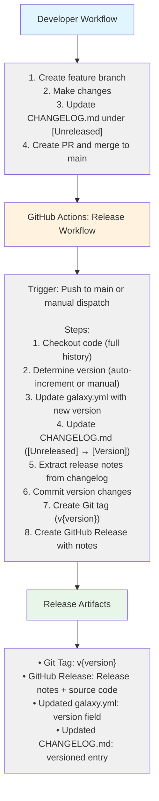

---

## Component Details

### 1. VERSION - Version Storage

**Purpose**: Single source of truth for current version

**Location**: `/VERSION`

**Format**:
```
0.1.0
```

**Updated By**: Release workflow (automated)

**Read By**:
- Release workflow (to determine current version)
- Users (quick version check)

**Why not galaxy.yml?**: This is an Ansible **Role** (not a Collection). Roles use `meta/main.yml` for Galaxy metadata, not `galaxy.yml`. We use a simple `VERSION` file for version tracking.

**Example Flow**:
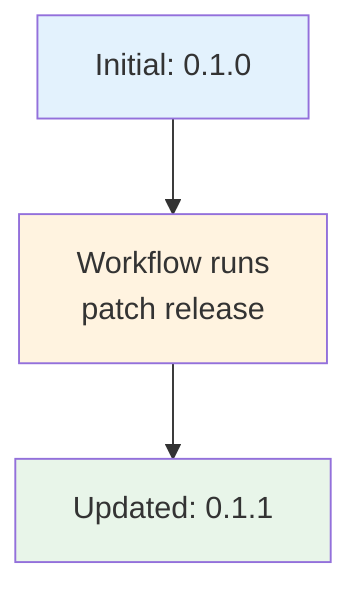

---

### 2. CHANGELOG.md - Change Tracking

**Purpose**: Human-readable change history

**Location**: `/CHANGELOG.md`

**Format**: [Keep a Changelog](https://keepachangelog.com/)

```markdown
## [Unreleased]

### Added
- New features here

## [0.1.1] - 2025-01-15

### Fixed
- Bug fixes

## [0.1.0] - 2025-01-10

### Added
- Initial release
```

**Updated By**:
- Developers (add to [Unreleased])
- Release workflow (move [Unreleased] to version)

**Read By**:
- Release workflow (extract release notes)
- Users (understand changes)
- Documentation site (via mkdocs)

**Example Flow**:
```markdown
Before Release:
## [Unreleased]
### Added
- New OSPF support

After Release (v0.2.0):
## [Unreleased]

## [0.2.0] - 2025-01-15
### Added
- New OSPF support
```

---

### 3. Release Workflow - Automation Engine

**Purpose**: Orchestrate release process

**Location**: `/.github/workflows/release.yml`

**Triggers**:
- Push to `main` branch (automatic)
- Manual workflow dispatch (with parameters)

**Inputs** (manual trigger):
```yaml
version: ""                 # Optional: specific version
release_type: "patch"       # major|minor|patch
```

**Outputs**:
- Updated `galaxy.yml`
- Updated `CHANGELOG.md`
- Git tag `v{version}`
- GitHub Release

**Logic**:

```python
# Version Determination
if manual_version:
    new_version = manual_version
else:
    current = read_version_file()
    if release_type == "major":
        new_version = increment_major(current)
    elif release_type == "minor":
        new_version = increment_minor(current)
    else:  # patch
        new_version = increment_patch(current)

# Update Files
update_version_file(new_version)
update_changelog(new_version)
extract_release_notes(changelog)

# Git Operations
git_commit("chore: release version {new_version}")
git_tag("v{new_version}")
git_push()

# GitHub Release
create_github_release(
    tag="v{new_version}",
    notes=release_notes
)
```

---

### 4. Git Tags - Version Markers

**Purpose**: Mark specific commits as releases

**Format**: `v{version}` (e.g., `v1.0.0`)

**Created By**: Release workflow

**Used For**:
- Checkout specific version
- Track release history
- GitHub Release association

**Example**:
```bash
# List tags
$ git tag -l
v0.1.0
v0.1.1
v0.2.0

# Checkout specific version
$ git checkout v0.1.1

# View tag details
$ git show v0.1.1
```

---

### 5. GitHub Releases - Distribution

**Purpose**: Provide downloadable releases with notes

**Created By**: Release workflow

**Contains**:
- Release version and date
- Release notes (from CHANGELOG.md)
- Source code (zip/tar.gz)
- Git tag reference

**Example**:
```
Release v0.2.0
Published on Jan 15, 2025

# Release 0.2.0

### Added
- **OSPF configuration support** - Complete OSPF implementation
  - Interface selection and area assignment
  - Configuration validation
  - NetBox custom field integration

### Fixed
- **VLAN deletion** - Fixed VLAN 1 protection logic

Assets:
- Source code (zip)
- Source code (tar.gz)
```

---

## Integration Flow

### Scenario: Feature Development to Release

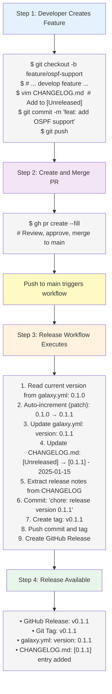

---

## File Dependencies

### VERSION File

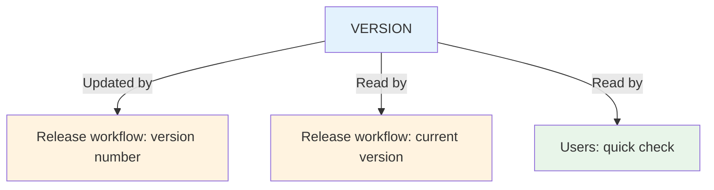

### CHANGELOG.md

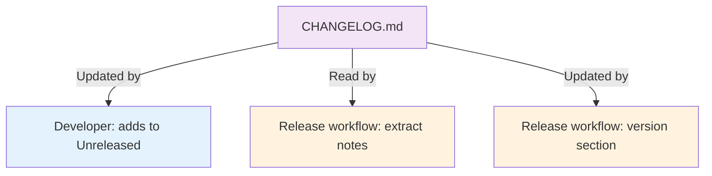

### meta/main.yml

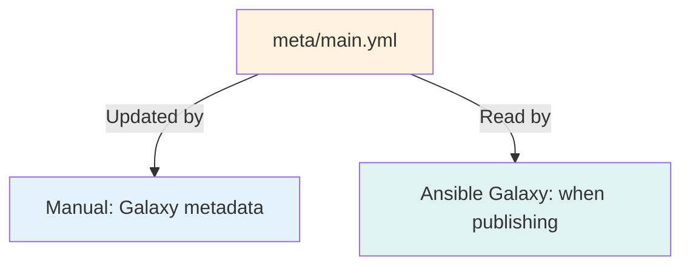

### Release Workflow

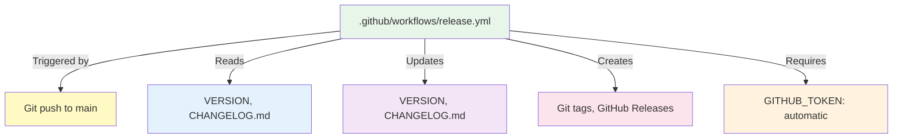

### Git Tags

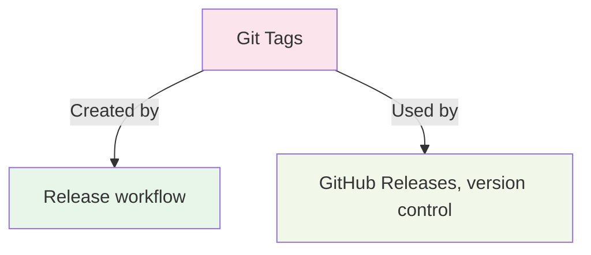

### GitHub Releases

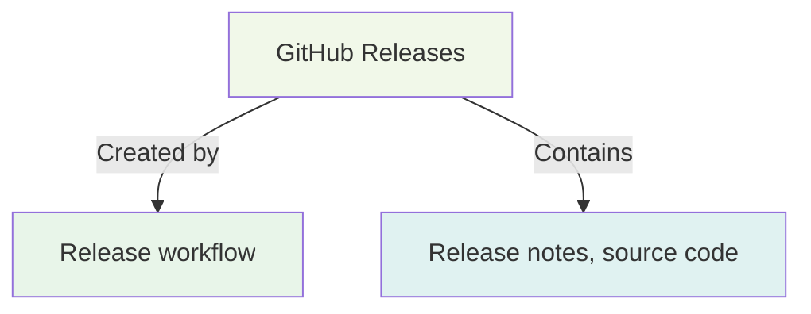

---

## Configuration Points

### Release Workflow Configuration

**File**: `.github/workflows/release.yml`

**Key Settings**:
```yaml
on:
  push:
    branches:
      - main              # Auto-trigger on main push
  workflow_dispatch:
    inputs:
      version: ...        # Manual version override
      release_type: ...   # major|minor|patch

permissions:
  contents: write         # Required for creating releases
  pull-requests: write    # Required for PR integration
```

### Version Configuration

**File**: `galaxy.yml`

```yaml
version: 0.1.0           # Current version (updated by workflow)
```

### Changelog Configuration

**File**: `CHANGELOG.md`

**Format Requirements**:
- Must have `[Unreleased]` section header
- Follow [Keep a Changelog](https://keepachangelog.com/) format
- Use standard categories: Added, Changed, Fixed, etc.

---

## Error Handling

### Workflow Failures

**Common Issues and Solutions**:

| Error | Cause | Solution |
|-------|-------|----------|
| Tag already exists | Version already released | Delete tag or use different version |
| No [Unreleased] section | CHANGELOG format issue | Add `[Unreleased]` header |
| Invalid YAML | Malformed galaxy.yml | Validate YAML syntax |
| Permission denied | Token issue | Check GITHUB_TOKEN permissions |

### Recovery Procedures

**Delete Failed Release**:
```bash
# Delete release
gh release delete v1.0.0 --yes

# Delete tag
git tag -d v1.0.0
git push origin :refs/tags/v1.0.0

# Reset VERSION if needed
git checkout HEAD~1 VERSION
git commit -m "chore: reset version"
git push
```

**Retry Release**:
```bash
# Fix issue (e.g., update CHANGELOG.md)
vim CHANGELOG.md
git add CHANGELOG.md
git commit -m "docs: fix changelog format"
git push

# Workflow reruns automatically
```

---

## Future: Ansible Galaxy Integration

When ready to publish to Ansible Galaxy:

### Step 1: Enable Publishing

Uncomment the Galaxy publishing job in `.github/workflows/ci.yml`:

```yaml
release:
  name: Release to Ansible Galaxy
  # ... (see ci.yml)
```

### Step 2: Add Secrets

Add `GALAXY_API_KEY` to repository secrets:

1. Generate key at https://galaxy.ansible.com/me/preferences
2. Add to GitHub: Settings → Secrets → Actions → New secret

### Step 3: Workflow Integration

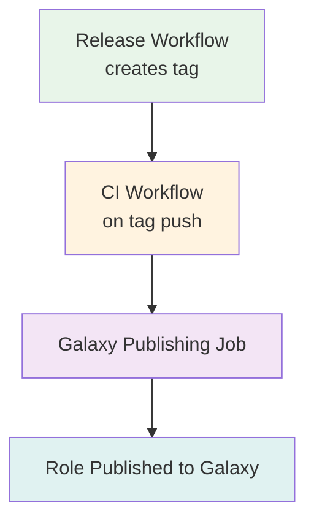

### Combined Flow

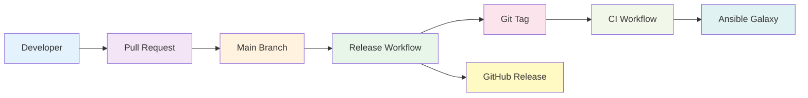

---

## Monitoring and Verification

### Check Release Status

```bash
# View workflow runs
gh run list --workflow=release.yml

# View specific run
gh run view <run-id> --log

# List releases
gh release list

# View specific release
gh release view v1.0.0
```

### Verify Version Consistency

```bash
# Check VERSION file
cat VERSION

# Check latest tag
git describe --tags --abbrev=0

# Check latest release
gh release view --json tagName -q .tagName

# All should match!
```

### Audit Trail

```bash
# Release commits
git log --grep="chore: release version" --oneline

# Tags with dates
git log --tags --simplify-by-decoration --pretty="format:%ai %d"

# Full release history
gh release list --limit 100
```

---

## Best Practices

1. **Always Update CHANGELOG First** - Before merging to main
2. **Use Semantic Versioning** - MAJOR.MINOR.PATCH strictly
3. **Meaningful Release Notes** - Explain what changed and why
4. **Test Before Merge** - CI should be green
5. **One Feature Per Release** - Keep releases focused
6. **Tag Immutability** - Never modify released tags
7. **Version Alignment** - Keep all version sources in sync

---

## Troubleshooting Guide

### Workflow Not Running

**Check**:
```bash
# Verify workflow file exists
ls -la .github/workflows/release.yml

# Check workflow syntax
cat .github/workflows/release.yml | python -m yaml

# View workflow status
gh workflow view release.yml
```

### Version Not Updated

**Check**:
```bash
# Verify VERSION file exists
cat VERSION

# Check commit history
git log --oneline -5

# View workflow logs
gh run view --log
```

### Release Notes Empty

**Check**:
```bash
# Verify [Unreleased] section exists
grep -A 10 "\[Unreleased\]" CHANGELOG.md

# Check format
head -20 CHANGELOG.md
```

---

## See Also

- [Release Process - Full Guide](RELEASE_PROCESS.md)
- [Release Quick Reference](RELEASE_QUICK_REFERENCE.md)
- [CHANGELOG.md](../CHANGELOG.md)
- [Contributing Guide](CONTRIBUTING.md)
- [Semantic Versioning](https://semver.org/)
- [Keep a Changelog](https://keepachangelog.com/)
