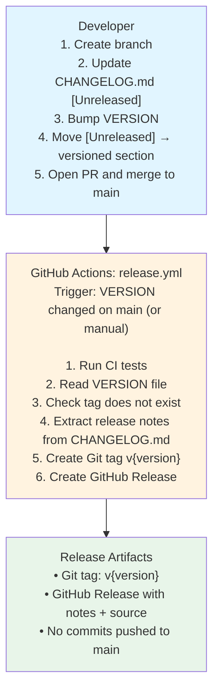

# Release Process

## TL;DR

1. Update `CHANGELOG.md` — move `[Unreleased]` content to a new version section
2. Update `VERSION` file with the new version number
3. Merge PR to `main`
4. Workflow creates Git tag and GitHub Release automatically

```bash
echo "0.6.0" > VERSION
vim CHANGELOG.md          # move [Unreleased] → [0.6.0] - YYYY-MM-DD
git add VERSION CHANGELOG.md
git commit -m "chore: release version 0.6.0"
git push
gh pr create --title "chore: release v0.6.0" --fill
gh pr merge --merge
```

---

## Overview

Releases are created by updating `VERSION` and `CHANGELOG.md` in a pull request. When the PR
is merged to `main`, a GitHub Actions workflow automatically creates a Git tag and GitHub
Release — no direct pushes to `main` are needed.



---

## Versioning

This project follows [Semantic Versioning](https://semver.org/):

```
MAJOR.MINOR.PATCH
  │     │     └─ Bug fixes, small improvements
  │     └─────── New features, backward compatible
  └───────────── Breaking changes
```

| Bump | Before → After | When |
|------|---------------|------|
| Patch | `0.5.0` → `0.5.1` | Bug fix, documentation update |
| Minor | `0.5.1` → `0.6.0` | New feature |
| Major | `0.6.0` → `1.0.0` | Breaking change |

The current version is stored in [`VERSION`](../VERSION) as a single plain-text line.

> **Note**: This is an Ansible **Role** (not a Collection). Roles use `meta/main.yml` for
> Galaxy metadata; the `VERSION` file is the version source of truth, not `galaxy.yml`.

### Conventional Commits

Recommended for readable history:

| Prefix | Meaning |
|--------|---------|
| `feat:` | New feature |
| `fix:` | Bug fix |
| `docs:` | Documentation |
| `chore:` | Maintenance (e.g., release commit) |
| `feat!:` / `BREAKING CHANGE:` | Breaking change |

---

## Changelog Management

All changes are tracked in [`CHANGELOG.md`](CHANGELOG.md) following
[Keep a Changelog](https://keepachangelog.com/) format.

### During Development

Add entries to the `[Unreleased]` section as you work:

```markdown
## [Unreleased]

### Added
- **OSPF configuration support** - New filters and tasks for OSPF
```

### Preparing a Release

Move `[Unreleased]` content to a new versioned section:

```markdown
## [Unreleased]

## [0.6.0] - 2026-03-15

### Added
- **OSPF configuration support** - New filters and tasks for OSPF

## [0.5.0] - 2026-02-25
```

### Changelog Categories (in order)

1. **Added** — New features
2. **Changed** — Changes to existing functionality
3. **Deprecated** — Soon-to-be removed features
4. **Removed** — Removed features
5. **Fixed** — Bug fixes
6. **Security** — Security vulnerability fixes

---

## Release Workflow

**File**: `.github/workflows/release.yml`

**Triggers**:
- Push to `main` when `VERSION` file changes
- Manual dispatch (`workflow_dispatch`)

**Steps**:

1. Run CI tests (lint, syntax check, unit tests)
2. Read `VERSION` file
3. Check if `v{version}` tag already exists — skip if so
4. Extract release notes from the matching `## [x.y.z]` section in `CHANGELOG.md`
5. Create annotated Git tag `v{version}`
6. Create GitHub Release with extracted notes

**Key configuration**:

```yaml
on:
  push:
    branches: [main]
    paths: [VERSION]      # Only triggers when VERSION changes
  workflow_dispatch:

permissions:
  contents: write         # Required for creating tags and releases
```

The workflow never commits to `main`. It only pushes tags (`refs/tags/*`), which are not
restricted by branch protection pull-request rules.

---

## Release Checklist

### Pre-Release

- [ ] CI green
- [ ] `CHANGELOG.md` updated — `[Unreleased]` content moved to new version section
- [ ] `VERSION` file updated

### During Release

- [ ] PR created with VERSION + CHANGELOG changes
- [ ] CI passes on PR
- [ ] PR merged to `main`

### Post-Release

- [ ] GitHub Release created automatically
- [ ] Git tag created
- [ ] `CHANGELOG.md` has an empty `[Unreleased]` section ready for the next cycle

---

## Common Scenarios

### Regular Feature Release

```
1. Develop on feature branch, add entries to CHANGELOG.md [Unreleased]
2. Update VERSION: 0.5.0 → 0.6.0
3. Move [Unreleased] → [0.6.0] - YYYY-MM-DD in CHANGELOG.md
4. Merge PR to main
5. Workflow creates v0.6.0 tag and release
```

### Critical Bug Fix (Patch)

```
1. Fix on hotfix branch, add entries to CHANGELOG.md [Unreleased]
2. Update VERSION: 0.6.0 → 0.6.1
3. Move [Unreleased] → [0.6.1] - YYYY-MM-DD in CHANGELOG.md
4. Merge PR to main
5. Workflow creates v0.6.1 tag and release
```

### Manual Trigger

If `VERSION` was already updated in a previous PR:

```bash
gh workflow run release.yml --ref main
# or: Actions → Release → Run workflow
```

---

## Reference Commands

### Version & Tags

```bash
cat VERSION
git tag -l
git describe --tags --abbrev=0
git show v0.5.0
git checkout v0.5.0
```

### GitHub Releases

```bash
gh release list
gh release view v0.5.0
gh release download v0.5.0
```

### Workflow Status

```bash
gh run list --workflow=release.yml
gh run view <run-id> --log
```

### Delete a Release (Recovery)

```bash
gh release delete v0.6.0 --yes
git tag -d v0.6.0
git push origin :refs/tags/v0.6.0
gh workflow run release.yml --ref main   # re-trigger
```

---

## Troubleshooting

| Problem | Cause | Fix |
|---------|-------|-----|
| Tag already exists | Version already released | Delete tag (see above) or bump VERSION |
| Release notes empty | No matching `## [x.y.z]` in CHANGELOG | Add version section matching VERSION |
| Workflow not triggered | VERSION not in changed files | Ensure VERSION was modified in the merged PR |
| CI tests failed | Code issues | Fix tests, update PR, re-merge |

---

## Role vs Collection

This is an Ansible **Role**, not a Collection:

| Feature | Collection | Role (This Project) |
|---------|-----------|---------------------|
| Metadata file | `galaxy.yml` | `meta/main.yml` |
| Version storage | `galaxy.yml` | `VERSION` file |
| Namespace | `namespace.collection_name` | `author.role_name` |
| Publish | `collection publish` | `role import` |
| Install | `collection install` | `role install` |

```bash
# Confirm this is a Role
ls meta/main.yml          # ✅ Exists
ls galaxy.yml 2>/dev/null # ❌ Should NOT exist
```

---

## Ansible Galaxy Publishing (Future)

When ready to publish to Galaxy:

1. Claim `aopdal` namespace at https://galaxy.ansible.com
2. Generate an API key at https://galaxy.ansible.com/me/preferences
3. Add `GALAXY_API_KEY` to repository secrets
4. Add to workflow:

```yaml
- name: Import role to Ansible Galaxy
  run: >-
    ansible-galaxy role import
    --api-key ${{ secrets.GALAXY_API_KEY }}
    aopdal ansible-role-aruba-cx-switch
```

Installing once published:

```bash
ansible-galaxy role install aopdal.aruba_cx_switch
ansible-galaxy role install aopdal.aruba_cx_switch,v0.6.0
```

---

## Best Practices

1. **Update CHANGELOG as you go** — Add entries during development, not just at release time
2. **Bump VERSION in the release PR** — Keep the version bump as a clear, dedicated commit
3. **Follow SemVer** — Patch for fixes, Minor for features, Major for breaking changes
4. **Write meaningful changelog entries** — Help users understand what actually changed
5. **Keep CI green** — Don't merge a release PR with failing tests
6. **Use `v` prefix on tags** — Always `v0.6.0`, never `0.6.0`

---

## See Also

- [Semantic Versioning](https://semver.org/)
- [Keep a Changelog](https://keepachangelog.com/)
- [GitHub Releases Documentation](https://docs.github.com/en/repositories/releasing-projects-on-github)
- [Contributing Guide](CONTRIBUTING.md)
- [CHANGELOG.md](CHANGELOG.md)
