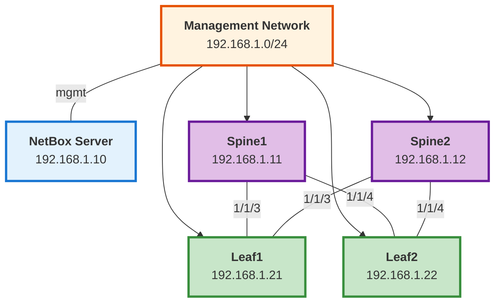

# Testing Guide for ansible-role-aruba-cx-switch

This document describes the comprehensive testing infrastructure for the Aruba AOS-CX Switch Ansible role with **virtual environment isolation**.

## Table of Contents

- [Overview](#overview)
- [Testing Infrastructure](#testing-infrastructure)
- [Quick Start](#quick-start)
- [Prerequisites](#prerequisites)
- [Local Testing](#local-testing)
- [CI/CD Pipeline](#cicd-pipeline)
- [Test Types](#test-types)
- [Common Commands](#common-commands)
- [Troubleshooting](#troubleshooting)
- [Quick Start (lab bring-up)](#quick-start-lab-bring-up)
- [Test Environment (EVE-NG + NetBox)](#test-environment-eve-ng-netbox)
- [Testing Scripts](#testing-scripts)
- [Filter-Plugin Unit Tests](#filter-plugin-unit-tests)
- [Tag-Dependent Task Testing](#tag-dependent-task-testing)

## Overview

This role includes comprehensive CI/CD testing infrastructure with **8 layers of testing**:

1. ✅ **Python Unit Tests** (`pytest`) - 309 tests for filter plugins — see [Filter-Plugin Unit Tests](#filter-plugin-unit-tests)
2. ✅ **YAML Linting** (`yamllint`) - Validates YAML syntax and style
3. ✅ **Ansible Linting** (`ansible-lint`) - Checks Ansible best practices
4. ✅ **Syntax Checking** - Validates playbook syntax (multiple Ansible versions)
5. ✅ **Molecule Testing** - Role integration testing (Docker-based)
6. ✅ **Integration Testing** - Full playbook testing
7. ✅ **Pre-commit Hooks** - Automated checks before commits
8. ✅ **CI/CD Pipeline** - GitHub Actions automation

### Key Benefits

- ✅ **Isolated Environment** - No conflicts with system packages
- ✅ **Single-version Testing** - Pinned to `ansible-core>=2.18.0,<2.19.0`
- ✅ **Automated CI/CD** - Runs on every push/PR
- ✅ **Pre-commit Hooks** - Catch issues before commit
- ✅ **Easy Commands** - Simple Makefile interface
- ✅ **Comprehensive Docs** - Multiple detailed guides
- ✅ **Industry Best Practices** - Virtual envs, linting, testing
- ✅ **Auto Galaxy Release** - Publish automatically on main branch

## Testing Infrastructure

### Core Components (21 files)

1. **GitHub Actions CI/CD**
    - `.github/workflows/ci.yml` - Multi-stage pipeline (lint, syntax, molecule, integration, release)
    - `.github/ISSUE_TEMPLATE/bug_report.md` - Bug report template
    - `.github/ISSUE_TEMPLATE/feature_request.md` - Feature request template

2. **Testing Configuration**
    - `.ansible-lint` - Ansible best practices linting (production profile)
    - `.yamllint` - YAML syntax validation rules
    - `requirements-test.txt` - Python testing dependencies
    - `.pre-commit-config.yaml` - Pre-commit hook configuration

3. **Molecule Testing Framework**
    - `molecule/default/molecule.yml` - Test configuration
    - `molecule/default/converge.yml` - Role application test
    - `molecule/default/verify.yml` - Verification tests

4. **Test Playbooks**
    - `tests/test.yml` - Main test playbook with comprehensive mock data
    - `tests/integration.yml` - Integration test scenarios
    - `tests/inventory` - Test inventory file

5. **Developer Tools**
    - `Makefile` - 20+ convenient commands with venv integration
    - `setup-testing.sh` - Automated setup script (creates venv)
    - `.gitignore` - Enhanced for testing artifacts and venv

### File Structure

```
ansible-role-aruba-cx-switch/
├── .github/
│   ├── workflows/
│   │   └── ci.yml                    # CI/CD pipeline
│   └── ISSUE_TEMPLATE/
│       ├── bug_report.md
│       └── feature_request.md
├── molecule/
│   └── default/
│       ├── molecule.yml              # Molecule config
│       ├── converge.yml              # Test playbook
│       └── verify.yml                # Verification
├── tests/
│   ├── test.yml                      # Main test
│   ├── integration.yml               # Integration tests
│   └── inventory                     # Test inventory
├── .ansible-lint                     # Ansible linting rules
├── .yamllint                         # YAML linting rules
├── .pre-commit-config.yaml           # Pre-commit hooks
├── .gitignore                        # Enhanced
├── Makefile                          # Testing commands
├── setup-testing.sh                  # Setup script
├── requirements-test.txt             # Python test deps
├── TESTING.md                        # Testing guide
├── CONTRIBUTING.md                   # Contribution guide
├── QUICK_REFERENCE.md                # Quick commands
├── CHANGELOG.md                      # Version history
└── .venv/                            # Virtual environment (created by setup)
```

## Quick Start

### Option 1: Automatic (Recommended) ⚡

```bash
# One command setup
./setup-testing.sh

# Run tests (Makefile handles venv automatically)
make test-quick    # Fast: lint + syntax
make test          # Full: includes Molecule
```

### Option 2: Using Makefile 🛠️

```bash
# Setup
make setup         # Creates venv + installs deps

# Test
make lint          # All linting
make syntax        # Syntax check
make molecule-test # Molecule tests
make test-quick    # Quick tests
make test          # Full tests

# Utilities
make info          # Show venv status
make clean         # Clean artifacts
make clean-all     # Clean including venv
make help          # Show all commands
```

### Option 3: Manual Control 🔧

```bash
# Create and activate venv
python3 -m venv .venv
source .venv/bin/activate

# Install dependencies
pip install -r requirements-test.txt
ansible-galaxy collection install -r requirements.yml
pre-commit install

# Run tests
yamllint .
ansible-lint
ansible-playbook tests/test.yml --syntax-check
molecule test

# Deactivate when done
deactivate
```

## Prerequisites

### 🚀 Option 1: Dev Container (Recommended)

The **easiest way** to run tests is using the VS Code Dev Container, which provides a pre-configured environment:

1. Install [VS Code](https://code.visualstudio.com/) and [Docker](https://www.docker.com/get-started)
2. Install the [Dev Containers extension](https://marketplace.visualstudio.com/items?itemName=ms-vscode-remote.remote-containers)
3. Open this folder in VS Code and click **"Reopen in Container"**
4. All dependencies are automatically installed! 🎉

**Benefits:**

- ✅ No manual setup required
- ✅ Consistent environment for all developers
- ✅ All tools pre-configured (Python, Ansible, Docker, linters)
- ✅ Pre-commit hooks automatically installed
- ✅ Works on Windows, Mac, and Linux

**To run tests in dev container:**

```bash
# All commands work out of the box
make test-quick
make test
molecule test
ansible-lint
```

### 📦 Option 2: Traditional Setup (Without Docker)

If you prefer not to use Docker or dev containers, you can set up a traditional virtual environment.

### Install Testing Dependencies

**IMPORTANT: All testing should be done in a virtual environment to avoid conflicts with system packages.**

```bash
# Quick setup with script (creates venv automatically)
./setup-testing.sh

# Manual setup
# 1. Create virtual environment
python3 -m venv .venv

# 2. Activate virtual environment
source .venv/bin/activate

# 3. Install Python testing requirements
pip install -r requirements-test.txt

# 4. Install Ansible collections
ansible-galaxy collection install -r requirements.yml

# 5. Install pre-commit hooks (optional but recommended)
pre-commit install
```

**Note:** Always activate the virtual environment before running tests:

```bash
source .venv/bin/activate
```

To deactivate when done:
```bash
deactivate
```

### System Requirements

- Python 3.12
- Python venv module (usually included with Python)
- Docker (for Molecule tests)
- Git
- Ansible-core 2.18 (`>=2.18.0,<2.19.0`, installed in venv)

## Local Testing

### Quick Test Suite

Run all tests locally (make sure virtual environment is activated):

```bash
# Activate virtual environment first
source .venv/bin/activate

# YAML linting
yamllint .

# Ansible linting
ansible-lint

# Syntax check
ansible-playbook tests/test.yml -i tests/inventory --syntax-check

# Full molecule test
molecule test

# Or use Makefile (handles venv automatically)
make test-quick
make test
```

### Individual Test Commands

#### 1. YAML Linting

Validates YAML syntax and formatting:

```bash
yamllint .
```

Configuration: `.yamllint`

#### 2. Ansible Linting

Checks Ansible best practices and potential issues:

```bash
# Run with default configuration
ansible-lint

# Run with specific profile
ansible-lint --profile production

# Fix auto-fixable issues
ansible-lint --fix
```

Configuration: `.ansible-lint`

#### 3. Syntax Checking

Validates playbook syntax without execution:

```bash
ansible-playbook tests/test.yml -i tests/inventory --syntax-check
```

#### 4. Molecule Testing

Molecule provides comprehensive role testing in isolated environments.

```bash
# Run full test sequence
molecule test

# Run individual steps
molecule create      # Create test instance
molecule converge    # Apply the role
molecule idempotence # Test idempotence
molecule verify      # Run verification tests
molecule destroy     # Clean up

# Debug mode
molecule --debug test

# Test with specific distro
MOLECULE_DISTRO=ubuntu2004 molecule test
```

Available distros:
- `ubuntu2404` (default)
- `ubuntu2204`
- `ubuntu2004`

Configuration: `molecule/default/molecule.yml`

#### 5. Pre-commit Hooks

Run all pre-commit checks:

```bash
# Run on all files
pre-commit run --all-files

# Run on staged files only
pre-commit run

# Run specific hook
pre-commit run ansible-lint
pre-commit run yamllint
```

Configuration: `.pre-commit-config.yaml`

## CI/CD Pipeline

The role uses GitHub Actions for continuous integration.

### Workflow: `.github/workflows/ci.yml`

The CI pipeline runs automatically on:

- Push to `main` or `develop` branches
- Pull requests to `main` or `develop`
- Manual workflow dispatch

### Pipeline Stages

1. **Lint** - YAML and Ansible linting
2. **Syntax** - Syntax check via `ansible-playbook --syntax-check` (ansible-core 2.18.x)
3. **Molecule** - Role testing in Docker containers
4. **Integration** - Integration test playbooks
5. **Release** - Automatic Galaxy release on main branch

### Viewing CI Results

Check the Actions tab in GitHub:

```
https://github.com/your-org/ansible-role-aruba-cx-switch/actions
```

## Test Types

### Python Unit Tests (Filter Plugins)

Located in: `tests/unit/`

**NEW**: Comprehensive unit tests for custom filter plugins using pytest.

The role includes **309 unit tests** covering all custom Ansible filters:

```bash
# Run all unit tests
pytest tests/unit/

# Run specific test file
pytest tests/unit/test_l3_config_helpers.py

# Run with coverage
pytest tests/unit/ --cov=filter_plugins --cov-report=html

# Run specific test categories
pytest tests/unit/ -m vlan      # VLAN filter tests
pytest tests/unit/ -m l3_config  # L3 config helper tests
pytest tests/unit/ -m utils      # Utility function tests
```

**Test Coverage**:
- `test_l3_config_helpers.py` - 56 tests for L3 configuration optimization
- `test_bgp_filters.py` - 41 tests for BGP session enrichment and policy collection
- `test_vlan_filters.py` - 40 tests for VLAN lifecycle management (incl. IGMP snooping)
- `test_interface_change_detection.py` - 31 tests for NetBox vs device change detection
- `test_utils.py` - 30 tests for utility functions
- `test_interface_filters.py` - 28 tests for interface categorization
- `test_vrf_filters.py` - 26 tests for VRF operations
- `test_rest_api_transforms.py` - 25 tests for REST API data normalization
- `test_comparison.py` - 17 tests for state comparison logic
- `test_ospf_filters.py` - 15 tests for OSPF configuration

**Configuration**: `pytest.ini` defines test discovery, markers, and coverage settings

### Molecule Tests (Role Validation)

Located in: `molecule/default/`

Tests individual role functionality in isolation:

- Role structure validation
- Task file existence
- Variable handling
- Template rendering

### Integration Tests

Located in: `tests/`

Tests role behavior with mock data:

- `tests/test.yml` - Main test playbook with comprehensive scenarios
- `tests/integration.yml` - Specific feature integration tests
- `tests/inventory` - Test inventory file

Run integration tests:

```bash
cd tests
ansible-playbook test.yml -i inventory -v
```

### Network Device Testing

For testing against real or simulated network devices:

```bash
# With GNS3/EVE-NG or physical switches
ansible-playbook tests/test.yml -i production_inventory --check

# Dry-run mode (no changes)
ansible-playbook tests/test.yml -i production_inventory --check --diff
```

## Test Data Structure

The role expects NetBox data structure. Example test data in `tests/test.yml`:

```yaml
netbox_vrfs:
  - name: "MGMT"
    rd: "65000:100"
    route_targets: ["65000:100"]

netbox_vlans:
  - vid: 100
    name: "DATA"

netbox_interfaces:
  - name: "1/1/1"
    type: "1000base-t"
    mode: "access"
    untagged_vlan:
      vid: 100
```

## Common Commands

Quick reference for the most frequently used testing commands:

```bash
# Setup and info
make venv              # Create virtual environment
make setup             # Complete setup (venv + dependencies)
make info              # Show system and venv info
make help              # Show all commands

# Python Unit Tests (NEW)
pytest tests/unit/                           # Run all unit tests
pytest tests/unit/ -v                        # Verbose output
pytest tests/unit/ --cov=filter_plugins      # With coverage
pytest tests/unit/test_l3_config_helpers.py  # Specific test file
pytest tests/unit/ -m l3_config              # By marker

# Testing
make lint              # YAML + Ansible linting
make syntax            # Syntax check
make test-quick        # Quick tests (no Molecule)
make test              # Full test suite

# Molecule
make molecule-test     # Full Molecule test
make molecule-create   # Create test instance
make molecule-converge # Apply role
make molecule-verify   # Verify
make molecule-destroy  # Destroy instance

# Cleanup
make clean             # Clean test artifacts
make clean-all         # Clean everything including venv

# Pre-commit
make pre-commit-setup  # Install hooks
make pre-commit        # Run hooks on all files
```

For a complete command reference, see [QUICK_REFERENCE.md](QUICK_REFERENCE.md).

## Writing New Tests

### Adding Python Unit Tests for Filters

**NEW**: When adding new filter plugins, create comprehensive unit tests:

1. **Create test file** in `tests/unit/`:
   ```bash
   # Follow naming convention: test_<module_name>.py
   tests/unit/test_my_new_filters.py
   ```

2. **Structure your tests**:
   ```python
   """Unit tests for my new filters"""
   import pytest
   from netbox_filters_lib.my_new_filters import my_filter_function

   class TestMyFilterFunction:
       """Tests for my_filter_function"""

       def test_basic_functionality(self):
           """Test basic use case"""
           result = my_filter_function(input_data)
           assert result == expected_output

       def test_edge_cases(self):
           """Test edge cases"""
           assert my_filter_function([]) == []
           assert my_filter_function(None) == default_value
   ```

3. **Run your tests**:
   ```bash
   # Run just your new tests
   pytest tests/unit/test_my_new_filters.py -v

   # Run with coverage
   pytest tests/unit/test_my_new_filters.py --cov=filter_plugins.netbox_filters_lib.my_new_filters
   ```

4. **Add test markers** in `pytest.ini` if needed

**Best Practices**:
- Test normal inputs, edge cases, and error conditions
- Use descriptive test names: `test_<what>_<condition>`
- Aim for high code coverage (>80%)
- Test both expected behavior and failure modes

### Adding Molecule Scenarios

Create a new scenario:

```bash
molecule init scenario <scenario-name>
```

Example scenarios:
- `default` - Basic role testing
- `idempotence` - Tests idempotent behavior
- `vsx` - Tests VSX configuration

### Adding Integration Tests

1. Create test playbook in `tests/`
2. Add test data structure
3. Run with: `ansible-playbook tests/your-test.yml -i tests/inventory`

## Troubleshooting

### Common Issues

#### Molecule Docker Connection Issues

```bash
# Check Docker is running
docker ps

# Clean up old containers
molecule destroy
docker system prune -f
```

#### Ansible Collection Not Found

```bash
# Reinstall collections
ansible-galaxy collection install -r requirements.yml --force
```

#### Linting Failures

```bash
# Auto-fix common issues
ansible-lint --fix

# Show only errors (not warnings)
ansible-lint --strict
```

#### Pre-commit Hook Failures

```bash
# Update hooks to latest versions
pre-commit autoupdate

# Clear cache and retry
pre-commit clean
pre-commit run --all-files
```

### Debug Mode

Enable debug output:

```bash
# Molecule
molecule --debug test

# Ansible
ansible-playbook tests/test.yml -vvv

# Ansible-lint
ansible-lint -v
```

## Test Coverage

Current test coverage:

- ✅ YAML syntax validation
- ✅ Ansible best practices linting
- ✅ Syntax checking across Ansible versions
- ✅ Role structure validation
- ✅ Task file validation
- ✅ Integration test playbooks
- ✅ Pre-commit hooks
- ⏳ Network device simulation (planned)
- ⏳ Performance testing (planned)

## Next Steps

### Initial Setup

1. **Review the setup**

   ```bash
   cat docs/TESTING.md
   cat docs/QUICK_REFERENCE.md
   make info
   ```

2. **Run initial setup**

   ```bash
   ./setup-testing.sh
   # OR
   make setup
   ```

3. **Test it works**

   ```bash
   make test-quick
   ```

4. **Setup pre-commit hooks**

   ```bash
   pre-commit install
   # OR
   make pre-commit-setup
   ```

5. **Commit and push to GitHub**

   ```bash
   git add .
   git commit -m "feat: add comprehensive CI/CD testing infrastructure"
   git push
   ```

6. **Configure GitHub Secrets** (for automatic releases)

    - Go to repository Settings → Secrets and variables → Actions
    - Add `GALAXY_API_KEY` with your Ansible Galaxy API token

### Daily Development Workflow

```bash
# Activate venv (if not using Makefile)
source .venv/bin/activate

# Make changes to role
# ... edit files ...

# Test locally
make test-quick

# Commit (pre-commit runs automatically)
git add .
git commit -m "feat: your change"

# Push (CI/CD runs automatically)
git push
```

### Before Pull Request

```bash
# Run full test suite
make test

# Check everything passes
make pre-commit
```

## Continuous Improvement

### Suggested Testing Workflow

1. **Before coding**: `pre-commit install`
2. **During development**: Run `yamllint` and `ansible-lint` frequently
3. **Before committing**: `pre-commit run --all-files`
4. **Before PR**: `molecule test`
5. **After PR merge**: CI/CD automatically runs full test suite

### Adding New Tests

When adding new features:

1. Add task tests in `molecule/default/verify.yml`
2. Add integration tests in `tests/`
3. Update this documentation
4. Ensure CI pipeline passes

## Resources

- [Ansible Lint Documentation](https://ansible-lint.readthedocs.io/)
- [Molecule Documentation](https://molecule.readthedocs.io/)
- [YAML Lint Documentation](https://yamllint.readthedocs.io/)
- [Pre-commit Documentation](https://pre-commit.com/)
- [GitHub Actions Documentation](https://docs.github.com/en/actions)

## Getting Help

If you encounter issues:

1. Check this documentation
2. Review the [QUICK_REFERENCE.md](QUICK_REFERENCE.md) for common commands
3. Review CI/CD logs in GitHub Actions
4. Run tests with debug/verbose flags
5. Open an issue on GitHub with test output

### Related Documentation

- [Filter-Plugin Unit Tests](#filter-plugin-unit-tests) - Filter plugin unit test reference (pytest)
- [Testing Scripts](#testing-scripts) - Helper scripts for test environment setup
- [CONTRIBUTING.md](CONTRIBUTING.md) - Contribution guidelines and workflow
- [QUICK_REFERENCE.md](QUICK_REFERENCE.md) - Quick command cheat sheet
- [CHANGELOG.md](CHANGELOG.md) - Version history and changes

---

**Happy Testing! 🧪✅**

All testing infrastructure is now in place with proper virtual environment isolation. Just run `./setup-testing.sh` to get started!

---

# Quick Start (lab bring-up)

> Originally `docs/TESTING_QUICK_START.md` — condensed environment bring-up. See [Test Environment (EVE-NG + NetBox)](#test-environment-eve-ng-netbox) for full details.

git clone https://github.com/netbox-community/netbox-docker.git ~/netbox-docker
cd ~/netbox-docker
docker-compose up -d

## Wait for startup (2-3 minutes)
## Access at http://localhost:8000
## Default credentials: admin / admin
```

#### 2. Bootstrap Switches in EVE-NG (10 minutes)

Connect to each switch console and configure:

```bash
## Spine1 (192.168.1.11)
configure terminal
  hostname spine1
  interface mgmt
    ip address 192.168.1.11/24
    default-gateway 192.168.1.1
    no shutdown
  https-server vrf mgmt
  https-server rest access-mode read-write
  ssh server vrf mgmt
  user admin password plaintext YourPassword123
write memory

## Repeat for spine2 (.12), leaf1 (.21), leaf2 (.22)
```

#### 3. Test Controller Setup (10 minutes)

```bash
## Create test directory
mkdir -p ~/aruba-test-environment
cd ~/aruba-test-environment

## Install Ansible and dependencies
python3 -m venv venv
source venv/bin/activate
pip install ansible pyaoscx pynetbox pytest netmiko

## Install Aruba collection
ansible-galaxy collection install arubanetworks.aoscx

## Install your role
ansible-galaxy install -f git+https://github.com/aopdal/ansible-role-aruba-cx-switch.git
```

#### 4. Create Inventory (5 minutes)

```yaml
## inventory/hosts.yml
---
all:
  vars:
    ansible_connection: ansible.netcommon.httpapi
    ansible_httpapi_use_ssl: true
    ansible_httpapi_validate_certs: false
    ansible_network_os: arubanetworks.aoscx.aoscx
    ansible_user: admin
    ansible_password: YourPassword123

    netbox_url: http://192.168.1.10:8000
    netbox_token: "YOUR_NETBOX_API_TOKEN"

    aoscx_debug: true
    aoscx_idempotent_mode: true

  children:
    test_lab:
      hosts:
        spine1:
          ansible_host: 192.168.1.11
        spine2:
          ansible_host: 192.168.1.12
        leaf1:
          ansible_host: 192.168.1.21
        leaf2:
          ansible_host: 192.168.1.22
```

### First Test: VLAN Creation

#### 1. Populate NetBox with Test Data

Create a Python script to populate NetBox:

```bash
## scripts/populate_netbox_basic.py
cat > scripts/populate_netbox_basic.py << 'EOF'
#!/usr/bin/env python3
"""Populate NetBox with basic test data"""
import pynetbox

## Connect to NetBox
nb = pynetbox.api('http://192.168.1.10:8000', token='YOUR_TOKEN')

## Create site
site = nb.dcim.sites.create(name='test-lab', slug='test-lab')

## Create manufacturer
manufacturer = nb.dcim.manufacturers.create(name='Aruba', slug='aruba')

## Create device type
device_type = nb.dcim.device_types.create(
    manufacturer=manufacturer.id,
    model='CX 8360 Virtual',
    slug='cx-8360-virtual'
)

## Create device role
spine_role = nb.dcim.device_roles.create(name='spine', slug='spine', color='2196f3')
leaf_role = nb.dcim.device_roles.create(name='leaf', slug='leaf', color='4caf50')

## Create devices
for name, role, ip in [
    ('spine1', spine_role.id, '192.168.1.11/24'),
    ('spine2', spine_role.id, '192.168.1.12/24'),
    ('leaf1', leaf_role.id, '192.168.1.21/24'),
    ('leaf2', leaf_role.id, '192.168.1.22/24'),
]:
    device = nb.dcim.devices.create(
        name=name,
        device_type=device_type.id,
        device_role=role,
        site=site.id
    )
    print(f"Created device: {name}")

## Create VLANs
for vid, name in [(10, 'servers'), (20, 'storage'), (30, 'management')]:
    vlan = nb.ipam.vlans.create(vid=vid, name=name, site=site.id)
    print(f"Created VLAN {vid}: {name}")

print("\nNetBox populated successfully!")
EOF

chmod +x scripts/populate_netbox_basic.py
python3 scripts/populate_netbox_basic.py
```

#### 2. Create Test Playbook

```yaml
## playbooks/test_vlans.yml
---
- name: Test VLAN Configuration
  hosts: leaf1
  gather_facts: false

  vars:
    aoscx_gather_facts: true
    aoscx_configure_vlans: true
    aoscx_idempotent_mode: true
    aoscx_debug: true

  pre_tasks:
    - name: Get device ID from NetBox
      ansible.builtin.set_fact:
        device_id: "{{ lookup('netbox.netbox.nb_lookup', 'devices', api_endpoint=netbox_url, token=netbox_token, api_filter='name=' + inventory_hostname) | first | json_query('value.id') }}"

    - name: Get interfaces from NetBox
      ansible.builtin.set_fact:
        interfaces: "{{ query('netbox.netbox.nb_lookup', 'interfaces', api_endpoint=netbox_url, token=netbox_token, api_filter='device=' + inventory_hostname) }}"

  roles:
    - aopdal.aruba_cx_switch
```

#### 3. Run Test

```bash
cd ~/aruba-test-environment
source venv/bin/activate

## Run playbook
ansible-playbook -i inventory/hosts.yml playbooks/test_vlans.yml -v

## Verify on switch
ssh admin@192.168.1.21 "show vlan"
```

Expected output:
```
VLAN 10: servers
VLAN 20: storage
VLAN 30: management
```

### Test Progression

Once basic VLANs work, progress through:

1. ✅ **VLAN Creation** (above)
2. **VLAN Deletion** - Remove VLAN 30 from NetBox, run again
3. **L2 Interfaces** - Add interfaces to NetBox, configure trunk/access
4. **L3 Interfaces** - Add IP addressing, create SVIs
5. **VRFs** - Add VRFs to NetBox, configure on switches
6. **Routing** - Configure OSPF or BGP

### Troubleshooting

#### NetBox Connection Issues

```bash
## Test NetBox API
curl -H "Authorization: Token YOUR_TOKEN" \
  http://192.168.1.10:8000/api/dcim/devices/
```

#### Switch API Issues

```bash
## Test switch API
curl -k -u admin:YourPassword123 \
  https://192.168.1.21/rest/v10.13/system?attributes=platform_name
```

#### Ansible Connection Issues

```bash
## Test Ansible connectivity
ansible -i inventory/hosts.yml leaf1 -m arubanetworks.aoscx.aoscx_command \
  -a "commands='show version'"
```

### Next Steps

1. Review the full [Test Environment](#test-environment-eve-ng-netbox) section for comprehensive test scenarios
2. Add more devices/interfaces to NetBox
3. Create validation tests with pytest
4. Automate with CI/CD

### Recommended Topology



**Data Plane Links:**
- Spine1 ↔ Leaf1/Leaf2 (ports 1/1/3, 1/1/4)
- Spine2 ↔ Leaf1/Leaf2 (ports 1/1/3, 1/1/4)

**Management:** All devices connect via mgmt interface to 192.168.1.0/24

### Resources

- **EVE-NG**: https://www.eve-ng.net/
- **NetBox**: https://netbox.dev/
- **Aruba AOS-CX Collection**: https://galaxy.ansible.com/arubanetworks/aoscx
- **pyaoscx SDK**: https://pypi.org/project/pyaoscx/

---

# Test Environment (EVE-NG + NetBox)

> Originally `docs/TESTING_ENVIRONMENT.md` — full lab setup.

vcpu: 2
memory: 4096 MB  # 4GB recommended, minimum 2GB
disk: 16 GB
interfaces: 8-16 (depending on topology)
```

##### Management Network

```yaml
## Example management IP scheme
spine1: 192.168.1.11/24
spine2: 192.168.1.12/24
leaf1:  192.168.1.21/24
leaf2:  192.168.1.22/24

## Gateway/Controller
controller: 192.168.1.10/24
netbox:     192.168.1.10:8000  # Can be on same host
```

#### 2. NetBox Setup

##### Installation Options

**Option 1: Docker Compose (Recommended for testing)**

```bash
## Quick setup using official NetBox Docker
git clone https://github.com/netbox-community/netbox-docker.git
cd netbox-docker
docker-compose up -d
```

**Option 2: Dedicated VM**

- Ubuntu 22.04 LTS
- NetBox installed via official documentation
- Persistent storage for test data

##### NetBox Configuration Structure

```yaml
## Sites
- name: "test-lab"
  slug: "test-lab"

## Device Roles
- name: "spine"
- name: "leaf"

## Device Types
- manufacturer: "Aruba"
  model: "CX 8360-32YC"  # Or your virtual switch model
  slug: "cx-8360-32yc"

## Devices
- name: "spine1"
  device_type: "cx-8360-32yc"
  device_role: "spine"
  site: "test-lab"
  primary_ip4: "192.168.1.11/24"

- name: "spine2"
  device_type: "cx-8360-32yc"
  device_role: "spine"
  site: "test-lab"
  primary_ip4: "192.168.1.12/24"

## VLANs
- vid: 10
  name: "servers"
  site: "test-lab"

- vid: 20
  name: "storage"
  site: "test-lab"

## VRFs
- name: "management"
  rd: "65000:100"

- name: "customer1"
  rd: "65000:200"

## IP Addressing
## Loopbacks, underlay, overlay IPs
```

#### 3. Test Controller Setup

##### Requirements

```yaml
## Software stack
os: "Ubuntu 22.04 LTS" or "Debian 12"
python: "3.10+"
ansible: "2.18"

## Python packages
packages:
  - ansible
  - pyaoscx  # Aruba AOS-CX Python SDK
  - pynetbox  # NetBox API client
  - pytest
  - pytest-testinfra  # Infrastructure testing
  - netmiko  # SSH connection library
  - jinja2
  - pyyaml
  - requests
```

##### Directory Structure

```
~/aruba-test-environment/
├── ansible.cfg
├── inventory/
│   ├── hosts.yml           # EVE-NG switch inventory
│   └── group_vars/
│       ├── all.yml         # NetBox connection, global vars
│       └── test_lab.yml    # Lab-specific variables
├── playbooks/
│   ├── 00_bootstrap.yml    # Initial switch setup (mgmt IP, API)
│   ├── 01_test_vlans.yml   # Test VLAN creation/deletion
│   ├── 02_test_l2.yml      # Test L2 interfaces
│   ├── 03_test_l3.yml      # Test L3 interfaces/VRFs
│   ├── 04_test_ospf.yml    # Test OSPF configuration
│   ├── 05_test_bgp.yml     # Test BGP/EVPN configuration
│   ├── 06_test_vxlan.yml   # Test VXLAN configuration
│   ├── 07_test_vsx.yml     # Test VSX configuration
│   ├── 08_test_cleanup.yml # Test idempotent cleanup
│   └── 99_reset_lab.yml    # Reset switches to baseline
├── tests/
│   ├── test_vlans.py       # pytest validation scripts
│   ├── test_interfaces.py
│   ├── test_routing.py
│   └── test_evpn.py
├── scripts/
│   ├── populate_netbox.py  # Populate NetBox with test data
│   ├── validate_config.py  # Validate switch configs
│   └── collect_logs.py     # Collect test logs
└── docs/
    ├── test_scenarios.md   # Test case documentation
    └── troubleshooting.md  # Common issues and fixes
```

### Test Scenarios

#### Phase 1: Basic Connectivity & VLANs

**Test Case 1.1: Bootstrap**

- Bootstrap fresh switches with management config
- Enable REST API
- Verify SSH and HTTPS access
- Expected: All switches reachable via API

**Test Case 1.2: VLAN Creation**

- Populate NetBox with VLANs 10, 20, 30
- Run role to create VLANs
- Verify VLANs exist on switches
- Expected: All VLANs created with correct names

**Test Case 1.3: VLAN Deletion (Idempotent)**

- Remove VLAN 30 from NetBox
- Run role in idempotent mode
- Verify VLAN 30 deleted from switch
- Expected: VLAN 30 removed, VLAN 10/20 remain

**Test Case 1.4: Orphaned VLAN Cleanup**

- Manually create VLAN 99 on switch (not in NetBox)
- Run role in idempotent mode
- Expected: VLAN 99 deleted automatically

#### Phase 2: L2 Interfaces

**Test Case 2.1: Access Ports**

- Configure access ports in NetBox
- Run role to apply configs
- Verify access VLAN assignments
- Expected: Ports have correct VLAN, mode access

**Test Case 2.2: Trunk Ports**

- Configure trunk ports with allowed VLANs
- Run role to apply configs
- Verify trunk mode and allowed VLANs
- Expected: Ports in trunk mode with correct VLANs

**Test Case 2.3: LAG Configuration**

- Configure LAG in NetBox
- Run role to create LAG
- Verify LAG members and LACP
- Expected: LAG active with all members

**Test Case 2.4: MCLAG (VSX)**

- Configure MCLAG between VSX pair
- Run role to configure MCLAG
- Verify MCLAG sync and status
- Expected: MCLAG operational, sync active

#### Phase 3: L3 & Routing

**Test Case 3.1: VRF Creation**

- Configure VRFs in NetBox
- Run role to create VRFs
- Verify VRF existence
- Expected: VRFs created with correct RD

**Test Case 3.2: VLAN Interfaces (SVIs)**

- Configure SVIs in NetBox with IP addressing
- Run role to create SVIs
- Verify IPs and VLAN association
- Expected: SVIs up with correct IPs

**Test Case 3.3: Loopback Interfaces**

- Configure loopback IPs in NetBox
- Run role to create loopbacks
- Expected: Loopbacks configured with IPs

**Test Case 3.4: OSPF Configuration**

- Configure OSPF areas and interfaces
- Run role to configure OSPF
- Verify OSPF neighbors and routes
- Expected: OSPF adjacencies up, routes exchanged

**Test Case 3.5: BGP/EVPN Configuration**

- Configure BGP peers and EVPN address family
- Run role to configure BGP
- Verify BGP sessions and EVPN routes
- Expected: BGP sessions up, EVPN routes present

#### Phase 4: Overlay & Advanced

**Test Case 4.1: VXLAN Tunnel Creation**

- Configure VXLAN VNIs in NetBox
- Run role to create VXLAN tunnels
- Verify VNI-to-VLAN mappings
- Expected: VXLAN tunnels operational

**Test Case 4.2: EVPN L2 Extension**

- Configure L2 EVPN services
- Run role to configure EVPN
- Verify MAC learning across fabric
- Expected: L2 connectivity across VXLAN

**Test Case 4.3: EVPN L3 (VRF) Services**

- Configure L3 EVPN with VRFs
- Run role to configure L3 EVPN
- Verify inter-VRF routing
- Expected: L3 connectivity with VRF isolation

**Test Case 4.4: VSX Configuration**

- Configure VSX pair parameters
- Run role to configure VSX
- Verify VSX sync and ISL
- Expected: VSX pair operational

#### Phase 5: Idempotent Operations

**Test Case 5.1: No-Change Run**

- Run role twice with same config
- Verify no changes on second run
- Expected: "changed=0" on second run

**Test Case 5.2: Interface Cleanup**

- Remove interface configs from NetBox
- Run role in idempotent mode
- Verify configs removed from switch
- Expected: Interfaces reset to default

**Test Case 5.3: VLAN Cleanup After Interface Changes**

- Remove VLAN from all interfaces
- Run role in idempotent mode
- Verify VLAN deleted from switch
- Expected: VLAN removed after interface cleanup

**Test Case 5.4: VRF Deletion**

- Remove VRF from NetBox
- Run role in idempotent mode
- Verify VRF removed (after interfaces removed)
- Expected: VRF deleted cleanly

### Implementation Steps

#### Step 1: EVE-NG Lab Setup (Week 1)

```bash
## 1. Import AOS-CX virtual image to EVE-NG
## 2. Create lab topology
## 3. Boot switches and configure basic management

## Example bootstrap config (via console)
configure terminal
  hostname spine1
  interface mgmt
    ip address 192.168.1.11/24
    no shutdown
  exit
  https-server vrf mgmt
  https-server rest access-mode read-write
  ssh server vrf mgmt
exit
write memory
```

#### Step 2: NetBox Setup (Week 1)

```bash
## 1. Deploy NetBox using Docker
cd ~/
git clone https://github.com/netbox-community/netbox-docker.git
cd netbox-docker
docker-compose up -d

## 2. Access NetBox at http://192.168.1.10:8000
## 3. Create API token
## 4. Populate with test data using script
```

#### Step 3: Test Controller Setup (Week 1)

```bash
## 1. Install requirements
sudo apt update
sudo apt install -y python3 python3-pip git

## 2. Create test environment
mkdir -p ~/aruba-test-environment
cd ~/aruba-test-environment

## 3. Install Python packages
python3 -m venv venv
source venv/bin/activate
pip install ansible pyaoscx pynetbox pytest pytest-testinfra netmiko

## 4. Install Aruba AOS-CX collection
ansible-galaxy collection install arubanetworks.aoscx

## 5. Install your role
ansible-galaxy install -f git+https://github.com/aopdal/ansible-role-aruba-cx-switch.git
```

#### Step 4: Create Test Playbooks (Week 2)

```yaml
## playbooks/01_test_vlans.yml
---
- name: Test VLAN Configuration
  hosts: test_lab
  gather_facts: false
  vars:
    aoscx_configure_vlans: true
    aoscx_idempotent_mode: true
    aoscx_debug: true

  pre_tasks:
    - name: Get device ID from NetBox
      ansible.builtin.set_fact:
        device_id: "{{ lookup('netbox.netbox.nb_lookup', 'devices', api_endpoint=netbox_url, token=netbox_token, api_filter='name=' + inventory_hostname) | first | json_query('value.id') }}"

    - name: Get interfaces from NetBox
      ansible.builtin.set_fact:
        interfaces: "{{ query('netbox.netbox.nb_lookup', 'interfaces', api_endpoint=netbox_url, token=netbox_token, api_filter='device=' + inventory_hostname) }}"

  roles:
    - aopdal.aruba_cx_switch

  post_tasks:
    - name: Verify VLANs created
      arubanetworks.aoscx.aoscx_facts:
        gather_network_resources:
          - vlans
      register: result

    - name: Display VLANs
      ansible.builtin.debug:
        var: result.ansible_network_resources.vlans
```

#### Step 5: Create Validation Tests (Week 2-3)

```python
## tests/test_vlans.py
import pytest
import requests
from pyaoscx.session import Session
from pyaoscx.pyaoscx_factory import PyaoscxFactory

@pytest.fixture
def switch_session():
    """Create AOS-CX API session"""
    session = Session('192.168.1.11', 'admin', 'password')
    session.open('https', 443)
    yield session
    session.close()

def test_vlan_10_exists(switch_session):
    """Test that VLAN 10 exists with correct name"""
    vlan = PyaoscxFactory.get_vlan(switch_session, 10)
    assert vlan is not None
    assert vlan.name == "servers"

def test_vlan_99_deleted(switch_session):
    """Test that orphaned VLAN 99 was deleted"""
    vlan = PyaoscxFactory.get_vlan(switch_session, 99)
    assert vlan is None

def test_idempotency(switch_session):
    """Test that running role twice makes no changes"""
    # This would be a more complex test using Ansible API
    pass
```

#### Step 6: Automation & CI/CD (Week 3-4)

```yaml
## .github/workflows/integration-test.yml
name: Integration Tests

on:
  push:
    branches: [ main, develop ]
  pull_request:
    branches: [ main ]
  schedule:
    - cron: '0 2 * * *'  # Nightly tests

jobs:
  integration-test:
    runs-on: ubuntu-latest
    steps:
      - uses: actions/checkout@v3

      - name: Run integration tests
        run: |
          # SSH into test controller
          # Run test playbooks
          # Collect results

      - name: Publish test results
        uses: EnricoMi/publish-unit-test-result-action@v2
        with:
          files: test-results/**/*.xml
```

### Test Execution

#### Manual Test Run

```bash
## 1. Activate environment
cd ~/aruba-test-environment
source venv/bin/activate

## 2. Run specific test
ansible-playbook -i inventory/hosts.yml playbooks/01_test_vlans.yml -vv

## 3. Run validation
pytest tests/test_vlans.py -v

## 4. Run full test suite
./run_all_tests.sh
```

#### Automated Test Run

```bash
## Create test runner script
cat > run_all_tests.sh << 'EOF'
#!/bin/bash
set -e

echo "Starting integration test suite..."

## Run each test phase
for playbook in playbooks/0*.yml; do
    echo "Running $playbook..."
    ansible-playbook -i inventory/hosts.yml "$playbook" || exit 1
done

## Run pytest validation
echo "Running validation tests..."
pytest tests/ -v --html=report.html

echo "All tests completed successfully!"
EOF

chmod +x run_all_tests.sh
```

### Monitoring & Validation

#### Real-time Monitoring

```python
## scripts/monitor_test.py
"""Monitor switch status during tests"""
import time
from pyaoscx.session import Session

def monitor_switch(ip, interval=5):
    session = Session(ip, 'admin', 'password')
    session.open('https', 443)

    while True:
        # Check system status
        # Check interface states
        # Check protocol status
        # Log to file
        time.sleep(interval)
```

#### Log Collection

```bash
## scripts/collect_logs.sh
#!/bin/bash
## Collect logs from all switches

SWITCHES="spine1 spine2 leaf1 leaf2"
LOG_DIR="logs/$(date +%Y%m%d_%H%M%S)"

mkdir -p "$LOG_DIR"

for switch in $SWITCHES; do
    echo "Collecting logs from $switch..."
    ssh admin@$switch "show running-config" > "$LOG_DIR/$switch-running.cfg"
    ssh admin@$switch "show tech all" > "$LOG_DIR/$switch-tech.txt"
done
```

### Benefits of This Approach

#### 1. **Realistic Testing**

- Real AOS-CX switches (virtual but authentic)
- Actual NetBox integration
- Production-like workflows

#### 2. **Comprehensive Coverage**

- L2, L3, overlay, routing protocols
- Idempotent operations
- Error handling and recovery

#### 3. **Repeatable**

- Automated test execution
- Consistent environment
- Version-controlled test cases

#### 4. **Documentation**

- Test scenarios = role documentation
- Example playbooks for users
- Troubleshooting guides

#### 5. **Continuous Validation**

- Catch regressions early
- Validate new features
- Ensure NetBox compatibility

### Cost & Resource Requirements

#### Option 1: Single Server (Minimum)

```yaml
Hardware:
  CPU: 8+ cores
  RAM: 32 GB
  Disk: 200 GB SSD

Software:
  EVE-NG: Community Edition (free)
  NetBox: Docker (free)
  Ansible: Open source (free)

Total Cost: ~$0 (using existing hardware)
```

#### Option 2: Dedicated Lab (Recommended)

```yaml
Hardware:
  CPU: 16+ cores
  RAM: 64 GB
  Disk: 500 GB NVMe

Software: Same as Option 1

Total Cost: ~$1000-2000 one-time (if buying hardware)
```

#### Option 3: Cloud-based (Flexible)

```yaml
Provider: AWS/Azure/GCP
Instance: t3.2xlarge or equivalent
Cost: ~$200-300/month (only when testing)
```

### Timeline

#### Week 1: Infrastructure Setup

- [ ] EVE-NG lab creation
- [ ] NetBox deployment
- [ ] Test controller setup
- [ ] Network connectivity verification

#### Week 2: Basic Tests

- [ ] Bootstrap playbooks
- [ ] VLAN tests
- [ ] L2 interface tests
- [ ] Initial validation scripts

#### Week 3: Advanced Tests

- [ ] L3/VRF tests
- [ ] Routing protocol tests
- [ ] EVPN/VXLAN tests (if applicable)
- [ ] VSX tests (if applicable)

#### Week 4: Automation & Documentation

- [ ] Test automation scripts
- [ ] CI/CD integration (optional)
- [ ] Documentation
- [ ] Troubleshooting guides

### Next Steps

1. **Decision Point**: Choose topology (Simple, Full Fabric, or VSX)
2. **Resource Allocation**: Identify hardware/VM for lab
3. **Priority Testing**: Which features to test first?
4. **Timeline**: When to start implementation?

To do for complete testing:

1. Create detailed NetBox population scripts.
2. Generate example test playbooks for specific scenarios.
3. Create the test validation (pytest) framework.
4. Design a specific topology based on your use case.

---

# Testing Scripts

> Originally `docs/TESTING_SCRIPTS.md` — helper scripts under `testing-scripts/`.

python populate_netbox.py \
  --url http://192.168.1.10:8000 \
  --token YOUR_NETBOX_TOKEN \
  --topology simple

## Full EVPN/VXLAN fabric (2 spines, 2 leafs)
python populate_netbox.py \
  --url http://192.168.1.10:8000 \
  --token YOUR_NETBOX_TOKEN \
  --topology fabric

## VSX topology (VSX pair + 2 leafs)
python populate_netbox.py \
  --url http://192.168.1.10:8000 \
  --token YOUR_NETBOX_TOKEN \
  --topology vsx
```

**What it creates:**
- Site (test-lab)
- Manufacturer (Aruba)
- Device type (CX 8360 Virtual)
- Device roles (spine, leaf, border)
- Devices with management IPs
- Interfaces (16-32 per device)
- VLANs (depends on topology)
- VRFs (depends on topology)

#### validate_deployment.py

Validates that switches are configured correctly after running the role.

**Usage:**
```bash
python validate_deployment.py \
  --inventory ../inventory/hosts.yml \
  --netbox-url http://192.168.1.10:8000 \
  --netbox-token YOUR_TOKEN
```

**Checks:**
- VLANs match NetBox
- Interfaces configured correctly
- VRFs exist
- Routing protocols running (if configured)
- EVPN/VXLAN operational (if configured)

#### bootstrap_switches.sh

Bootstrap script to configure initial management access on switches.

**Usage:**
```bash
## Edit script with your switch IPs and passwords
./bootstrap_switches.sh
```

**What it does:**
- Configures management IP
- Enables HTTPS REST API
- Enables SSH server
- Creates admin user
- Saves configuration

### Directory Structure

When using these scripts, organize your test environment like this:

```
~/aruba-test-environment/
├── ansible.cfg
├── inventory/
│   └── hosts.yml
├── playbooks/
│   └── test_*.yml
├── testing-scripts/          # This directory
│   ├── populate_netbox.py
│   ├── validate_deployment.py
│   └── bootstrap_switches.sh
└── logs/
    └── test-results/
```

### Getting Started

1. **Deploy NetBox**
   ```bash
   git clone https://github.com/netbox-community/netbox-docker.git
   cd netbox-docker
   docker-compose up -d
   ```

2. **Get NetBox API Token**
   - Login to NetBox (admin/admin)
   - Go to: Admin → API Tokens → Add Token
   - Copy token for use in scripts

3. **Populate NetBox**
   ```bash
   python populate_netbox.py --url http://localhost:8000 --token YOUR_TOKEN --topology simple
   ```

4. **Bootstrap Switches**
   - Connect to EVE-NG switches via console
   - Configure management IPs manually or use bootstrap script

5. **Run Ansible Role**
   ```bash
   cd ~/aruba-test-environment
   ansible-playbook -i inventory/hosts.yml playbooks/test_vlans.yml
   ```

6. **Validate Results**
   ```bash
   python validate_deployment.py --inventory inventory/hosts.yml
   ```

### See Also

- [Test Environment (EVE-NG + NetBox)](#test-environment-eve-ng-netbox) - Full testing environment documentation
- [Quick Start (lab bring-up)](#quick-start-lab-bring-up) - Quick start guide
- [TESTING.md](TESTING.md) - Complete testing guide

---

# Filter-Plugin Unit Tests

> Originally `docs/UNIT_TESTING.md` — pytest suite under `tests/unit/`.

pytest tests/unit/

## Or using make
make test-unit
```

#### Run Specific Test File
```bash
pytest tests/unit/test_vlan_filters.py
pytest tests/unit/test_vrf_filters.py
```

#### Run Specific Test Class
```bash
pytest tests/unit/test_utils.py::TestCollapseVlanList
```

#### Run Specific Test
```bash
pytest tests/unit/test_utils.py::TestCollapseVlanList::test_consecutive_vlans
```

#### Run with Coverage Report
```bash
pytest tests/unit/ --cov=filter_plugins --cov-report=html
## Open htmlcov/index.html to view coverage

## Or using make
make test-unit-coverage
```

#### Run with Verbose Output
```bash
pytest tests/unit/ -v
```

#### Run Tests by Category
```bash
## Run only VLAN-related tests
pytest tests/unit/ -m vlan

## Run only VRF-related tests
pytest tests/unit/ -m vrf

## Run only fast tests (skip slow ones)
pytest tests/unit/ -m "not slow"
```

### Test Structure

```
tests/unit/
├── __init__.py                       # Package initialization
├── conftest.py                       # Pytest configuration and setup
├── fixtures.py                       # Shared test data and fixtures
├── test_utils.py                     # Utility function tests
├── test_vlan_filters.py              # VLAN filter tests
├── test_vrf_filters.py               # VRF filter tests
├── test_interface_filters.py         # Interface categorization and IP processing tests
├── test_interface_change_detection.py # Change detection and idempotency tests
├── test_comparison.py                # State comparison tests
├── test_l3_config_helpers.py         # L3 configuration helper tests
├── test_ospf_filters.py              # OSPF filter tests
├── test_bgp_filters.py               # BGP filter tests
└── test_rest_api_transforms.py       # REST API transform tests
```

### Test Fixtures

Located in `tests/unit/fixtures.py`:

- `get_sample_interfaces()` - Sample NetBox interface data
- `get_sample_vlans()` - Sample NetBox VLAN data
- `get_sample_vrfs()` - Sample NetBox VRF data
- `get_sample_ip_addresses()` - Sample NetBox IP address data
- `get_sample_ansible_facts()` - Sample Ansible device facts
- `get_sample_ospf_config()` - Sample OSPF configuration data

### Coverage Goals

Target: **>= 90% code coverage** for all filter plugins

```bash
pytest tests/unit/ --cov=filter_plugins --cov-report=term-missing
```

### Writing New Tests

#### Test Naming Convention
- Test files: `test_<module_name>.py`
- Test classes: `Test<FunctionName>`
- Test methods: `test_<specific_behavior>`

#### Example Test Structure
```python
class TestMyFunction:
    """Tests for my_function"""

    def test_normal_case(self):
        result = my_function(valid_input)
        assert result == expected_output

    def test_edge_case(self):
        result = my_function(edge_case_input)
        assert result is not None

    def test_error_handling(self):
        with pytest.raises(ValueError):
            my_function(invalid_input)
```

#### Best Practices
1. One assertion per test when possible
2. Clear test names that describe what's being tested
3. Use fixtures for common test data
4. Test edge cases and error conditions
5. Keep tests independent — no dependencies between tests

### Debugging Failed Tests

```bash
pytest tests/unit/ --pdb          # Drop into pdb on failure
pytest tests/unit/ -l             # Show local variables on failure
pytest tests/unit/ --lf           # Run only failed tests from last run
pytest tests/unit/ -s             # Show print statements
```

### Performance

Target: < 5 seconds for the full unit test suite.

```bash
pytest tests/unit/ --durations=10  # Show 10 slowest tests
```

### Continuous Integration

Unit tests run automatically on:
- Pre-commit hooks
- Pull request creation
- Main branch commits
- Release tags

See [TESTING.md](TESTING.md) for the full testing guide covering Molecule, integration tests, and CI/CD.

---

# Tag-Dependent Task Testing

> Originally `docs/TAG_DEPENDENT_TESTING.md` — verifying tag-driven inclusion.

ansible-playbook -i netbox_inv_int.yml configure_aoscx.yml -l production-switches -t vlans
```

#### Scenario 2: Updating BGP Neighbors

```bash
## Explicit - only BGP changes
ansible-playbook -i netbox_inv_int.yml configure_aoscx.yml -l border-routers -t bgp
```

#### Scenario 3: Initial Switch Deployment

```bash
## Full run - everything including routing
ansible-playbook -i netbox_inv_int.yml configure_aoscx.yml -l new-switch
```

#### Scenario 4: Emergency Interface Fix

```bash
## Quick - no routing protocol risk
ansible-playbook -i netbox_inv_int.yml configure_aoscx.yml -l problematic-switch -t interfaces
```

### Verification Script

Create a test script to verify tag behavior:

```bash
#!/bin/bash
## test-tag-dependencies.sh

INVENTORY="netbox_inv_int.yml"
PLAYBOOK="configure_aoscx.yml"
LIMIT="z13-cx3"

echo "=== Testing Tag Dependencies ==="
echo

echo "1. Testing -t vlans (should NOT show routing):"
ansible-playbook -i "$INVENTORY" "$PLAYBOOK" -l "$LIMIT" -t vlans --list-tasks | grep -E "(OSPF|BGP|VSX)" && echo "❌ FAIL: Routing tasks included" || echo "✅ PASS: No routing tasks"
echo

echo "2. Testing -t routing (should show OSPF and BGP):"
ROUTING_COUNT=$(ansible-playbook -i "$INVENTORY" "$PLAYBOOK" -l "$LIMIT" -t routing --list-tasks | grep -E "(OSPF|BGP)" | wc -l)
if [ "$ROUTING_COUNT" -eq 2 ]; then
    echo "✅ PASS: Both routing protocols included (VRFs also run but not grep'd here)"
else
    echo "❌ FAIL: Expected 2 routing tasks, got $ROUTING_COUNT (ensure device_ospf and device_bgp custom fields are true)"
fi
echo

echo "3. Testing no tags (should show everything):"
ALL_COUNT=$(ansible-playbook -i "$INVENTORY" "$PLAYBOOK" -l "$LIMIT" --list-tasks | grep -E "(OSPF|BGP|VSX)" | wc -l)
if [ "$ALL_COUNT" -eq 3 ]; then
    echo "✅ PASS: All high-impact tasks included"
else
    echo "❌ FAIL: Expected 3 tasks, got $ALL_COUNT"
fi
echo

echo "=== Test Complete ==="
```

Make it executable:

```bash
chmod +x test-tag-dependencies.sh
./test-tag-dependencies.sh
```
