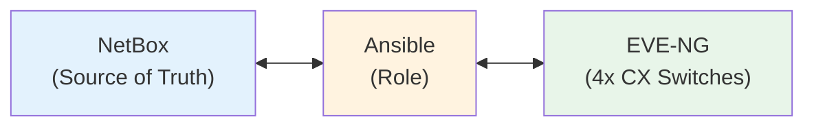
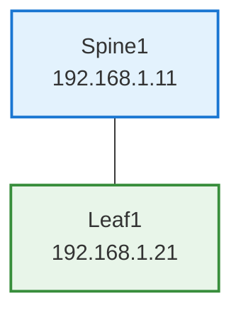

# Testing Environment Proposal Summary

## Executive Summary

This proposal outlines a comprehensive integration testing environment for the `ansible-role-aruba-cx-switch` role using real (virtual) Aruba AOS-CX switches, NetBox as source of truth, and EVE-NG for network simulation.

## Why This Approach?

### Current State

- Limited testing with mocked data
- No validation against real switch behavior
- NetBox integration untested
- Idempotent operations unverified

### Proposed State

- Real AOS-CX switches (virtual in EVE-NG)
- Actual NetBox integration
- Comprehensive test scenarios
- Automated validation

## Architecture at a Glance



## Recommended Starting Point: Simple Topology

### Hardware Requirements

- **Single server/VM** with 8+ CPU cores, 32GB RAM, 200GB SSD
- **OR** Your existing EVE-NG setup if already available

### Software Stack (All Free/Open Source)

- EVE-NG Community Edition
- NetBox (Docker deployment)
- Ansible + Aruba AOS-CX collection
- Python test framework (pytest)

### Initial Topology



**Tests to validate:**

1. ✅ VLAN creation from NetBox
2. ✅ VLAN deletion (idempotent cleanup)
3. ✅ Orphaned VLAN removal
4. ✅ L2 interface configuration (trunk/access)
5. ✅ VRF creation
6. ✅ L3 interface configuration (SVIs)
7. ✅ Idempotent operations (no changes on re-run)

## Implementation Timeline

### Week 1: Infrastructure (8-10 hours)

**Days 1-2:** EVE-NG setup

- Import AOS-CX virtual switch images
- Create 2-switch topology
- Configure management network
- Bootstrap switches with mgmt IPs

**Days 3-4:** NetBox deployment

- Deploy NetBox via Docker
- Configure API access
- Run `populate_netbox.py` script
- Verify data structure

**Day 5:** Test controller setup

- Install Ansible + dependencies
- Configure inventory
- Test connectivity to switches and NetBox

### Week 2: Basic Tests (6-8 hours)

**Days 1-2:** VLAN tests

- Test VLAN creation
- Test VLAN deletion
- Test orphaned VLAN cleanup

**Days 3-4:** Interface tests

- Test access port configuration
- Test trunk port configuration
- Test LAG configuration

**Day 5:** Validation

- Run `validate_deployment.py`
- Document results
- Fix any issues found

### Week 3: Advanced Tests (Optional, 8-10 hours)

- L3 interfaces and VRFs
- Routing protocols (OSPF/BGP)
- EVPN/VXLAN (if expanding to 4-switch fabric)

### Week 4: Automation (Optional, 4-6 hours)

- Create test runner script
- Document test procedures
- Set up periodic testing

## Quick Start (30 minutes to first test)

### Step 1: NetBox (5 min)

```bash
git clone https://github.com/netbox-community/netbox-docker.git
cd netbox-docker && docker-compose up -d
# Get API token from http://localhost:8000
```

### Step 2: Bootstrap Switches (10 min)

```bash
# Console into each switch
configure terminal
  hostname spine1
  interface mgmt
    ip address 192.168.1.11/24
  https-server rest access-mode read-write
```

### Step 3: Populate NetBox (5 min)

```bash
python testing-scripts/populate_netbox.py \
  --url http://192.168.1.10:8000 \
  --token YOUR_TOKEN \
  --topology simple
```

### Step 4: Run First Test (5 min)

```bash
ansible-playbook -i inventory/hosts.yml playbooks/test_vlans.yml
```

### Step 5: Validate (5 min)

```bash
ssh admin@192.168.1.21 "show vlan"
# Should see VLANs 10, 20, 30 from NetBox
```

## Benefits

### Immediate Benefits

- **Catch bugs early**: Find issues before production
- **Validate NetBox integration**: Ensure data flows correctly
- **Test idempotent cleanup**: Verify VLAN/interface cleanup works
- **Documentation**: Test playbooks serve as usage examples

### Long-term Benefits

- **Regression testing**: Run after each code change
- **Feature validation**: Test new features in isolation
- **CI/CD ready**: Can be automated with GitHub Actions
- **Training**: New team members can learn from tests

## Cost Analysis

### Option 1: Use Existing EVE-NG (Recommended)

- **Cost**: $0
- **Setup time**: 2-3 days
- **Pros**: No new hardware, you already have EVE-NG
- **Cons**: Shared resources with existing labs

### Option 2: Dedicated Test Lab

- **Cost**: ~$1000-2000 (one-time hardware)
- **Setup time**: 1 week
- **Pros**: Isolated, always available, fast
- **Cons**: Initial hardware investment

### Option 3: Cloud-based (Flexible)

- **Cost**: ~$200-300/month (only when testing)
- **Setup time**: 2-3 days
- **Pros**: No hardware, scalable
- **Cons**: Ongoing cost, network latency

## Risks & Mitigations

| Risk | Impact | Mitigation |
|------|--------|------------|
| Virtual switches behave differently | Medium | Document differences, test on real hardware before production |
| NetBox schema changes | Low | Pin NetBox version, test upgrades |
| Resource constraints | Medium | Start with simple topology, expand as needed |
| Time investment | Medium | Start with basic tests, add incrementally |

## Success Criteria

### Phase 1 Success (Weeks 1-2)

- ✅ 2-switch lab operational
- ✅ NetBox populated with test data
- ✅ VLAN creation/deletion working
- ✅ Basic interface configuration working
- ✅ Validation script confirms correct config

### Phase 2 Success (Weeks 3-4)

- ✅ All basic test scenarios passing
- ✅ Idempotent operations verified
- ✅ Test documentation complete
- ✅ Repeatable test process

### Long-term Success

- ✅ Tests run before each release
- ✅ Zero regression bugs in production
- ✅ New features tested before merge
- ✅ CI/CD pipeline integrated

## Next Steps

### Immediate (This Week)

1. **Decision**: Approve testing environment approach
2. **Resources**: Identify EVE-NG server to use
3. **Access**: Ensure NetBox can be deployed (Docker host)
4. **Timeline**: Confirm when to start implementation

### Short-term (Next 2 Weeks)

1. **Infrastructure**: Set up EVE-NG lab
2. **NetBox**: Deploy and populate test data
3. **First test**: Run VLAN creation test
4. **Validation**: Verify switch configuration

### Medium-term (Next Month)

1. **Expand tests**: Add L2/L3 interface tests
2. **Automation**: Create test runner scripts
3. **Documentation**: Complete test procedures
4. **Integration**: Add to development workflow

## Questions to Answer

Before proceeding, please consider:

1. **Resource Allocation**: Which EVE-NG server will you use?
2. **NetBox Instance**: Dedicated or shared with production?
3. **Priority Tests**: Which features are most critical to test first?
4. **Timeline**: When can you dedicate time to set this up?
5. **Scope**: Start simple (2 switches) or go full fabric (4 switches)?

## Supporting Documentation

- **[TESTING_ENVIRONMENT.md](TESTING_ENVIRONMENT.md)**: Complete technical guide
- **[TESTING_QUICK_START.md](TESTING_QUICK_START.md)**: 30-minute quick start
- **[testing-scripts/README.md](../testing-scripts/README.md)**: Helper script usage

## Recommendation

**Start with the Simple Topology** (1 spine, 1 leaf):

- Lowest resource requirements
- Fastest setup (2-3 days)
- Tests 80% of functionality
- Can expand to 4-switch fabric later

**Focus on critical tests first:**

1. VLAN management (creation/deletion/cleanup)
2. L2 interface configuration
3. Idempotent operations

**Expand gradually:**

- Add L3/VRF tests once L2 is solid
- Add EVPN/VXLAN tests if needed for your use case
- Add automation/CI once manual tests are reliable

## Conclusion

This testing environment provides:

- ✅ **Real validation** with actual switch behavior
- ✅ **Production confidence** before deployment
- ✅ **Living documentation** through test examples
- ✅ **Regression prevention** via automated tests
- ✅ **Incremental investment** - start small, expand as needed

**Total investment to basic working tests: 2-3 days of focused work**

Ready to proceed? Let me know and I can help with:

1. Detailed NetBox population for your specific use case
2. Custom test playbooks for your topology
3. Integration with your existing EVE-NG setup
4. Troubleshooting and optimization
