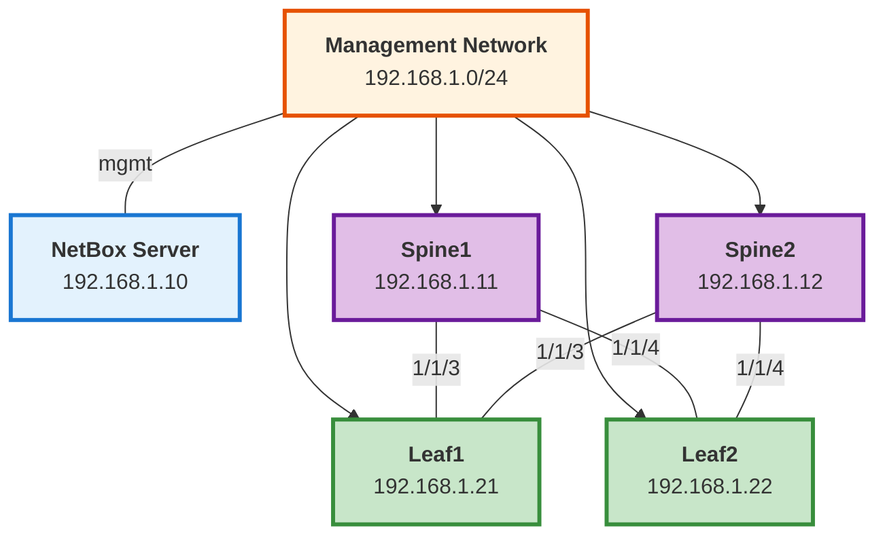

# Testing Environment - Quick Start Guide

This is a condensed guide to get your testing environment running quickly. See [TESTING_ENVIRONMENT.md](TESTING_ENVIRONMENT.md) for full details.

## Prerequisites

- EVE-NG installed with Aruba AOS-CX virtual images
- 4x Aruba CX virtual switches (2 spines, 2 leafs)
- Host system with Python 3.10+, Docker, and Ansible

## Quick Setup (30 minutes)

### 1. NetBox Setup (5 minutes)

```bash
# Deploy NetBox using Docker
git clone https://github.com/netbox-community/netbox-docker.git ~/netbox-docker
cd ~/netbox-docker
docker-compose up -d

# Wait for startup (2-3 minutes)
# Access at http://localhost:8000
# Default credentials: admin / admin
```

### 2. Bootstrap Switches in EVE-NG (10 minutes)

Connect to each switch console and configure:

```bash
# Spine1 (192.168.1.11)
configure terminal
  hostname spine1
  interface mgmt
    ip address 192.168.1.11/24
    default-gateway 192.168.1.1
    no shutdown
  https-server vrf mgmt
  https-server rest access-mode read-write
  ssh server vrf mgmt
  user admin password plaintext YourPassword123
write memory

# Repeat for spine2 (.12), leaf1 (.21), leaf2 (.22)
```

### 3. Test Controller Setup (10 minutes)

```bash
# Create test directory
mkdir -p ~/aruba-test-environment
cd ~/aruba-test-environment

# Install Ansible and dependencies
python3 -m venv venv
source venv/bin/activate
pip install ansible pyaoscx pynetbox pytest netmiko

# Install Aruba collection
ansible-galaxy collection install arubanetworks.aoscx

# Install your role
ansible-galaxy install -f git+https://github.com/aopdal/ansible-role-aruba-cx-switch.git
```

### 4. Create Inventory (5 minutes)

```yaml
# inventory/hosts.yml
---
all:
  vars:
    ansible_connection: ansible.netcommon.httpapi
    ansible_httpapi_use_ssl: true
    ansible_httpapi_validate_certs: false
    ansible_network_os: arubanetworks.aoscx.aoscx
    ansible_user: admin
    ansible_password: YourPassword123

    netbox_url: http://192.168.1.10:8000
    netbox_token: "YOUR_NETBOX_API_TOKEN"

    aoscx_debug: true
    aoscx_idempotent_mode: true

  children:
    test_lab:
      hosts:
        spine1:
          ansible_host: 192.168.1.11
        spine2:
          ansible_host: 192.168.1.12
        leaf1:
          ansible_host: 192.168.1.21
        leaf2:
          ansible_host: 192.168.1.22
```

## First Test: VLAN Creation

### 1. Populate NetBox with Test Data

Create a Python script to populate NetBox:

```bash
# scripts/populate_netbox_basic.py
cat > scripts/populate_netbox_basic.py << 'EOF'
#!/usr/bin/env python3
"""Populate NetBox with basic test data"""
import pynetbox

# Connect to NetBox
nb = pynetbox.api('http://192.168.1.10:8000', token='YOUR_TOKEN')

# Create site
site = nb.dcim.sites.create(name='test-lab', slug='test-lab')

# Create manufacturer
manufacturer = nb.dcim.manufacturers.create(name='Aruba', slug='aruba')

# Create device type
device_type = nb.dcim.device_types.create(
    manufacturer=manufacturer.id,
    model='CX 8360 Virtual',
    slug='cx-8360-virtual'
)

# Create device role
spine_role = nb.dcim.device_roles.create(name='spine', slug='spine', color='2196f3')
leaf_role = nb.dcim.device_roles.create(name='leaf', slug='leaf', color='4caf50')

# Create devices
for name, role, ip in [
    ('spine1', spine_role.id, '192.168.1.11/24'),
    ('spine2', spine_role.id, '192.168.1.12/24'),
    ('leaf1', leaf_role.id, '192.168.1.21/24'),
    ('leaf2', leaf_role.id, '192.168.1.22/24'),
]:
    device = nb.dcim.devices.create(
        name=name,
        device_type=device_type.id,
        device_role=role,
        site=site.id
    )
    print(f"Created device: {name}")

# Create VLANs
for vid, name in [(10, 'servers'), (20, 'storage'), (30, 'management')]:
    vlan = nb.ipam.vlans.create(vid=vid, name=name, site=site.id)
    print(f"Created VLAN {vid}: {name}")

print("\nNetBox populated successfully!")
EOF

chmod +x scripts/populate_netbox_basic.py
python3 scripts/populate_netbox_basic.py
```

### 2. Create Test Playbook

```yaml
# playbooks/test_vlans.yml
---
- name: Test VLAN Configuration
  hosts: leaf1
  gather_facts: false

  vars:
    aoscx_gather_facts: true
    aoscx_configure_vlans: true
    aoscx_idempotent_mode: true
    aoscx_debug: true

  pre_tasks:
    - name: Get device ID from NetBox
      ansible.builtin.set_fact:
        device_id: "{{ lookup('netbox.netbox.nb_lookup', 'devices', api_endpoint=netbox_url, token=netbox_token, api_filter='name=' + inventory_hostname) | first | json_query('value.id') }}"

    - name: Get interfaces from NetBox
      ansible.builtin.set_fact:
        interfaces: "{{ query('netbox.netbox.nb_lookup', 'interfaces', api_endpoint=netbox_url, token=netbox_token, api_filter='device=' + inventory_hostname) }}"

  roles:
    - aopdal.aruba_cx_switch
```

### 3. Run Test

```bash
cd ~/aruba-test-environment
source venv/bin/activate

# Run playbook
ansible-playbook -i inventory/hosts.yml playbooks/test_vlans.yml -v

# Verify on switch
ssh admin@192.168.1.21 "show vlan"
```

Expected output:
```
VLAN 10: servers
VLAN 20: storage
VLAN 30: management
```

## Test Progression

Once basic VLANs work, progress through:

1. ✅ **VLAN Creation** (above)
2. **VLAN Deletion** - Remove VLAN 30 from NetBox, run again
3. **L2 Interfaces** - Add interfaces to NetBox, configure trunk/access
4. **L3 Interfaces** - Add IP addressing, create SVIs
5. **VRFs** - Add VRFs to NetBox, configure on switches
6. **Routing** - Configure OSPF or BGP

## Troubleshooting

### NetBox Connection Issues

```bash
# Test NetBox API
curl -H "Authorization: Token YOUR_TOKEN" \
  http://192.168.1.10:8000/api/dcim/devices/
```

### Switch API Issues

```bash
# Test switch API
curl -k -u admin:YourPassword123 \
  https://192.168.1.21/rest/v10.13/system?attributes=platform_name
```

### Ansible Connection Issues

```bash
# Test Ansible connectivity
ansible -i inventory/hosts.yml leaf1 -m arubanetworks.aoscx.aoscx_command \
  -a "commands='show version'"
```

## Next Steps

1. Review full [TESTING_ENVIRONMENT.md](TESTING_ENVIRONMENT.md) for comprehensive test scenarios
2. Add more devices/interfaces to NetBox
3. Create validation tests with pytest
4. Automate with CI/CD

## Recommended Topology



**Data Plane Links:**
- Spine1 ↔ Leaf1/Leaf2 (ports 1/1/3, 1/1/4)
- Spine2 ↔ Leaf1/Leaf2 (ports 1/1/3, 1/1/4)

**Management:** All devices connect via mgmt interface to 192.168.1.0/24

## Resources

- **EVE-NG**: https://www.eve-ng.net/
- **NetBox**: https://netbox.dev/
- **Aruba AOS-CX Collection**: https://galaxy.ansible.com/arubanetworks/aoscx
- **pyaoscx SDK**: https://pypi.org/project/pyaoscx/
