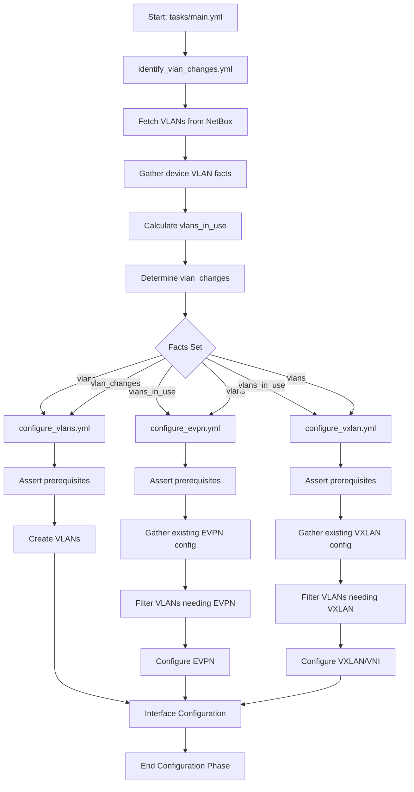
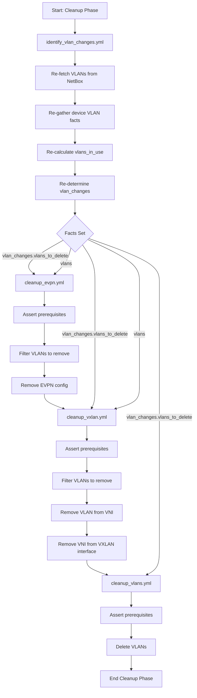
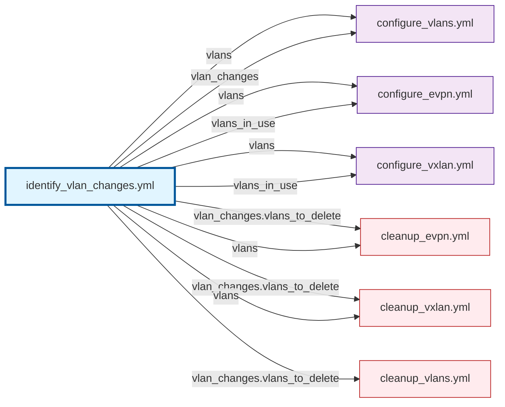

# VLAN Change Identification Workflow

## Overview

### Single Source of Truth: `identify_vlan_changes.yml`

The `identify_vlan_changes.yml` task file is now the **single source of truth** for all VLAN change calculations. It:

1. **Fetches VLANs from NetBox** (if not already provided)
2. **Gathers current VLAN state** from the device
3. **Calculates VLANs in use** by interfaces
4. **Determines VLAN changes** needed (create/delete)

### Facts Set by `identify_vlan_changes.yml`

This task sets the following facts used by all downstream tasks:

| Fact | Description | Used By |
|------|-------------|---------|
| `vlans` | VLANs available from NetBox (desired state) | All VLAN-related tasks |
| `vlans_in_use` | VLANs currently in use on interfaces (or all NetBox VLANs when `aoscx_configure_vlans_all=true`) | configure_vlans.yml, configure_evpn.yml, configure_vxlan.yml |
| `vlan_changes` | VLANs to create/delete based on analysis | configure_vlans.yml, cleanup_*.yml |

### Configure-All Mode (`aoscx_configure_vlans_all`)

By default, `vlans_in_use` is built from VLANs referenced by interfaces
(untagged/tagged) and by port-access roles in `port_access` config_context.
Set `aoscx_configure_vlans_all: true` to instead treat **every** VLAN that
NetBox returns for the device as "in use". This:

- Skips interface scanning for VLAN usage.
- Creates every NetBox-scoped VLAN on the device.
- Protects every NetBox-scoped VLAN from idempotent cleanup.

Typical use: access/edge switches where the VLAN catalog should always
match NetBox regardless of current port assignments.

#### Excluding VLAN groups from configure-all (`aoscx_configure_vlans_all_exclude_vlan_groups`)

`available_on_device` returns every VLAN NetBox scopes to a device -
including VLANs from groups scoped to a Region/Site-group above the
device's own site. If a region has a VLAN group dedicated to, say,
inter-switch linknet VLANs, every device in that region (including access
switches that should never carry those VLANs) sees them as "available".

Set `aoscx_configure_vlans_all_exclude_vlan_groups` to a list of NetBox
VLAN group slugs to drop from the configure-all catalog:

```yaml
aoscx_configure_vlans_all_exclude_vlan_groups:
  - region-linknets
```

This only affects the "treat every available VLAN as in use" step - if an
interface genuinely references a VLAN from an excluded group (e.g. a core
switch's routed linknet interface), it is still detected as in-use via the
normal interface-scanning path and configured/protected as usual.

Because a device only ever sees a group if NetBox's own scoping
(region/site/location) makes it available, it is safe to set this list
globally (e.g. `group_vars/all.yml`) - excluding a slug that a given
device's NetBox scope never returns is a no-op for that device.

### Task Execution Order

#### Configuration Phase (Create/Update)

```
1. identify_vlan_changes.yml  ← Analyze VLANs ONCE
   ↓
2. configure_vlans.yml         ← Create VLANs
   ↓
3. configure_evpn.yml          ← Configure EVPN for VLANs
   ↓
4. configure_vxlan.yml         ← Configure VXLAN/VNI for VLANs
```

#### Cleanup Phase (Delete) - Only in Idempotent Mode

```
1. identify_vlan_changes.yml  ← RE-analyze VLANs based on current state
   ↓
2. cleanup_evpn.yml            ← Remove EVPN config for deleted VLANs
   ↓
3. cleanup_vxlan.yml           ← Remove VXLAN/VNI for deleted VLANs
   ↓
4. cleanup_vlans.yml           ← Delete VLANs themselves
```

### Why Run `identify_vlan_changes.yml` Twice?

The task runs **twice** (before configuration and before cleanup) for important reasons:

1. **Before Configuration**: Analyzes initial state to determine what to create
2. **Before Cleanup**: Re-analyzes after interface changes to determine what can be safely deleted

Between these two runs, interface configurations may change (L2 interfaces updated, LAGs modified, etc.), which affects what VLANs are "in use" and therefore what can be deleted.

## Implementation Details

### Assertions for Safety

All dependent tasks now include assertions to verify that `identify_vlan_changes.yml` has run:

```yaml
- name: Verify VLAN analysis has been performed
  ansible.builtin.assert:
    that:
      - vlans is defined
      - vlans_in_use is defined
      - vlan_changes is defined
    fail_msg: "ERROR: identify_vlan_changes.yml must run before this task"
    success_msg: "VLAN analysis completed - proceeding with task"
```

This prevents tasks from running with stale or missing data.

### Removed Duplicate Logic

The following duplicate logic was **removed** from downstream tasks:

- ❌ Fetching VLANs from NetBox API
- ❌ Calculating VLANs in use
- ❌ Determining VLAN changes

These tasks now simply **use** the facts set by `identify_vlan_changes.yml`.

### Device Command Optimization

Both EVPN and VXLAN configuration tasks use the same efficient command to check existing configuration:

```yaml
- name: Gather current EVPN/VXLAN configuration
  arubanetworks.aoscx.aoscx_command:
    commands:
      - show evpn evi
```

The `show evpn evi` command provides both EVPN VLANs and VXLAN/VNI mappings in a single output, eliminating the need for multiple device queries. The output format is:

```
L2VNI : 10100010
    VLAN                       : 10
    Status                     : up
    ...
```

**Regex patterns used:**

- EVPN VLANs: `VLAN\s+:\s+(\d+)` - Extracts VLAN IDs
- VXLAN VNI-to-VLAN mappings: `L2VNI\s+:\s+(\d+).*?VLAN\s+:\s+(\d+)` - Extracts both VNI and VLAN ID

## Benefits

- ✅ **Consistency**: All tasks work from the same VLAN analysis
- ✅ **Maintainability**: VLAN logic centralized in one place
- ✅ **Safety**: Assertions prevent tasks running with stale data
- ✅ **Clarity**: Clear execution order documented
- ✅ **Idempotency**: Proper re-analysis before cleanup ensures safe deletions

## Files Modified

### Primary Task Files

- `tasks/identify_vlan_changes.yml` - Enhanced as single source of truth
- `tasks/main.yml` - Added identify_vlan_changes.yml before configuration tasks

### Configuration Tasks (Simplified)

- `tasks/configure_vlans.yml` - Removed duplicate logic, added assertion
- `tasks/configure_evpn.yml` - Removed duplicate logic, added assertion
- `tasks/configure_vxlan.yml` - Removed duplicate logic, added assertion

### Cleanup Tasks (Verified)

- `tasks/cleanup_vlans.yml` - Added assertion
- `tasks/cleanup_evpn.yml` - Added assertion
- `tasks/cleanup_vxlan.yml` - Added assertion

## Testing Recommendations

When testing this refactored workflow:

1. **Test Configuration**: Verify VLANs, EVPN, and VXLAN are created correctly
2. **Test Idempotency**: Run twice, second run should make no changes
3. **Test Cleanup**: Enable idempotent mode, remove VLANs from NetBox, verify cleanup
4. **Test Assertions**: Try running tasks out of order to verify assertions catch issues
5. **Test Debug Output**: Enable debug mode to see VLAN analysis results

## Debug Mode

Enable debug output to see VLAN analysis results:

```yaml
aoscx_debug: true
# or
ansible-playbook -vv playbook.yml
```

Debug output includes:

- VLANs available from NetBox
- VLANs in use on interfaces
- VLANs to create
- VLANs to delete
- Protected VLANs (in use, cannot delete)

## Diagrams

### Configuration Phase Flow



### Cleanup Phase Flow (Idempotent Mode Only)



### Fact Dependencies



## For Developers

### Adding a New VLAN-Related Task

If you're adding a new task that needs to work with VLANs, follow this pattern:

#### 1. Add Assertion at the Start

```yaml
- name: Verify VLAN analysis has been performed
  ansible.builtin.assert:
    that:
      - vlans is defined
      - vlans_in_use is defined
      # Add vlan_changes if you need to know what to create/delete
      - vlan_changes is defined
    fail_msg: "ERROR: identify_vlan_changes.yml must run before YOUR_TASK.yml"
    success_msg: "VLAN analysis completed - proceeding with YOUR_TASK"
```

#### 2. Use the Facts (Don't Recalculate)

**DON'T DO THIS:**

```yaml
# ❌ BAD: Recalculating vlans_in_use
- name: Get VLANs in use
  ansible.builtin.set_fact:
    vlans_in_use: "{{ interfaces | get_vlans_in_use(...) }}"
```

**DO THIS:**

```yaml
# ✅ GOOD: Use existing fact
- name: Filter VLANs for my task
  ansible.builtin.set_fact:
    my_vlans: "{{ vlans | selectattr('vid', 'in', vlans_in_use.vids) | list }}"
```

#### 3. Add to main.yml After identify_vlan_changes.yml

```yaml
# In tasks/main.yml, after the "Identify VLAN changes (before configuration)" task
- name: Include my new VLAN task
  ansible.builtin.include_tasks:
    file: my_vlan_task.yml
    apply:
      tags:
        - my_tag
        - vlans
  when: aoscx_configure_my_feature | bool
  tags:
    - my_tag
    - vlans
```

### Available Facts (Examples)

#### `vlans` - VLANs from NetBox

```yaml
vlans:
  - vid: 10
    name: "Data"
    description: "Data VLAN"
    l2vpn_termination:
      id: 123
      l2vpn:
        identifier: 10010  # VNI
```

#### `vlans_in_use` - VLANs on Interfaces

```yaml
vlans_in_use:
  vids: [1, 10, 20, 30]  # List of VLAN IDs
```

#### `vlan_changes` - What Needs to Change

```yaml
vlan_changes:
  vlans_to_create:
    - vid: 40
      name: "Voice"
  vlans_to_delete: [50, 60]  # VLAN IDs to delete
  vlans_in_use: [10, 20]     # Protected from deletion
```

### Common Patterns

#### Pattern 1: Configure Feature for VLANs with L2VPN

```yaml
- name: Filter VLANs with L2VPN termination
  ansible.builtin.set_fact:
    vlans_with_l2vpn: "{{ vlans |
      selectattr('vid', 'in', vlans_in_use.vids) |
      selectattr('l2vpn_termination', 'defined') |
      selectattr('l2vpn_termination.id', 'defined') |
      list }}"
```

#### Pattern 2: Cleanup Feature for Deleted VLANs

```yaml
- name: Filter VLANs to clean up
  ansible.builtin.set_fact:
    vlans_to_cleanup: "{{ vlans |
      selectattr('vid', 'in', vlan_changes.vlans_to_delete) |
      selectattr('l2vpn_termination.id', 'defined') |
      list }}"
```

#### Pattern 3: Check if VLAN is in Use

```yaml
- name: Only process unused VLANs
  some_module:
    vlan_id: "{{ item.vid }}"
  loop: "{{ vlans }}"
  when: item.vid not in vlans_in_use.vids
```

### Testing EVPN/VXLAN Detection

The role runs `show evpn evi` on the switch and passes the output through the
`parse_evpn_evi_output` filter plugin (`netbox_filters_lib/vlan_filters.py`):

```yaml
- name: Get existing EVPN/VXLAN configuration
  arubanetworks.aoscx.aoscx_command:
    commands:
      - show evpn evi
  register: evpn_config_output

- name: Parse EVPN EVI output
  ansible.builtin.set_fact:
    evpn_parsed: "{{ evpn_config_output.stdout[0] | parse_evpn_evi_output }}"
```

The filter returns:

```python
{
  "evpn_vlans":    [10, 20, 30],          # VLAN IDs with EVPN configured
  "vxlan_vlans":   [10, 20, 30],          # VLAN IDs with VXLAN configured
  "vxlan_vnis":    [10100010, 10100020],  # VNI values
  "vxlan_mappings": [[10100010, 10], [10100020, 20]]  # [VNI, VLAN] pairs
}
```

**Expected `show evpn evi` output format:**

```
L2VNI : 10100010
    Route Distinguisher        : 172.20.1.33:10
    VLAN                       : 10
    Status                     : up
    RT Import                  : 65005:10
    RT Export                  : 65005:10
```

**To test the filter locally:**

```python
import re

output = """
L2VNI : 10100010
    Route Distinguisher        : 172.20.1.33:10
    VLAN                       : 10
L2VNI : 10100020
    VLAN                       : 20
"""

# VNI pattern (used by the filter)
vnis = re.findall(r'^L2VNI\s+:\s+(\d+)', output, re.MULTILINE)
print(f"VNIs: {vnis}")   # ['10100010', '10100020']

# VLAN pattern (used by the filter)
vlans = re.findall(r'^\s+VLAN\s+:\s+(\d+)', output, re.MULTILINE)
print(f"VLANs: {vlans}") # ['10', '20']
```

### File Locations

- **Single Source**: `tasks/identify_vlan_changes.yml`
- **Configuration**: `tasks/configure_*.yml`
- **Cleanup**: `tasks/cleanup_*.yml`
- **Orchestration**: `tasks/main.yml`
- **Documentation**: `docs/VLAN_CHANGE_IDENTIFICATION_WORKFLOW.md`

## Related Documentation

- [BGP Configuration](BGP_CONFIGURATION.md)
- [Base Configuration](BASE_CONFIGURATION.md)
- [Contributing Guide](CONTRIBUTING.md)
