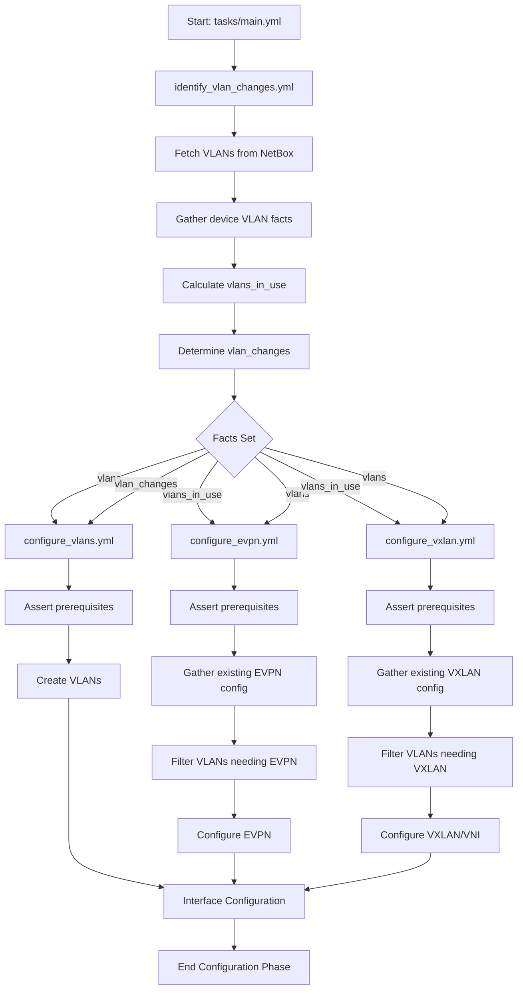
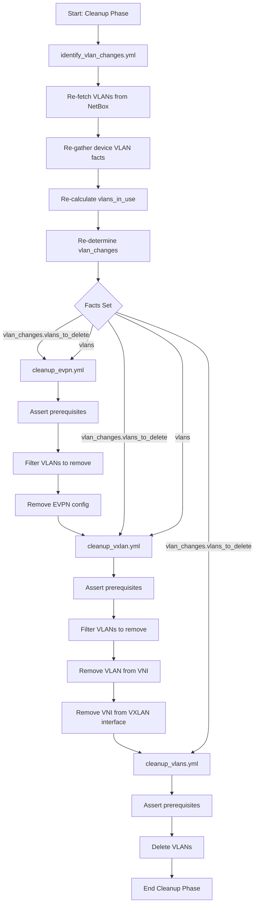
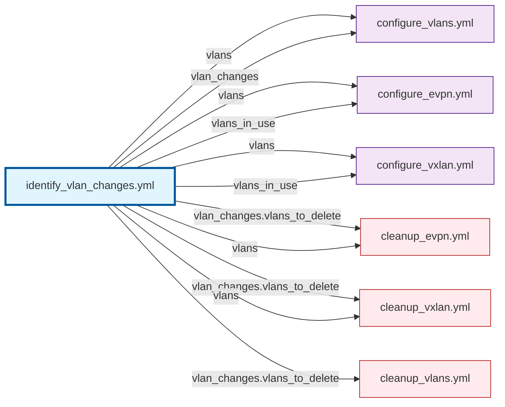

# VLAN Workflow Visualization

## Configuration Phase Flow

## Cleanup Phase Flow (Idempotent Mode Only)

## Fact Dependencies

## Facts Reference Table

| Fact Name | Type | Set By | Used By | Purpose |
|-----------|------|--------|---------|---------|
| `vlans` | list[dict] | identify_vlan_changes.yml | configure_vlans, configure_evpn, configure_vxlan, cleanup_evpn, cleanup_vxlan | VLANs from NetBox (desired state) |
| `vlans_in_use` | dict | identify_vlan_changes.yml | configure_vlans, configure_evpn, configure_vxlan | VLANs currently used by interfaces |
| `vlans_in_use.vids` | list[int] | identify_vlan_changes.yml | configure_evpn, configure_vxlan | VLAN IDs in use |
| `vlan_changes` | dict | identify_vlan_changes.yml | configure_vlans, cleanup_* | Changes needed |
| `vlan_changes.vlans_to_create` | list[dict] | identify_vlan_changes.yml | configure_vlans | VLANs to create |
| `vlan_changes.vlans_to_delete` | list[int] | identify_vlan_changes.yml | cleanup_* | VLANs to delete |
| `vlan_changes.vlans_in_use` | list[int] | identify_vlan_changes.yml | Debug only | VLANs protected from deletion |
