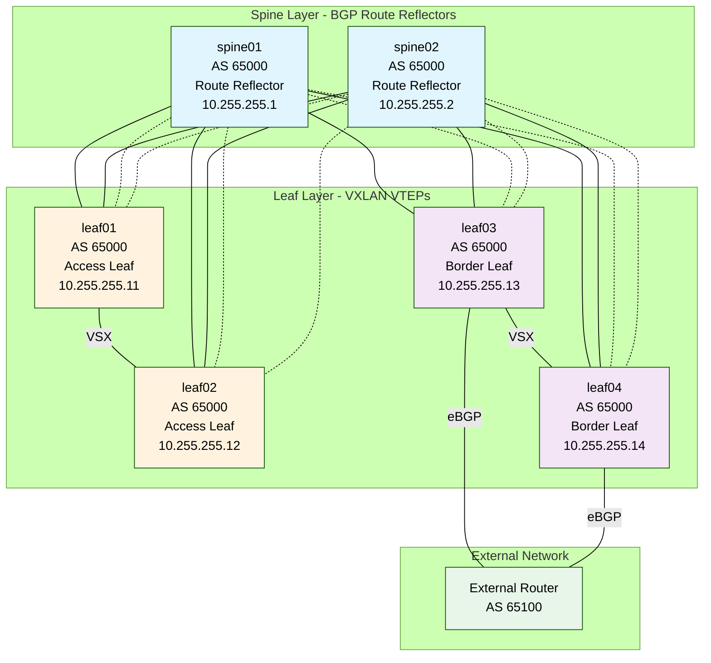

# BGP EVPN Fabric Example

This example demonstrates a complete production-grade BGP/EVPN fabric deployment using the `ansible-role-aruba-cx-switch` role, suitable for data center or campus environments.

The example files live in `examples/bgp-evpn-fabric/` in the repository.

## What This Example Demonstrates

- **Multi-tier architecture:** Spine and leaf topology
- **OSPF routing** Routing to loopbacks for BGP peering
- **BGP routing:** Underlay and overlay with route reflectors
- **EVPN/VXLAN:** Layer 2 and Layer 3 VPN services
- **VRF integration:** Tenant separation with VRF-lite
- **Structured inventory:** Group-based configuration inheritance
- **Production features:** Loopbacks, VXLAN tunnels, anycast gateways, VSX for leafs HA

## Topology

This is an example topology which does not match sample data in json file.



**Switch Roles:**

- **Spines (spine01, spine02):** BGP route reflectors for EVPN control plane
- **Leafs (leaf01, leaf02):** Access layer switches with VXLAN tunnels for endpoint connectivity
- **Border Leafs (leaf03, leaf04):** External connectivity and inter-VRF routing

**Connections:**

- **Solid lines:** BGP IPv4 unicast (underlay routing)
- **Dashed lines:** BGP L2VPN EVPN (overlay control plane)
- **Blue:** Spine switches (Route Reflectors)
- **Orange:** Access leaf switches (VTEPs)
- **Purple:** Border leaf switches (VTEPs + External peering)

## Prerequisites

1. **Ansible-core 2.18** with required collections:

   ```bash
   ansible-galaxy install -r requirements.yml
   ```

2. **NetBox with BGP Plugin**:

   - NetBox 4.4+
   - netbox-bgp-plugin installed
   - BGP sessions, peerings, and routing policies configured
   - API token with read permissions

3. **Python dependencies**:

   ```bash
   pip install -r requirements.txt
   ```

4. **Physical Requirements**:

   - Aruba CX switches (6300, 8360, etc.)
   - Underlay IP connectivity between all switches
   - Loopback addressing plan
   - Or use the OVA Aruba CX simulator for testing

## Quick Start

### 1. Copy the Example

```bash
cp -r examples/bgp-evpn-fabric ~/my-fabric
cd ~/my-fabric
```

### 2. Configure Inventory

Use NetBox as your source of truth:

```bash
# Set NetBox credentials as environment variables
export NETBOX_API=https://netbox.example.com
export NETBOX_TOKEN=your_api_token_here
# Set Aruba credentials as environment variables
export ARUBA_USER=your_user
export ARUBA_PASSWORD=your_password

# Verify inventory is working
ansible-inventory -i netbox_inventory.yml --graph

# Check what variables are set
ansible-inventory -i netbox_inventory.yml --host spine01
```

The NetBox inventory automatically:
- Groups devices by `device_roles` (spines, leafs, border_leafs)
- Retrieves interface configurations
- Filters to only active Aruba CX switches

Edit `netbox_inventory.yml` to customize query filters.

### 3. Set Up Credentials

You may want to use vault to store credentials and not use environment variables.
Make changes to the group_vars files and create vault files.

```bash
ansible-vault create group_vars/all/vault.yml
```

Add credentials:

```yaml
---
vault_ansible_password: "your_switch_password"
vault_netbox_token: "your_netbox_api_token"
```

### 4. Review NetBox Configuration

Ensure NetBox has:

- All switches with loopback interfaces
- BGP autonomous system numbers
- BGP peering sessions between spines and leafs
- VRFs with route distinguishers and targets
- VLANs with VXLAN VNIs assigned
- EVPN configuration in config_context

See `netbox-export-sample.json` for required data structure.

### 5. Dry Run (Check Mode)

```bash
ansible-playbook -i netbox_inventory.yml playbook.yml --check
```

### 6. Deploy Infrastructure Phase

Deploy underlay routing and base BGP:

```bash
ansible-playbook -i inventory/netbox_inventory.yml playbook.yml --tags bgp
```

### 7. Deploy EVPN/VXLAN

Enable EVPN overlay:

```bash
ansible-playbook -i inventory/netbox_inventory.yml playbook.yml --tags evpn,vxlan
```

### 8. Full Deployment

Deploy everything:

```bash
ansible-playbook -i inventory/netbox_inventory.yml playbook.yml
```

## File Structure

```
examples/bgp-evpn-fabric/
├── playbook.yml                             # Main playbook
├── netbox_inventory.yml                     # Example inventory
├── ansible.cfg                              # Example Ansible configuration
├── requirements.txt                         # Python requirements
├── requirements.yml                         # Ansible requirements
├── group_vars/
│   ├── all.yml                              # Global settings
│   ├── aoscx.yml                            # Common switch config
│   └── localhost.yml                        # Variables needed for API access
└── netbox-export-sample.json                # Sample NetBox structure
```

## Configuration Details

### Underlay Routing

- **Protocol:** BGP (eBGP or iBGP)
- **Address Family:** IPv4 unicast
- **Peering:** Each leaf peers with both spines
- **Router IDs:** Derived from loopback interfaces

### Overlay EVPN

- **Route Reflectors:** Spine switches
- **EVPN Clients:** Leaf switches
- **Address Family:** L2VPN EVPN
- **Encapsulation:** VXLAN

### VRF Configuration

Each tenant VRF includes:

- **Route Distinguisher (RD):** Unique per device
- **Route Targets (RT):** Shared across fabric
- **Anycast Gateway:** Shared default gateway IP per VLAN

### VXLAN Tunnels

- **Source:** Loopback interface
- **VNI Assignment:** Per-VLAN from NetBox
- **Flooding:** Head-end replication (HER)

## Deployment Phases

### Phase 1: Base Configuration

```bash
ansible-playbook -i inventory/hosts.yml playbook.yml --tags base
```

- Banner, timezone, NTP, DNS
- Management interface
- User accounts

### Phase 2: VLANs and VRFs

```bash
ansible-playbook -i inventory/hosts.yml playbook.yml --tags vlans,vrfs
```

- Create VLANs
- Create VRFs
- Associate VLANs with VRFs

### Phase 3: Underlay Routing

```bash
ansible-playbook -i inventory/hosts.yml playbook.yml --tags bgp
```

- Configure BGP for underlay
- Establish IPv4 unicast peerings
- Advertise loopback addresses

### Phase 4: EVPN Overlay

```bash
ansible-playbook -i inventory/hosts.yml playbook.yml --tags evpn,vxlan
```

- Configure EVPN address family
- Enable VXLAN encapsulation
- Configure VNI-to-VLAN mappings
- Set up anycast gateways

### Phase 5: Interface Configuration

```bash
ansible-playbook -i inventory/hosts.yml playbook.yml --tags interfaces
```

- Configure access ports
- Configure trunk ports to other switches
- Apply VLAN assignments

## Running Specific Operations

### Update Only Spines

```bash
ansible-playbook -i inventory/hosts.yml playbook.yml --limit spines
```

### Update Only Leafs

```bash
ansible-playbook -i inventory/hosts.yml playbook.yml --limit leafs
```

### Reconfigure EVPN Without Touching BGP

```bash
ansible-playbook -i inventory/hosts.yml playbook.yml --tags evpn
```

### Add New VLANs Without Changing Routing

```bash
ansible-playbook -i inventory/hosts.yml playbook.yml --tags vlans
```

## NetBox Configuration Requirements

### Device Configuration

Each switch must have in NetBox:

1. **Loopback Interface:**

   - Name: `loopback0`
   - IP address assigned
   - Used as router ID and VXLAN source

2. **BGP Configuration** (via netbox-bgp-plugin):

   - Autonomous System (AS) number
   - Router ID (typically loopback IP)
   - BGP peering sessions to spine switches

3. **VRFs** (if using multi-tenancy):

   - Route distinguisher (RD)
   - Route targets (import/export)

4. **VLANs with VNIs:**

   - VLAN ID
   - VXLAN VNI (L2 VNI)
   - Associated VRF (for L3 routing)

### Config Context Structure

```yaml
evpn:
  enabled: true
  anycast_gateway_mac: "00:00:5e:00:01:01"

vxlan:
  source_interface: "loopback0"
  udp_port: 4789

bgp:
  route_reflector_client: false  # true for leafs, false for spines
```

See `netbox-export-sample.json` for complete example.

## Troubleshooting

### BGP Sessions Not Establishing

```bash
# Check underlay connectivity
ansible -i inventory/hosts.yml leafs -m shell -a "ping <spine_loopback_ip>"

# Verify BGP configuration
ansible-playbook -i inventory/hosts.yml playbook.yml --tags bgp --check -vvv
```

### EVPN Routes Not Being Advertised

```bash
# Check EVPN configuration on spines (route reflectors)
# Verify L2VPN EVPN address family is active
# Check route reflector client configuration on leafs
```

### VXLAN Tunnels Not Forming

```bash
# Verify loopback reachability via underlay
# Check VXLAN source interface configuration
# Verify VNI assignments match NetBox
```

### NetBox BGP Data Not Loading

```bash
# Test NetBox API access
ansible -i inventory/hosts.yml leafs -m debug -a "var=hostvars[inventory_hostname].bgp_sessions"

# Verify netbox-bgp-plugin is installed
# Check API token permissions
```

## Scaling and Expansion

### Adding New Leaf Switches

1. Add switch to NetBox
2. Configure BGP peerings to spines
3. Add to `inventory/hosts.yml` in `leafs` group
4. Run playbook with `--limit new_leaf_name`

### Adding New VLANs

1. Create VLAN in NetBox
2. Assign VNI and VRF
3. Run: `ansible-playbook -i inventory/hosts.yml playbook.yml --tags vlans,evpn`

### Adding New VRFs

1. Create VRF in NetBox with RD and RT
2. Associate VLANs with the VRF
3. Run: `ansible-playbook -i inventory/hosts.yml playbook.yml --tags vrfs,evpn`

## Validation

After deployment, verify:

```bash
# Check BGP sessions
show bgp ipv4 unicast summary
show bgp l2vpn evpn summary

# Check VXLAN tunnels
show interface vxlan 1
show vxlan tunnel

# Check EVPN routes
show bgp l2vpn evpn
show evpn vni

# Check VRF routing
show ip route vrf <vrf_name>
```

## Next Steps

- **Monitor the fabric:** Integrate with NMS/observability tools
- **Add redundancy:** Configure VSX on border leafs
- **External connectivity:** Configure routing to external networks
- **Multi-tenancy:** Deploy additional VRFs for tenant isolation
- **Automation:** Integrate with CI/CD for continuous deployment

## Documentation

- **[BGP_CONFIGURATION.md](../BGP_CONFIGURATION.md)** - BGP setup, NetBox plugin, and fabric examples
- **[EVPN_VXLAN_CONFIGURATION.md](../EVPN_VXLAN_CONFIGURATION.md)** - EVPN/VXLAN guide
- **[FILTER_PLUGINS.md](../FILTER_PLUGINS.md)** - Data transformation details

## Getting Help

If you encounter issues:

1. Check NetBox data structure matches samples
2. Verify BGP plugin is installed and configured
3. Review filter plugin documentation
4. Test with `--check` and `-vvv` for detailed output
5. Validate underlay connectivity first, then overlay
